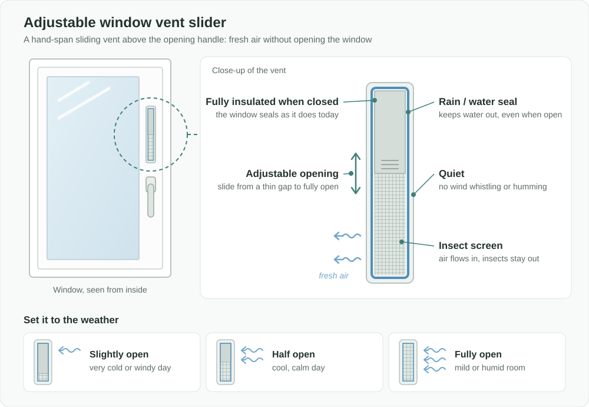

Türkçe: [README.tr.md](README.tr.md)

# Adjustable Window Vent Slider: Continuous Fresh Air Without Opening the Window

## Summary

A small sliding vent, about a hand-span (roughly 20 cm) long, is built into PVC-type windows next to or above the opening handle. It can be opened **as much or as little as needed**, from a thin gap to fully open. It is **sealed against rain and water**, **screened against insects** and **quiet**: it does not whistle, hum or rattle in the wind. When it is closed, the window insulates exactly as it does today. In autumn and winter, the vent lets a room get **continuous, controlled fresh air for as long as needed**, adjusted to the cold, the rain and the wind. There is no need to tilt or fully open the window, and it helps prevent damp and mold in homes that suffer from them.

## Problem

- In autumn and winter, rooms still need fresh air, but the only options are usually to **tilt the window or open it fully**.
- A tilted or open window lets in far more cold air than needed. Heat escapes, heating costs rise, and the room quickly becomes uncomfortable, so people close the window again.
- When windows stay closed for long periods, **humidity builds up**. The result is condensation on the glass and walls, damp, mold and musty air, which are unhealthy, especially for children, the elderly and people with respiratory problems.
- An open window lets in **rain and wind**, and in mild weather also **flies and mosquitoes**.
- Modern PVC windows seal very tightly. That is good for insulation, but without deliberate ventilation it makes the damp problem worse.

## Proposed Solution

Add a **small, adjustable, weather-sealed ventilation slider** to the window itself:

1. **Location:** a hand-span-long slot on the window sash, above or next to the opening handle, where it is easy to see and reach.
2. **Adjustable opening:** the slider opens gradually, from a hairline gap to fully open. The user chooses the amount according to the outside temperature, rain and wind.
3. **Sealed against water and weather:** rain and wind-driven water cannot get in, even when the vent is open.
4. **Insect screen:** a built-in screen keeps flies and mosquitoes out while air flows.
5. **Full insulation when closed:** when the slider is closed, the window keeps its original thermal and sound insulation.
6. **Quiet in the wind:** the vent is shaped so that air passing through it, even in strong wind, makes no whistling, humming or rattling. It can stay open in bedrooms and at night without disturbing anyone.
7. **Unlimited ventilation time:** because the airflow is small and controlled, the vent can stay open for hours or all day without chilling the room, instead of the short, wasteful "open the window for ten minutes" routine.

## How It Works

| Situation | Setting | Result |
|---|---|---|
| Very cold, windy or stormy day | Slider slightly open | A trickle of fresh air with almost no heat loss |
| Cool, calm autumn day | Slider half open | Steady fresh air all day |
| Mild weather, or a humid room after cooking, showering or drying laundry | Slider fully open | Faster air exchange, and moisture is removed |
| Heavy rain | Any setting | No water gets in, thanks to the weather seal |
| Maximum insulation needed | Slider closed | The window insulates as usual |

The user simply slides it by hand, like adjusting a small shutter. The window itself does not need to be tilted or opened during the cold months.

## Implementation & Phasing

1. **Prototype and testing:** a prototype is built for common PVC window types and tested for airflow, water tightness, insect protection, **noise in strong wind** and insulation when closed.
2. **Factory-fitted option:** window manufacturers offer the slider as an option on new windows.
3. **Retrofit version:** a version that can be fitted to existing PVC windows is offered, so that homes with damp problems can benefit without replacing their windows.
4. **Wider adoption:** housing projects, schools, hospitals and public buildings, where fresh air and damp prevention matter most, are encouraged to use it. Energy-efficiency or healthy-housing programs could include it.

## Stakeholders & Benefits

- **Residents:** fresh air all winter without cold drafts, less condensation, damp and mold, and a healthier home.
- **Vulnerable groups:** children, the elderly and people with asthma or allergies benefit from cleaner, drier air.
- **Households and the country:** less heat lost through open or tilted windows, which means lower heating costs and lower energy use.
- **Window manufacturers and installers:** a new product, retrofit market and line of work.
- **Landlords and building managers:** fewer damp and mold complaints and less damage to walls and finishes.
- **Schools, offices and public buildings:** continuous fresh air in crowded rooms without opening windows in the cold.

## Risks & Mitigations

| Risk | Mitigation |
|---|---|
| Water or wind-driven rain getting in | Weather-sealed design, tested for water tightness |
| Heat loss if left fully open in severe cold | Fine adjustment, so users can leave only a thin gap; clear markings for cold-weather settings |
| Weakening the window's insulation or security | Full insulation when closed; the slot is too small for entry |
| Wind noise (whistling, humming or rattling) through the open vent | A quiet airflow design, tested in strong wind at every opening setting |
| Dust or dirt in the vent and screen | An easy-to-clean, removable screen |
| Similar background ventilators ("trickle vents") already exist in some markets | This proposal focuses on fine user adjustment at handle height, water and insect sealing together, and a retrofit version for existing PVC windows |

**Keywords:** window ventilation, trickle vent, PVC windows, indoor air quality, condensation, damp and mold, energy efficiency, healthy housing, retrofit

## Origin

Originally proposed by Merih İlgör (September 2026); published here as an open project idea.

## License

This work is licensed under CC BY-NC-SA 4.0 for non-commercial use; see [LICENSE](LICENSE). Commercial use requires a revenue-share agreement; see [COMMERCIAL-LICENSE.md](COMMERCIAL-LICENSE.md).
