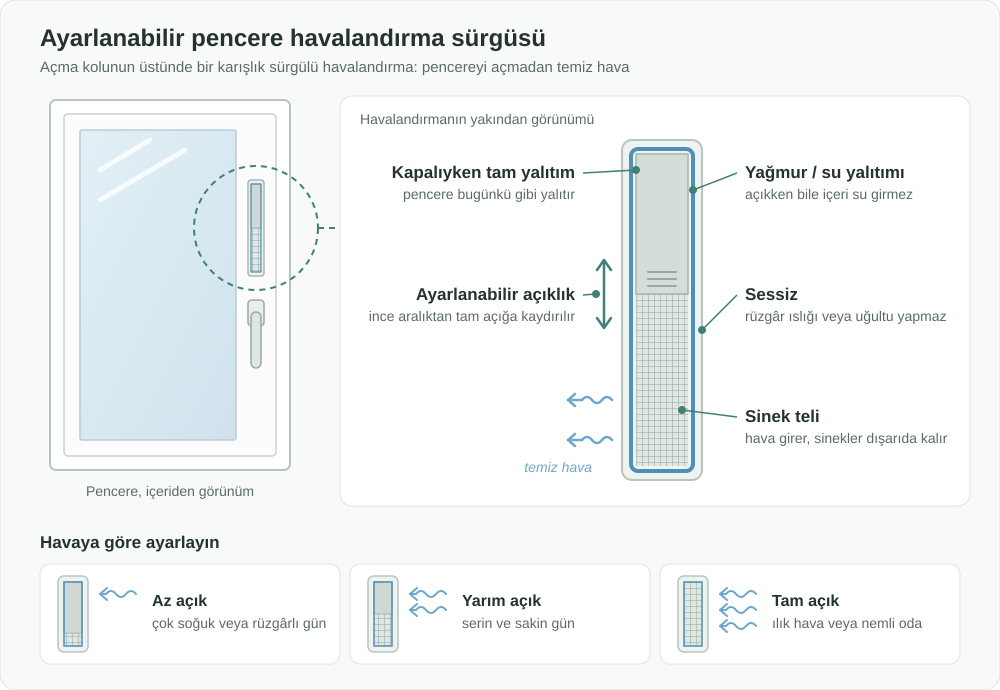

English: [README.md](README.md)

# Ayarlanabilir Pencere Havalandırma Sürgüsü: Pencereyi Açmadan Sürekli Temiz Hava

## Özet

Pimapen benzeri pencerelerde, açma kolunun üstüne veya yanına yaklaşık bir karış (20 cm civarı) uzunluğunda küçük bir sürgülü havalandırma yerleştirilir. Sürgü, ince bir aralıktan tamamen açığa kadar **istenildiği kadar** açılabilir. **Yağmura ve suya karşı yalıtımlıdır**, **sineklere karşı tellidir** ve **sessizdir**: rüzgârda ıslık çalmaz, uğultu veya tıkırtı yapmaz. Kapalıyken pencere bugünkü gibi tam yalıtım sağlar. Sonbahar ve kış aylarında odanın; soğuğa, yağışa ve rüzgâra göre ayarlanarak **istenildiği kadar ve süresiz** havalandırılmasını sağlar. Pencereyi yarım veya tam açmaya gerek kalmaz; rutubet sorunu olan evlerde rutubet ve küfü önlemeye yardımcı olur.

## Sorun

- Sonbahar ve kış aylarında da odaların havalandırılması gerekir, ancak genellikle tek seçenek **pencereyi vasistas yapmak veya tamamen açmaktır**.
- Vasistas veya açık pencere gerekenden çok daha fazla soğuk hava içeri alır. Isı kaçar, ısınma masrafı artar, oda kısa sürede rahatsız edici hale gelir ve pencere tekrar kapatılır.
- Pencereler uzun süre kapalı kalınca **nem birikir**. Sonuç; camlarda ve duvarlarda terleme, rutubet, küf ve ağır havadır. Bu durum özellikle çocuklar, yaşlılar ve solunum sorunu olanlar için sağlıksızdır.
- Açık pencere **yağmuru ve rüzgârı**, ılık havalarda ise **sinek ve sivrisinekleri** de içeri alır.
- Modern pimapen pencereler çok iyi sızdırmazlık sağlar. Bu yalıtım için iyidir, ancak bilinçli havalandırma olmadığında rutubet sorununu artırır.

## Önerilen Çözüm

Pencerenin kendisine **küçük, ayarlanabilir ve hava koşullarına karşı yalıtımlı bir havalandırma sürgüsü** eklemek:

1. **Konum:** Pencere kanadında, açma kolunun üstünde veya yanında, kolayca görülüp ulaşılabilen bir karış uzunluğunda bir yuva.
2. **Ayarlanabilir açıklık:** Sürgü, kıl payı aralıktan tamamen açığa kadar kademeli açılır. Kullanıcı açıklık miktarını dış sıcaklığa, yağışa ve rüzgâra göre seçer.
3. **Suya ve hava koşullarına karşı yalıtım:** Sürgü açıkken bile yağmur ve rüzgârla savrulan su içeri giremez.
4. **Sinek teli:** Dahili tel, hava geçerken sinek ve sivrisinekleri dışarıda tutar.
5. **Kapalıyken tam yalıtım:** Sürgü kapatıldığında pencere orijinal ısı ve ses yalıtımını korur.
6. **Rüzgârda sessiz:** Havalandırma, kuvvetli rüzgârda bile içinden geçen havanın ıslık, uğultu veya tıkırtı yapmayacağı şekilde tasarlanır. Böylece yatak odalarında ve gece boyunca kimseyi rahatsız etmeden açık kalabilir.
7. **Süresiz havalandırma:** Hava akışı küçük ve kontrollü olduğu için sürgü, odayı üşütmeden saatlerce veya tüm gün açık kalabilir. "Pencereyi on dakika aç" şeklindeki kısa ve israflı alışkanlığın yerini alır.

## Nasıl Çalışır

| Durum | Ayar | Sonuç |
|---|---|---|
| Çok soğuk, rüzgârlı veya fırtınalı gün | Sürgü az açık | Neredeyse hiç ısı kaybı olmadan ince bir temiz hava akışı |
| Serin ve sakin sonbahar günü | Sürgü yarım açık | Gün boyu sürekli temiz hava |
| Ilık hava ya da yemek, duş veya çamaşır kurutma sonrası nemli oda | Sürgü tam açık | Daha hızlı hava değişimi ve nemin atılması |
| Şiddetli yağmur | Her ayarda | Hava koşulu yalıtımı sayesinde içeri su girmez |
| En yüksek yalıtım gerektiğinde | Sürgü kapalı | Pencere her zamanki gibi yalıtım sağlar |

Kullanıcı sürgüyü küçük bir kepenk ayarlar gibi elle kaydırır. Soğuk aylarda pencerenin kendisini vasistas yapmaya veya açmaya gerek kalmaz.

## Uygulama ve Fazlandırma

1. **Prototip ve test:** Yaygın pimapen pencere tipleri için bir prototip üretilir; hava akışı, su sızdırmazlığı, sinek koruması, **kuvvetli rüzgârdaki ses** ve kapalıyken yalıtım açısından test edilir.
2. **Fabrikada takılı seçenek:** Pencere üreticileri sürgüyü yeni pencerelerde bir seçenek olarak sunar.
3. **Sonradan takılabilir versiyon:** Mevcut pimapen pencerelere takılabilen bir versiyon sunulur; böylece rutubet sorunu yaşayan evler pencerelerini değiştirmeden faydalanabilir.
4. **Yaygınlaştırma:** Temiz havanın ve rutubet önlemenin en önemli olduğu konut projeleri, okullar, hastaneler ve kamu binalarında kullanımı teşvik edilir; enerji verimliliği veya sağlıklı konut programlarına dahil edilebilir.

## Paydaşlar ve Faydalar

- **Konut sakinleri:** Soğuk hava akımı olmadan kış boyu temiz hava; daha az terleme, rutubet ve küf; daha sağlıklı bir ev.
- **Hassas gruplar:** Çocuklar, yaşlılar ve astım veya alerjisi olanlar daha temiz ve daha kuru havadan faydalanır.
- **Haneler ve ülke:** Açık veya vasistas pencerelerden kaçan ısının azalması; daha düşük ısınma masrafı ve enerji tüketimi.
- **Pencere üreticileri ve montajcılar:** Yeni bir ürün, sonradan takma pazarı ve iş kolu.
- **Ev sahipleri ve yöneticiler:** Daha az rutubet ve küf şikâyeti; duvar ve boyalarda daha az hasar.
- **Okullar, ofisler ve kamu binaları:** Soğukta pencere açmadan kalabalık odalarda sürekli temiz hava.

## Riskler ve Önlemler

| Risk | Önlem |
|---|---|
| Su veya rüzgârla savrulan yağmurun içeri girmesi | Hava koşullarına karşı yalıtımlı, su sızdırmazlığı test edilmiş tasarım |
| Şiddetli soğukta tam açık bırakılırsa ısı kaybı | İnce ayar imkânı ile yalnızca ince bir aralık bırakılabilmesi; soğuk hava ayarları için net işaretler |
| Pencerenin yalıtımının veya güvenliğinin zayıflaması | Kapalıyken tam yalıtım; yuva içeri girişe izin vermeyecek kadar küçük |
| Açık havalandırmadan rüzgâr sesi (ıslık, uğultu veya tıkırtı) gelmesi | Sessiz hava akışı tasarımı; her açıklık ayarında kuvvetli rüzgârda test edilmesi |
| Havalandırmada ve telde toz ve kir birikmesi | Kolay temizlenen, çıkarılabilir tel |
| Benzer arka plan havalandırıcılarının ("trickle vent") bazı pazarlarda zaten bulunması | Bu öneri; kol hizasında kullanıcının ince ayar yapabilmesine, su ve sinek yalıtımının birlikte sağlanmasına ve mevcut pimapen pencereler için sonradan takılabilir bir versiyona odaklanır |

**Anahtar kelimeler:** pencere havalandırma, pimapen, iç hava kalitesi, terleme, rutubet ve küf, enerji verimliliği, sağlıklı konut, sonradan takılabilir

## Köken

Merih İlgör tarafından önerilmiştir (Eylül 2026); burada açık bir proje fikri olarak yayımlanmaktadır.

## Lisans

Bu çalışma, ticari olmayan kullanım için CC BY-NC-SA 4.0 lisansı ile lisanslanmıştır; bkz. [LICENSE](LICENSE). Ticari kullanım bir gelir paylaşımı anlaşması gerektirir; bkz. [COMMERCIAL-LICENSE.md](COMMERCIAL-LICENSE.md).
