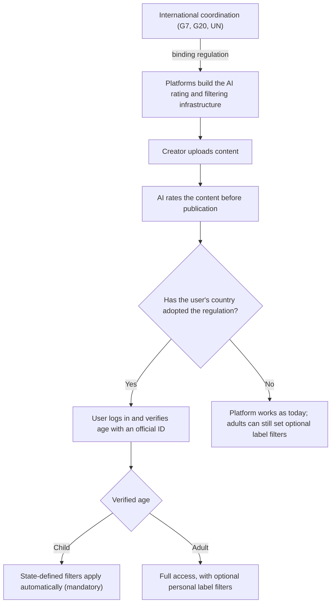

Türkçe: [README.tr.md](README.tr.md)

# AI-Based Content Rating with ID-Verified Age for Social Media Platforms

## Summary

This proposal calls for bringing the content rating system already used in traditional media, such as national TV channels and cinema (Türkiye's "Akıllı İşaretler" / smart signs), to social media platforms. Every piece of content uploaded to a platform would be rated automatically by AI before publication. In countries that choose to adopt the regulation, users would verify their age with an official ID when they log in. Content filters set by the state would then apply automatically, and without exception, to users identified as children. Adults could optionally set their own filters, whether or not their country has adopted the regulation.

Global technology companies are unlikely to build such infrastructure voluntarily, and they operate across borders. The proposal therefore asks the proposing country (Türkiye) to lead an effort to put the issue on the agenda of the G7, the G20, the United Nations or similar international platforms. The aim is a common action plan that makes the infrastructure a binding international regulation for platforms such as YouTube, Instagram and TikTok. Each country would stay free to activate it under its own legislation.

## Problem

- **Blanket bans are being discussed.** Some countries, such as France, are debating legal measures that would ban social media entirely for children below a certain age.
- **Legitimate concerns exist.** In Türkiye there is also well-founded concern about children being exposed to inappropriate content on social media and spending too much time on screens.
- **Bans carry their own risk.** Cutting children off from the digital world entirely risks pushing them toward unsupervised, illegal or far more dangerous alternative channels.
- **Valuable content would be lost.** Platforms like YouTube host countless educational videos and even full lessons that support children's academic and personal development.
- **Voluntary action is unrealistic.** It is not realistic to expect profit-driven social media companies to build a comprehensive safety and content-filtering infrastructure on their own.
- **National action alone is insufficient.** Social media giants operate globally, so the problem crosses national borders and needs international cooperation.

The most sensible solution is not to pull children away from the platforms they already use. It is to put regulations in place that make those platforms safe and auditable for them.

## Proposed Solution

Integrate the content rating system used in traditional media into social media platforms, and make it a legal obligation for global companies. The regulatory framework has three core pillars:

1. **AI-assisted automatic classification.** Every piece of content uploaded to social media platforms is automatically analyzed and rated by advanced AI before it is published (e.g., Educational, General Audience, 13+, Contains Violence/Horror).
2. **Identity verification and national-authority integration.** Social media companies are obliged to build this filtering infrastructure. In countries that want to apply the regulation within their borders, official ID/age verification at login is made technically mandatory.
3. **"Mandatory" filters for children, "optional" filters for adults.** For users identified as children through age verification, content filters set by the state are applied automatically and are strictly mandatory. This is not left to individual discretion. Adults who meet the age criteria can personalize their own settings to block content labels they do not want on their accounts, whether or not their country applies the regulation.

## How It Works

### Operating model

| Layer | Who is responsible | Mandatory or optional |
|---|---|---|
| Building the AI rating and filtering infrastructure | Social media companies | Mandatory for platforms (under the international regulation) |
| Adopting the regulation within a country | Each national government | Optional per country |
| ID/age verification at login | Platforms, in adopting countries | Mandatory for every user logged in from an adopting country |
| State-defined content filters for children | Applied automatically on verified age | Mandatory; not left to user or parental discretion |
| Personal label filters for adults | Adult users (and parents as end users) | Optional; available whether or not the country adopts the regulation |

### Flow

1. **Upload:** A creator uploads content to a platform such as YouTube, Instagram or TikTok.
2. **Pre-publication rating:** Before the content is published, an AI model analyzes it and assigns rating labels (Educational, General Audience, 13+, Violence/Horror, etc.), similar to the smart signs used on national channels and in films.
3. **Login and verification:** A user logs in. If the user is logged in from a country that has adopted the regulation, official ID-based age verification is technically required. It is not a choice.
4. **Filter application:**
   - A verified child sees content only through the state-defined filters, which work as an automatic safe mode for the relevant age groups.
   - A verified adult has full access and can optionally block specific content labels.
   - In countries that have not adopted the regulation, the platform still offers the optional personal label filters to adults.
5. **National rules:** Each adopting country defines its filters under its own legal framework.

## Implementation & Phasing

1. **National initiative:** The proposing country (Türkiye) takes ownership of the proposal and prepares it with its relevant institutions.
2. **International agenda-setting:** The proposing country takes the lead in raising the issue with world leaders at the G7, the G20, the United Nations or similar international platforms.
3. **Common action plan:** Leaders unite around a common action plan and take the diplomatic steps needed to make the infrastructure a binding international regulation for global technology companies (YouTube, Instagram, TikTok, etc.).
4. **Platform obligation:** Social media companies are required to build the AI rating, ID/age verification and filtering infrastructure.
5. **Country-by-country activation:** Any country that wishes can activate the infrastructure under its own legislation and set the filters for children. Countries that do not wish to apply it are not required to.

## Stakeholders & Benefits

| Stakeholder | Role / Benefit |
|---|---|
| Children | Keep access to the educational content on the platforms they already use, while being protected from inappropriate content; avoid being pushed to unsupervised channels |
| Parents | Can personalize filters and add optional restrictions as end users |
| Adult users | Gain an optional, personalized way to block unwanted content labels, regardless of national regulation |
| National governments | Can choose to adopt the regulation and set filters within their own legal framework |
| Ministry of Transport and Infrastructure, Information and Communication Technologies Authority (BTK), Ministry of Family and Social Services (Türkiye) | Relevant implementing institutions for the national side of the regulation |
| Social media platforms (YouTube, Instagram, TikTok, etc.) | Build and operate the rating, verification and filtering infrastructure under a single international framework |
| International forums (G7, G20, UN) | Venue for leaders to agree on a common, binding action plan |

The overall benefit is that the internet is protected as a safe space for children and turned into a safe learning environment, without isolating them from the digital world.

## Risks & Mitigations

| Risk | Mitigation in the proposal |
|---|---|
| Blanket age bans push children toward unsupervised or dangerous alternative channels | Keep children on the platforms they already use and make those platforms safe through rating and filtering |
| Platforms will not build the infrastructure voluntarily because of profit motives | Make it a legal obligation (regulation) imposed on the platforms |
| National regulation alone cannot bind global companies | Coordinate through the G7, the G20, the UN or similar platforms for a binding international regulation |
| Countries differ in their legal and cultural preferences | Adoption is optional per country, and filters are defined under each country's own legislation |
| Child protection could be bypassed if it depends on individual choice | In adopting countries, ID-based age verification at login and child filters are mandatory, not left to discretion |
| Adults' freedom of access | Adult filtering stays optional and personal |

## References / Examples

- **France:** Cited as an example of a country debating a full social media ban for children below a certain age.
- **Akıllı İşaretler (smart signs):** The content rating system successfully used on Turkish national TV channels and in cinema (Educational, General Audience, 13+, Violence/Horror, etc.). It serves as the model for the proposed labels.
- **YouTube:** Cited as a platform with countless educational videos and lessons for children.
- **YouTube, Instagram, TikTok:** Named as the main global platforms the regulation would apply to.
- **G7, G20, United Nations:** Proposed international venues for the common action plan.

**Keywords:** child online safety, age verification, content rating, social media regulation, AI moderation, digital policy, online harms, parental controls, G20, international regulation

## Origin

Originally drafted by Merih İlgör as a public policy proposal (July 2026); published here as an open project idea.

## License

This work is licensed under CC BY-NC-SA 4.0 for non-commercial use. See [LICENSE](LICENSE). Commercial use requires a revenue-share agreement. See [COMMERCIAL-LICENSE.md](COMMERCIAL-LICENSE.md). Modified versions may not be sold or transferred to third parties as new ideas, and patent-like rights are reserved; see [COMMERCIAL-LICENSE.md](COMMERCIAL-LICENSE.md#derivatives-improvements-and-idea-protection).
