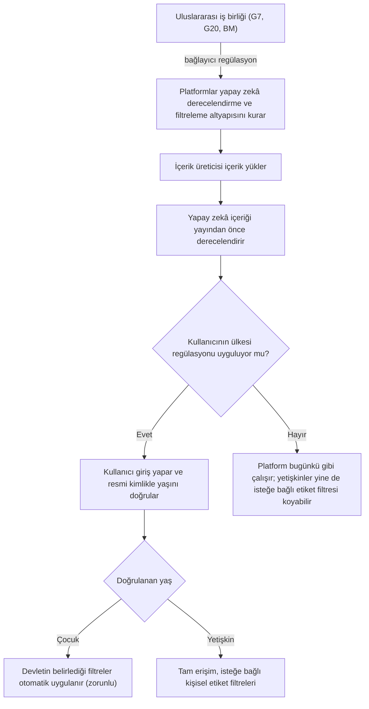

English: [README.md](README.md)

# Sosyal Medya Platformları İçin Yapay Zekâ Destekli İçerik Derecelendirme ve Kimlik Doğrulamalı Yaş Tespiti

## Özet

Bu öneri, geleneksel medyada (ulusal kanallar ve sinema) başarıyla uygulanan içerik derecelendirme (Akıllı İşaretler) sisteminin sosyal medya platformlarına entegre edilmesini ve bunun küresel şirketlere yasal bir zorunluluk olarak getirilmesini öngörmektedir. Platformlara yüklenen her içerik, yayımlanmadan önce yapay zekâ tarafından otomatik olarak derecelendirilir. Regülasyonu uygulamayı seçen ülkelerde kullanıcılar platforma girişte resmi kimlik/yaş doğrulaması yapar. Çocuk olduğu tespit edilen kullanıcılar için devletin belirlediği içerik filtreleri otomatik ve kesinlikle zorunlu olarak devreye girer. Yetişkinler ise, ülkelerinde bu regülasyon uygulansın veya uygulanmasın, kendi filtrelerini opsiyonel olarak düzenleyebilir.

Sosyal medya devleri küresel çapta faaliyet gösterdiği için ulusal çabaların ötesinde uluslararası bir iş birliği gerekir. Bu nedenle konunun G7, G20, Birleşmiş Milletler veya benzeri uluslararası platformlarda Türkiye'nin öncülüğünde dünya liderlerinin gündemine taşınması önerilmektedir. Amaç, isteyen her ülkenin kendi mevzuatına göre devreye alabileceği bu altyapının küresel teknoloji şirketlerine (YouTube, Instagram, TikTok vb.) bağlayıcı bir uluslararası regülasyon olarak getirilmesidir.

## Sorun

- **Tamamen yasaklama tartışılıyor.** Son dönemde Fransa gibi ülkelerde sosyal medyanın belirli yaş altındaki çocuklara tamamen yasaklanmasına yönelik hukuki girişimler ve tartışmalar gündeme gelmektedir.
- **Haklı endişeler var.** Ülkemizde de çocukların sosyal medyada uygunsuz içeriklere maruz kalması ve aşırı ekran süresi tüketmesi haklı bir endişe kaynağıdır.
- **Yasakların da riski var.** Çocukları dijital dünyadan tamamen soyutlamak, onları denetimsiz, yasa dışı veya çok daha tehlikeli alternatif kanallara yönlendirme riski taşır.
- **Değerli içerik kaybedilir.** YouTube gibi platformlarda çocukların akademik ve kişisel gelişimine katkı sağlayan sayısız eğitim videosu ve ders içeriği bulunmaktadır.
- **Gönüllülük gerçekçi değil.** Bu çapta bir güvenlik altyapısının kâr odaklı şirketlerden gönüllü olarak beklenmesi gerçekçi değildir.
- **Ulusal çabalar yetersiz kalır.** Sosyal medya devlerinin küresel çapta faaliyet göstermesi nedeniyle konu ulusal sınırları aşan bir boyuta sahiptir.

En akılcı çözüm, çocukları alıştıkları platformlardan koparmak değil, bu mecraları onlar için güvenli ve denetlenebilir hale getirecek regülasyonları hayata geçirmektir.

## Önerilen Çözüm

Geleneksel medyada başarıyla uygulanan içerik derecelendirme (Akıllı İşaretler) sisteminin sosyal medya platformlarına entegre edilmesi ve küresel şirketlere yasal bir zorunluluk olarak getirilmesi. Önerilen regülasyonun temel çerçevesi üç unsurdan oluşur:

1. **Yapay Zekâ Destekli Otomatik Sınıflandırma:** Sosyal medya platformlarına yüklenen her içerik, yayımlanmadan önce gelişmiş yapay zekâ tarafından otomatik olarak analiz edilip derecelendirilmelidir (Eğitici, Genel İzleyici, +13, Şiddet/Korku içerir vb.).
2. **Kimlik Doğrulaması ve Ulusal Otorite Entegrasyonu:** Sosyal medya şirketleri bu filtreleme altyapısını kurmakla yükümlü olmalıdır. Bu regülasyonu kendi sınırları içinde uygulamak isteyen ülkelerde, kullanıcıların platforma girişlerinde (login) resmi kimlik/yaş doğrulaması yapması teknik olarak zorunlu kılınmalıdır.
3. **Çocuklar İçin "Zorunlu", Yetişkinler İçin "Opsiyonel" Filtre:** Yaş doğrulaması sonucunda çocuk olduğu tespit edilen kullanıcılar için, devletin belirlediği içerik filtreleri otomatik ve kesinlikle zorunlu olarak devreye girmelidir. Bu, inisiyatife bırakılmamalıdır. Yaş kriterlerini sağlayan yetişkin kullanıcılar ise, ülkelerinde bu regülasyon uygulansın veya uygulanmasın, kendi hesaplarında istemedikleri içerik etiketlerini engelleyebilecekleri kişiselleştirilmiş opsiyonel ayar yetkisine sahip olmalıdır.

## Nasıl Çalışır

### İşleyiş modeli

| Katman | Sorumlu | Zorunlu / Opsiyonel |
|---|---|---|
| Yapay zekâ derecelendirme ve filtreleme altyapısının kurulması | Sosyal medya şirketleri | Platformlar için zorunlu (uluslararası regülasyon kapsamında) |
| Regülasyonun ülke içinde uygulanması | Her ülkenin kendi yönetimi | Ülke bazında opsiyonel |
| Girişte kimlik/yaş doğrulaması | Uygulayan ülkelerde platformlar | Uygulayan ülkeden giriş yapan her kullanıcı için zorunlu |
| Çocuklar için devletin belirlediği içerik filtreleri | Doğrulanan yaşa göre otomatik | Zorunlu; kullanıcının veya ebeveynin inisiyatifine bırakılmaz |
| Yetişkinler için kişisel etiket filtreleri | Yetişkin kullanıcılar (ve son kullanıcı olarak ebeveynler) | Opsiyonel; regülasyon olsa da olmasa da sunulur |

### Akış

1. **Yükleme:** İçerik üreticisi YouTube, Instagram, TikTok gibi bir platforma içerik yükler.
2. **Yayın öncesi derecelendirme:** İçerik yayımlanmadan önce yapay zekâ tarafından analiz edilir ve ulusal kanallarda ve filmlerde olduğu gibi derecelendirme etiketleri (Eğitici, Genel İzleyici, +13, Şiddet/Korku vb.) atanır.
3. **Giriş ve doğrulama:** Kullanıcı platforma giriş yapar. Regülasyonu uygulayan bir ülkeden giriş yapılıyorsa, resmi kimliğe dayalı yaş doğrulaması teknik olarak zorunludur ve seçimli değildir.
4. **Filtrelerin uygulanması:**
   - Doğrulanmış çocuk kullanıcı, içerikleri yalnızca devletin belirlediği filtrelerle (belirli yaş grupları için otomatik güvenli mod) görür.
   - Doğrulanmış yetişkin kullanıcı tam erişime sahiptir ve dilerse belirli içerik etiketlerini engelleyebilir.
   - Regülasyonu uygulamayan ülkelerde de yetişkinlere opsiyonel kişisel etiket filtreleri sunulur.
5. **Ulusal kurallar:** Uygulayan her ülke, filtreleri kendi yasal mevzuatı çerçevesinde belirler.

## Uygulama ve Aşamalandırma

1. **Ulusal girişim:** Öneri, öneren ülke (Türkiye) tarafından ilgili kurumlarıyla birlikte sahiplenilir.
2. **Uluslararası gündeme taşıma:** Bu hayati konu, G7, G20, Birleşmiş Milletler veya benzeri uluslararası platformlarda Türkiye'nin öncülüğünde dünya liderlerinin gündemine taşınır.
3. **Ortak eylem planı:** Liderler ortak bir eylem planı etrafında birleşir. İsteyen her ülkenin kendi mevzuatına göre devreye alabileceği bu altyapının küresel teknoloji şirketlerine (YouTube, Instagram, TikTok vb.) bağlayıcı bir uluslararası regülasyon olarak getirilmesi için gerekli diplomatik aksiyonlar alınır.
4. **Platform yükümlülüğü:** Sosyal medya şirketleri, yapay zekâ derecelendirme, kimlik/yaş doğrulama ve filtreleme altyapısını kurmakla yükümlü kılınır.
5. **Ülke bazında devreye alma:** İsteyen her ülke altyapıyı kendi mevzuatına göre devreye alır ve çocuklar için filtreleri belirler. İstemeyen ülke uygulamak zorunda değildir.

## Paydaşlar ve Faydalar

| Paydaş | Rol / Fayda |
|---|---|
| Çocuklar | Alıştıkları platformlardaki eğitim içeriklerine erişmeye devam ederken uygunsuz içeriklerden korunurlar ve denetimsiz kanallara yönelmezler |
| Ebeveynler | Son kullanıcı olarak filtreleri kişiselleştirebilir ve opsiyonel kısıtlamalar getirebilirler |
| Yetişkin kullanıcılar | Ulusal regülasyondan bağımsız olarak istemedikleri içerik etiketlerini engelleyebilecekleri kişiselleştirilmiş, opsiyonel bir imkâna sahip olurlar |
| Ülke yönetimleri | Regülasyonu uygulayıp uygulamamayı seçebilir ve filtreleri kendi yasal çerçevelerinde belirleyebilirler |
| Ulaştırma ve Altyapı Bakanlığı, Bilgi Teknolojileri ve İletişim Kurumu (BTK), Aile ve Sosyal Hizmetler Bakanlığı | Regülasyonun ulusal ayağında ilgili uygulayıcı kurumlar |
| Sosyal medya platformları (YouTube, Instagram, TikTok vb.) | Derecelendirme, doğrulama ve filtreleme altyapısını tek bir uluslararası çerçevede kurar ve işletirler |
| Uluslararası platformlar (G7, G20, BM) | Liderlerin ortak ve bağlayıcı bir eylem planında uzlaşacağı zemin |

Genel fayda: Geleceğimizin teminatı olan çocuklar, dijital dünyadan soyutlanmadan internetin tehlikelerinden korunur ve internet güvenli bir eğitim alanına dönüştürülür.

## Riskler ve Önlemler

| Risk | Öneride yer alan önlem |
|---|---|
| Tamamen yaş yasağı, çocukları denetimsiz veya tehlikeli alternatif kanallara yönlendirebilir | Çocukları alıştıkları platformlarda tutmak ve bu platformları derecelendirme ve filtreleme ile güvenli hale getirmek |
| Kâr odaklı platformlar altyapıyı gönüllü olarak kurmaz | Altyapının platformlara yasal bir zorunluluk (regülasyon) olarak getirilmesi |
| Ulusal regülasyon tek başına küresel şirketleri bağlamaya yetmez | G7, G20, BM veya benzeri platformlarda bağlayıcı uluslararası regülasyon için ortak hareket |
| Ülkelerin yasal ve kültürel tercihleri farklıdır | Uygulama ülke bazında opsiyoneldir ve filtreler her ülkenin kendi mevzuatına göre belirlenir |
| Çocukların korunması bireysel tercihe bırakılırsa etkisiz kalabilir | Uygulayan ülkelerde girişte kimlik/yaş doğrulaması ve çocuk filtreleri zorunludur, inisiyatife bırakılmaz |
| Yetişkinlerin erişim özgürlüğü | Yetişkinler için filtreleme opsiyonel ve kişiseldir |

## Kaynaklar / Örnekler

- **Fransa:** Sosyal medyanın belirli yaş altındaki çocuklara tamamen yasaklanmasını tartışan ülkelere örnek olarak anılmıştır.
- **Akıllı İşaretler:** Ulusal kanallarda ve sinemada başarıyla uygulanan içerik derecelendirme sistemi (Eğitici, Genel İzleyici, +13, Şiddet/Korku vb.). Önerilen etiketlerin modelidir.
- **YouTube:** Çocuklara yönelik sayısız eğitim videosu ve ders içeriği barındıran platform örneği.
- **YouTube, Instagram, TikTok:** Regülasyonun başta uygulanacağı küresel platformlar.
- **G7, G20, Birleşmiş Milletler:** Ortak eylem planı için önerilen uluslararası platformlar.

**Anahtar kelimeler:** çocukların çevrimiçi güvenliği, yaş doğrulama, içerik derecelendirme, sosyal medya düzenlemesi, yapay zekâ moderasyonu, dijital politika, uluslararası düzenleme

## Köken

İlk olarak Merih İlgör tarafından bir kamu politikası önerisi olarak hazırlanmıştır (Temmuz 2026). Burada açık bir proje fikri olarak yayımlanmaktadır.

## Lisans

Bu çalışma, ticari olmayan kullanım için CC BY-NC-SA 4.0 ile lisanslanmıştır. Bkz. [LICENSE](LICENSE). Ticari kullanım için gelir paylaşımı anlaşması gerekir. Bkz. [COMMERCIAL-LICENSE.md](COMMERCIAL-LICENSE.md). Değiştirilmiş sürümler yeni bir fikir olarak satılamaz veya üçüncü kişilere aktarılamaz; patent benzeri haklar saklıdır. Bkz. [COMMERCIAL-LICENSE.md](COMMERCIAL-LICENSE.md#derivatives-improvements-and-idea-protection).
