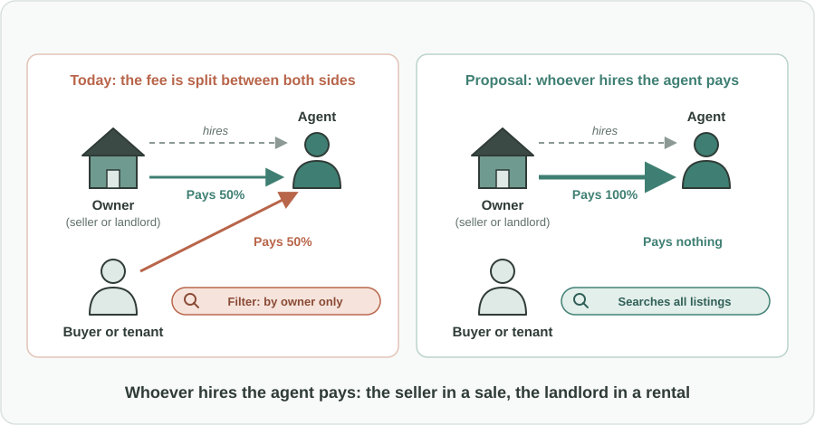
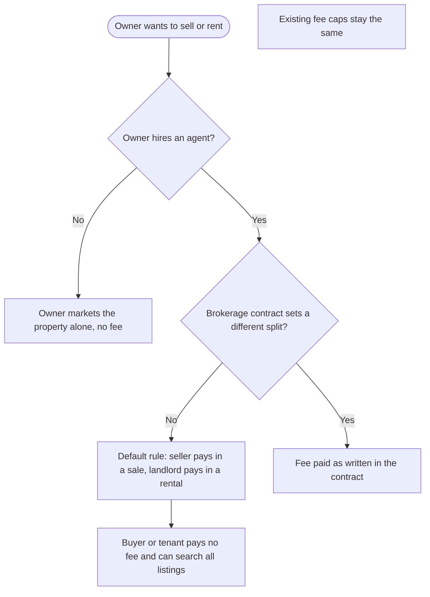

Türkçe: [README.tr.md](README.tr.md)

# Brokerage Fee Paid by the Client: Whoever Hires the Agent Pays the Agent

## Summary

When a property is sold or rented, the work of finding the other side (preparing and publishing listings, answering calls, showing the property, preparing the contract) belongs to the owner. If the owner hands this work to a real estate agent, the owner is the one giving the job, so the owner should pay for it. This proposal makes that the default rule: **the seller pays the brokerage fee in a sale, and the landlord pays it in a rental**, unless the brokerage contract explicitly says otherwise. Buyers and tenants did not hire the agent, so by default they should not be charged. The change is announced through public-service campaigns so everyone knows who pays.

## Problem

- Marketing a property takes real work: writing and publishing listings, taking phone calls, arranging and attending viewings, negotiating and preparing the contract. This is the owner's task, and hiring an agent is the owner's choice.
- Many regulations split the brokerage fee equally between both sides unless agreed otherwise. In practice this means the buyer or tenant pays for a service they **did not order**, from an agent they **did not choose**.
- Buyers and tenants who want to avoid this extra cost filter their searches to **"by owner" listings only**. Good properties listed through agents are skipped, and agents lose potential deals.
- For tenants in particular, a brokerage fee on top of a deposit and the first rent makes moving harder and more expensive.
- Agents' income becomes uneven and uncertain, which makes it harder for agencies to stay in business and to keep or hire staff.

## Proposed Solution

Apply a simple principle: **whoever gives the job pays for the job.**

1. **Default payer in a sale:** the seller pays the brokerage fee.
2. **Default payer in a rental:** the landlord pays the brokerage fee.
3. **Contract can say otherwise:** the parties may still agree on a different split, but only if the brokerage contract states it clearly. Without such a clause, the default applies.
4. **Existing caps stay:** the maximum fee rates or amounts that a regulation already sets do not change. Only the question of *who* pays changes.
5. **Public awareness:** the new rule is announced with public-service campaigns (television, radio, online) so that owners, buyers, tenants and agents all know who pays from the start.

## How It Works

| Situation | Who hires the agent | Who pays the fee by default |
|---|---|---|
| Owner sells a property through an agent | Seller | Seller |
| Owner rents out a property through an agent | Landlord | Landlord |
| Buyer or tenant hires their own agent to search for them | Buyer or tenant | Buyer or tenant |
| The brokerage contract clearly sets a different split | As agreed | As written in the contract |
| No agent involved ("by owner") | Nobody | No fee |

For a buyer or tenant, the experience becomes simple: the listed price or rent is what they pay, whether the property is offered by the owner or through an agent.

## Implementation & Phasing

1. **Rule change:** the regulator changes the default fee rule so that the party who hires the agent (the seller or the landlord) pays, keeping the possibility of a different written agreement.
2. **Transition period:** a clear start date, so that brokerage contracts signed before it continue under the old rule and new contracts follow the new one.
3. **Public-service campaign:** short, clear announcements explaining who pays, aimed at owners, buyers, tenants and agents.
4. **Listing clarity:** listing platforms and agencies show on every listing that the buyer or tenant pays no brokerage fee by default.
5. **Review:** after a period, the regulator reviews complaints, agent activity and market feedback, and adjusts guidance if needed.

## Stakeholders & Benefits

- **Buyers and tenants:** no fee for a service they did not order; lower moving costs; free to consider every listing.
- **Owners (sellers and landlords):** a clear, predictable cost for a service they choose, and wider reach because buyers no longer avoid agent listings.
- **Real estate agents:** more business, because buyers and tenants stop filtering to "by owner" listings; a single, clear client; steadier income.
- **Employment:** steadier agency income helps more agencies stay in business and supports jobs in the sector.
- **Regulators and consumer bodies:** a simple, fair rule that is easy to explain and reduces disputes about who owes what.

## Risks & Mitigations

| Risk | Mitigation |
|---|---|
| Owners add the fee to the price or rent | The fee becomes part of a visible, comparable price; buyers and tenants no longer face a separate, unexpected charge; existing fee caps still apply |
| Contracts use the "otherwise agreed" clause to push the fee back to buyers and tenants | The exception is valid only if it is written clearly in the brokerage contract; the regulator monitors misuse |
| Confusion during the change | A clear start date and public-service campaigns before and after it |
| Agents resist the change | Emphasize the upside: more buyers and tenants considering agent listings, and one clear client relationship |

**Keywords:** brokerage fee, real estate agent, commission, property sale, rental market, tenant rights, consumer protection, housing costs, fair pricing

## Origin

Originally proposed by Merih İlgör (November 2025); published here as an open project idea.

## License

This work is licensed under CC BY-NC-SA 4.0 for non-commercial use; see [LICENSE](LICENSE). Commercial use requires a revenue-share agreement; see [COMMERCIAL-LICENSE.md](COMMERCIAL-LICENSE.md). Modified versions may not be sold or transferred to third parties as new ideas, and patent-like rights are reserved; see [COMMERCIAL-LICENSE.md](COMMERCIAL-LICENSE.md#derivatives-improvements-and-idea-protection).
