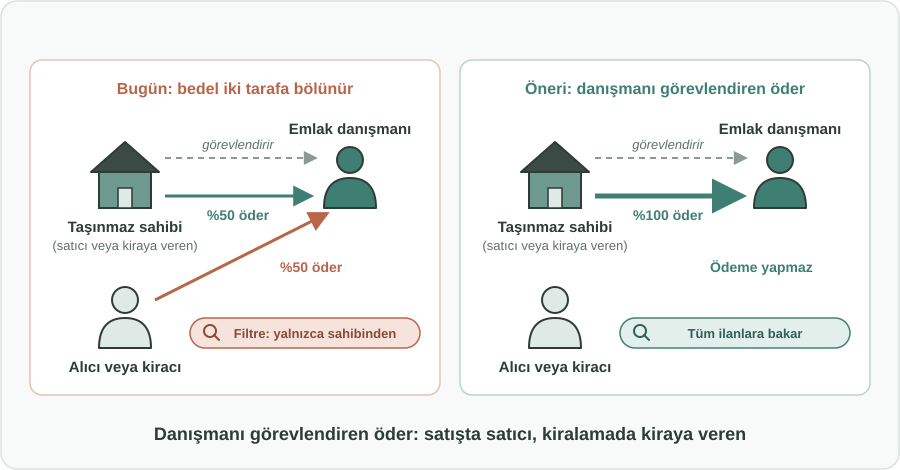
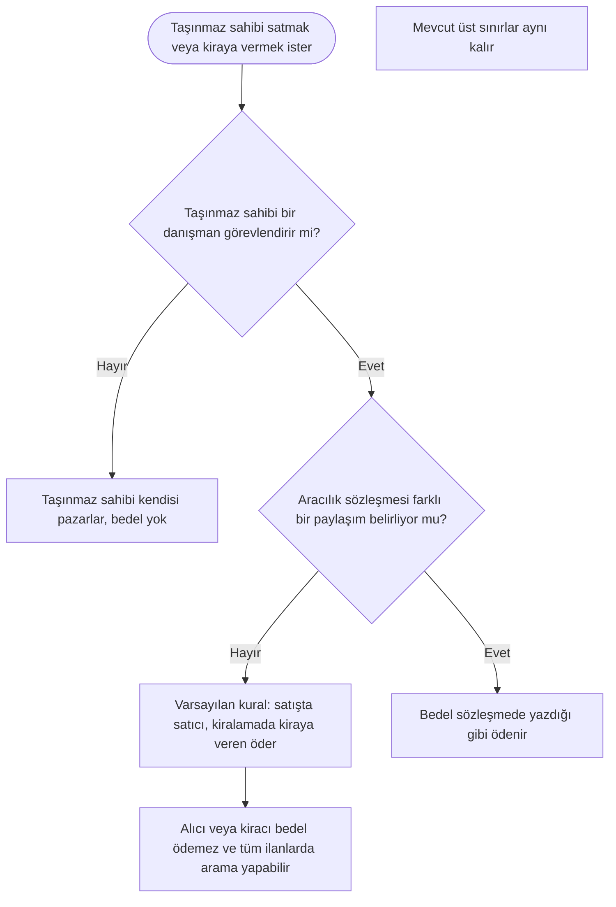

English: [README.md](README.md)

# Emlak Komisyonunu İşi Veren Öder: Aracıyı Kim Görevlendirdiyse Hizmet Bedelini O Öder

## Özet

Bir taşınmaz satılırken veya kiraya verilirken karşı tarafı bulma işi (ilanı hazırlayıp yayınlamak, telefonlara cevap vermek, taşınmazı göstermek, sözleşmeyi hazırlamak) taşınmaz sahibine aittir. Taşınmaz sahibi bu işi bir emlak danışmanına verirse, işi veren kendisi olduğu için bedelini de kendisi ödemelidir. Bu öneri bunu varsayılan kural haline getirir: **satışta hizmet bedelini satıcı, kiralamada ise kiraya veren öder**; aracılık sözleşmesinde açıkça aksi yazılmadıkça bu kural geçerlidir. Alıcı ve kiracı aracıyı görevlendirmediği için varsayılan olarak bedel ödememelidir. Değişiklik, herkesin kimin ödeyeceğini bilmesi için kamu spotlarıyla duyurulur.

## Sorun

- Bir taşınmazı pazarlamak gerçek bir emek ister: ilan yazıp yayınlamak, telefonlara bakmak, gösterimleri ayarlayıp katılmak, pazarlık yürütmek ve sözleşmeyi hazırlamak. Bu, taşınmaz sahibinin işidir; emlak danışmanıyla çalışmak da onun tercihidir.
- Birçok düzenleme, aksi kararlaştırılmadıkça hizmet bedelini iki taraf arasında eşit paylaştırır. Uygulamada bu, alıcının veya kiracının **sipariş etmediği** bir hizmet için, **seçmediği** bir aracıya ödeme yapması demektir.
- Bu ek maliyetten kaçınmak isteyen alıcılar ve kiracılar aramalarını **yalnızca "sahibinden" ilanlarla** sınırlar. Emlak danışmanı aracılığıyla ilana çıkan iyi taşınmazlar atlanır, danışmanlar da olası işlemleri kaybeder.
- Özellikle kiracılar için depozito ve ilk kiranın üzerine eklenen komisyon, taşınmayı zorlaştırır ve pahalılaştırır.
- Emlak danışmanlarının gelirleri düzensiz ve belirsiz hale gelir; bu da işletmelerin ayakta kalmasını, çalışanlarını korumasını ve yeni eleman almasını zorlaştırır.

## Önerilen Çözüm

Basit bir ilkeyi uygulamak: **işi veren, işin bedelini öder.**

1. **Satışta varsayılan ödeyen:** Hizmet bedelini satıcı öder.
2. **Kiralamada varsayılan ödeyen:** Hizmet bedelini kiraya veren öder.
3. **Sözleşmeyle farklı düzenleme:** Taraflar yine farklı bir paylaşım üzerinde anlaşabilir; ancak bu, aracılık sözleşmesinde açıkça yazılı olmalıdır. Böyle bir hüküm yoksa varsayılan kural uygulanır.
4. **Mevcut üst sınırlar korunur:** Düzenlemelerin zaten belirlediği azami oran veya tutarlar değişmez. Değişen tek şey bedeli *kimin* ödediğidir.
5. **Kamuoyunun bilgilendirilmesi:** Yeni kural kamu spotlarıyla (televizyon, radyo, internet) duyurulur; böylece taşınmaz sahipleri, alıcılar, kiracılar ve emlak danışmanları en baştan kimin ödeyeceğini bilir.

## Nasıl Çalışır

| Durum | Aracıyı görevlendiren | Varsayılan olarak bedeli ödeyen |
|---|---|---|
| Taşınmaz sahibi taşınmazı bir danışman aracılığıyla satar | Satıcı | Satıcı |
| Taşınmaz sahibi taşınmazı bir danışman aracılığıyla kiraya verir | Kiraya veren | Kiraya veren |
| Alıcı veya kiracı, kendisi için arama yapacak bir danışman tutar | Alıcı veya kiracı | Alıcı veya kiracı |
| Aracılık sözleşmesi açıkça farklı bir paylaşım belirler | Anlaşıldığı gibi | Sözleşmede yazdığı gibi |
| Aracı yok ("sahibinden") | Kimse | Bedel yok |

Alıcı veya kiracı için durum sadeleşir: taşınmaz ister sahibinden ister bir danışman aracılığıyla sunulsun, ödenecek tutar ilandaki fiyat veya kiradır.

## Uygulama ve Fazlandırma

1. **Kural değişikliği:** Düzenleyici kurum, varsayılan bedel kuralını aracıyı görevlendiren tarafın (satıcı veya kiraya veren) ödeyeceği şekilde değiştirir; yazılı olarak farklı bir anlaşma yapma imkânı korunur.
2. **Geçiş dönemi:** Net bir başlangıç tarihi belirlenir; bu tarihten önce imzalanan aracılık sözleşmeleri eski kurala, yeni sözleşmeler ise yeni kurala tabi olur.
3. **Kamu spotu kampanyası:** Kimin ödeyeceğini anlatan kısa ve net duyurular taşınmaz sahiplerine, alıcılara, kiracılara ve emlak danışmanlarına ulaştırılır.
4. **İlanlarda açıklık:** İlan platformları ve emlak işletmeleri, her ilanda alıcı veya kiracının varsayılan olarak hizmet bedeli ödemediğini gösterir.
5. **Değerlendirme:** Belirli bir süre sonra düzenleyici kurum şikâyetleri, sektör hareketliliğini ve piyasadan gelen geri bildirimleri değerlendirir, gerekirse yönlendirmeleri günceller.

## Paydaşlar ve Faydalar

- **Alıcılar ve kiracılar:** Sipariş etmedikleri bir hizmet için bedel ödememe; daha düşük taşınma maliyeti; tüm ilanları değerlendirebilme özgürlüğü.
- **Taşınmaz sahipleri (satıcılar ve kiraya verenler):** Kendi seçtikleri bir hizmet için açık ve öngörülebilir bir maliyet; alıcılar danışman ilanlarından kaçınmadığı için daha geniş erişim.
- **Emlak danışmanları:** Alıcılar ve kiracılar aramalarını "sahibinden" ile sınırlamayı bıraktığı için daha fazla iş; tek ve net bir müşteri; daha istikrarlı gelir.
- **İstihdam:** Daha istikrarlı gelir, daha fazla emlak işletmesinin faaliyetini sürdürmesine yardımcı olur ve sektördeki istihdamı destekler.
- **Düzenleyici kurumlar ve tüketici kuruluşları:** Anlatması kolay, adil ve kimin neyi ödeyeceği konusundaki anlaşmazlıkları azaltan basit bir kural.

## Riskler ve Önlemler

| Risk | Önlem |
|---|---|
| Taşınmaz sahipleri bedeli satış fiyatına veya kiraya ekler | Bedel görünür ve karşılaştırılabilir fiyatın parçası olur; alıcı ve kiracı ayrı, beklenmedik bir ödemeyle karşılaşmaz; mevcut üst sınırlar yine geçerlidir |
| Sözleşmelerde "aksi kararlaştırılmadıkça" istisnası kullanılarak bedel yeniden alıcı ve kiracıya yüklenir | İstisna yalnızca aracılık sözleşmesinde açıkça yazılıysa geçerlidir; düzenleyici kurum kötüye kullanımı izler |
| Geçiş sırasında kafa karışıklığı | Net bir başlangıç tarihi ve bu tarihten önce ve sonra kamu spotları |
| Emlak danışmanlarının değişikliğe direnmesi | Kazanımların vurgulanması: danışman ilanlarını değerlendiren daha fazla alıcı ve kiracı, tek ve net bir müşteri ilişkisi |

**Anahtar kelimeler:** emlak komisyonu, hizmet bedeli, emlak danışmanı, taşınmaz satışı, kiralama, kiracı hakları, tüketici hakları, konut maliyeti

## Köken

Merih İlgör tarafından önerilmiştir (Kasım 2025); burada açık bir proje fikri olarak yayımlanmaktadır.

## Lisans

Bu çalışma, ticari olmayan kullanım için CC BY-NC-SA 4.0 lisansı ile lisanslanmıştır; bkz. [LICENSE](LICENSE). Ticari kullanım bir gelir paylaşımı anlaşması gerektirir; bkz. [COMMERCIAL-LICENSE.md](COMMERCIAL-LICENSE.md). Değiştirilmiş sürümler yeni bir fikir olarak satılamaz veya üçüncü kişilere aktarılamaz; patent benzeri haklar saklıdır. Bkz. [COMMERCIAL-LICENSE.md](COMMERCIAL-LICENSE.md#derivatives-improvements-and-idea-protection).
