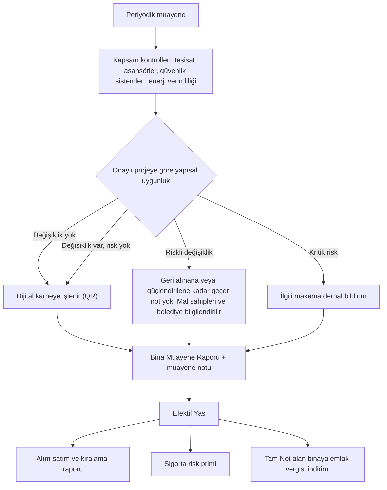
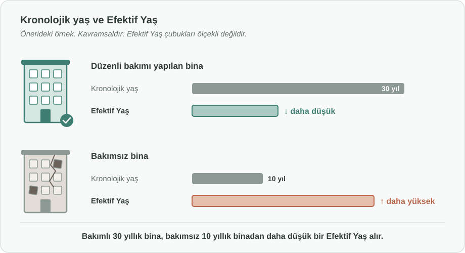

# Bina Muayene ve Efektif Yaş Değerleme Sistemi

English: [README.md](README.md)

## Özet

Konut stoku (ev/apartman/site) için araç muayenesine benzer, periyodik bir **"Bina Muayene Sistemi"** önerilmektedir. Bu sistemde konutlar sadece kronolojik yaşlarına göre değil; fiziksel kondisyonlarına, teknik altyapılarına, enerji verimliliklerine, güvenlik standartlarına ve **onaylı projesine yapısal uygunluğuna** göre değerlendirilerek bir **"Efektif Yaş"** ile tanımlanır. Amaç; oturan kişilerin güvensiz ve sağlıksız koşullara maruz kalmasının önüne geçmek, satın alma ve kiralama süreçlerindeki gizli maliyetleri ve şüpheleri ortadan kaldırmak, konut değerlemelerinde objektif bir yapı sağlamak, ulusal enerji tüketimini azaltmak, istihdam yaratmak ve konut sigortalarında risk priminin daha hesaplanabilir ve daha düşük olmasını sağlamaktır. Eski binalara yük oluşturmamak adına sistem fazlar halinde devreye alınır.

## Sorun

- Ülkemizdeki konutlar sadece kronolojik yaşlarına göre değerlendirilmektedir. Bu durum bakımlı ancak yaşlı binaların değer kaybetmesine, yeni ancak teknik altyapısı (paslı borular, çalışmayan jeneratörler) sorunlu binaların ise gizli riskler taşımasına neden olmaktadır.
- Mevcut durumda binalar satış ve kiralama aşamasında yalnızca estetik unsurlarıyla değerlendirilmektedir. Paslı tesisat boruları, işlevsiz yangın/jeneratör sistemleri ve düşük enerji verimliliği gibi "gizli kusurlar" hem ekonomik kayba hem de güvenlik riskine yol açmaktadır.
- Oturan kişiler paslı borular, çalışmayan jeneratör ve alarmlar, çalışmayan dedektörler ve bakımsız asansörler gibi güvensiz ve sağlıksız unsurlara maruz kalmaktadır.
- LED ampullerle değiştirilmemiş, enerji sarfiyatı yüksek lambalar ile çalışmayan veya verimsizleşen gün-ısı (güneş enerjisi) sistemleri enerji sarfiyatını artırmakta ve ülkenin enerji tüketimini etkilemektedir.
- Bina tamamlandıktan sonra yapılan izinsiz yapısal değişiklikler (kolon ve kirişlerin kesilmesi veya oyulması, taşıyıcı/perde duvarların kaldırılması, ruhsatsız kat veya ek yapılması vb.) fark edilmemektedir. Bu değişiklikler binanın deprem dayanımını zayıflatmakta; yalnızca değişikliği yapanları değil, binadaki herkesi tehlikeye atmaktadır.
- Satın alma ve kiralama süreçlerinde gizli maliyetler ve şüpheler bulunmakta, konut değerlemelerinde objektif bir yapı bulunmamaktadır.

## Önerilen Çözüm

Konut stoku için araç muayenesine benzer, periyodik bir **"Bina Muayene ve Efektif Yaş Değerleme Sistemi"** kurulmalıdır. Sistemin temel bileşenleri şunlardır:

1. **Efektif Yaş Hesaplaması:** Binaların kronolojik yaşından ziyade bakım durumu ve teknik altyapısına göre bir "Efektif Yaş" puanı oluşturulmalıdır. Düzenli bakımı yapılan 30 yıllık bir bina, bakımsız 10 yıllık bir binadan daha değerli ve güvenli kabul edilmelidir. Bakımları tam binaların "Efektif Yaşı" düşük hesaplanmalıdır.
2. **Teknik Denetim Kapsamı:** Araç muayenesine benzer şekilde; tesisatlar (paslı boru kontrolü), asansörler, güvenlik sistemleri (alarm, yangın tesisatı, jeneratör, hidrofor) ve enerji verimliliği (ortak alan aydınlatmalarının LED dönüşümü, gün-ısı sistemlerinin verimliliği) periyodik denetime tabi tutulmalıdır.
3. **Enerji ve Ekonomi Verimliliği:** Verimsiz aydınlatma ve ısıtma sistemlerinin tespiti ile ulusal enerji sarfiyatının azaltılması hedeflenmeli; bu dönüşüm için teşvik mekanizmaları kurulmalıdır.
4. **Yapısal Uygunluk Kontrolü:** Her muayenede binada ilk onaylı projeye (mimari ve statik proje) göre değişiklik yapılıp yapılmadığı kontrol edilmeli; yapıldıysa bu değişikliğin deprem veya diğer riskleri doğurup doğurmadığı değerlendirilmelidir.

## Nasıl Çalışır

### Denetim Kapsamı

| Alan | Denetlenen unsurlar |
|---|---|
| Yapısal uygunluk | Onaylı ilk projeye göre yapılan değişiklikler: kesilmiş veya oyulmuş kolon ve kirişler, kaldırılmış taşıyıcı duvarlar, ruhsatsız kat veya ekler, ciddi ek yük getiren kullanım değişiklikleri |
| Tesisat | Paslı boru kontrolü |
| Güvenlik sistemleri | Alarm, yangın tesisatı, dedektörler, jeneratör, hidrofor |
| Düşey ulaşım | Asansörler |
| Enerji verimliliği | Aydınlatmaların (ortak alanlar dahil) LED dönüşümü, gün-ısı/güneş enerjisi sistemlerinin verimliliği, verimsiz aydınlatma ve ısıtma sistemleri |

### İlk Projeye Göre Yapısal Uygunluk Kontrolü

1. **Onaylı projeyle karşılaştırma:** Binanın mevcut durumu, belediyede kayıtlı onaylı mimari ve statik projesiyle karşılaştırılır.
2. **Değişikliklerin tespiti:** Kolon ve kirişlerin kesilmesi veya oyulması, taşıyıcı (perde) duvarların kaldırılması, taşıyıcı elemanlarda açılan boşluklar, ruhsatsız kat, ek veya ağır yükler gibi yapısal değişiklikler kayıt altına alınır.
3. **Risk değerlendirmesi:** Değişiklik tespit edilirse, bir inşaat (statik) mühendisi bu değişikliğin deprem riski veya çökme, aşırı yüklenme gibi diğer riskleri doğurup doğurmadığını değerlendirir.
4. **Sonuca göre işlem:**
   - *Risk yok:* Değişiklik binanın dijital karnesine işlenir.
   - *Risk var:* Değişiklik geri alınana veya mühendislik projesiyle ilgili eleman güçlendirilene kadar bina geçer not alamaz; mal sahipleri ve belediye bilgilendirilir.
   - *Can güvenliğini tehdit eden kritik risk:* Acil güvenlik önlemleri alınabilmesi için ilgili makam derhal bilgilendirilir.
5. **Sorumluluğun belirlenmesi:** Kayıtlar elverdiği ölçüde değişikliği yapan bağımsız bölüm veya kişi belirlenir; böylece onarım maliyeti haksız şekilde tüm sakinlere yüklenmez.

### Efektif Yaş ve Bina Muayene Raporu

- Her muayene sonucunda bir **"Bina Muayene Raporu"** ve **"muayene notu"** oluşturulur; binanın **Efektif Yaşı** buna göre hesaplanır.
- Risk doğuran bir yapısal değişiklik diğer tüm puanların önüne geçer: bina ne kadar bakımlı olursa olsun, risk giderilene kadar geçer not ve düşük Efektif Yaş alamaz.
- Konut **alım-satım ve kiralama** süreçlerinde "Bina Muayene Raporu" zorunlu hale getirilerek gizli maliyetlerin önüne geçilir, şeffaf ve objektif değerleme sağlanır.
- **Konut sigortalarında** risk primi, binanın muayene notuna göre belirlenerek bakımlı bina sakinlerine daha düşük prim avantajı sunulur.

### Muayene Periyodu

- Araç muayenesinde olduğu gibi bakım ve denetimler düzenli aralıklarla yapılır.
- Yeni binalar için ilk "n" yıl (önerilen: 5-10 yıl) muafiyet uygulanır; ardından periyodik kontrol zorunlu hale gelir.

### Dijital Bina Karnesi (QR Kod)

- Her binanın muayene raporları ve notları, Efektif Yaşı, yapılan bakım, onarım ve yenilemeleri ile tespit edilen her yapısal değişikliği (risk değerlendirmesi ve çözümüyle birlikte) içeren **dijital bir geçmişi (karnesi)** tutulur.
- Bina girişine yerleştirilen bir **QR kod** bu karneye bağlanır; sakinler, alıcı ve kiracı adayları, sigortacılar ve denetçiler binanın güncel durumunu ve geçmişini şeffaf şekilde görebilir.

### Teşvik Modeli: Emlak Vergisi İndirimi

- Muayeneden **"Tam Not"** alan binalara **emlak vergisi indirimi** sağlanır.
- Böylece bakım, düşük sigorta primine ek olarak mal sahipleri ve sakinler için doğrudan kazanca dönüşür ve gönüllü, düzenli bakım teşvik edilir.

## Uygulama ve Fazlandırma

Eski binalara ani ve ağır mali yükler getirmemek adına sistem kademeli olarak devreye alınmalıdır:

| Faz | Kapsam |
|---|---|
| 1. Faz | Yeni binalar için ilk 5-10 yıl muafiyet, ardından periyodik kontrol zorunluluğu. |
| 2. Faz | Kamu binaları ve büyük sitelerden başlanarak yaygınlaştırma. |
| 3. Faz | Eski binalarda "Güvenlik Öncelikli" (asansör, yangın, elektrik) denetimler; enerji verimliliği dönüşümü için uzun vadeli kredi imkanları ve teşvikli dönüşüm modelleri. |

**Uygulayıcı paydaşlar:**

- **Çevre, Şehircilik ve İklim Değişikliği Bakanlığı:** Konu doğrudan bu bakanlığın yetki alanındadır (sorumlu kurum).
- **Hazine ve Maliye Bakanlığı:** Sistemin sigorta ayağı için koordinasyon.
- **Enerji ve Tabii Kaynaklar Bakanlığı:** Sistemin enerji ayağı için koordinasyon.

## Paydaşlar ve Faydalar

Sistem, **her paydaşının bu sistemden faydalanacağı** şekilde tasarlanmıştır:

- **Konut sakinleri:** Paslı borular, çalışmayan dedektörler ve bakımsız asansörler gibi can sağlığını tehdit eden unsurlar en aza indirilir; barınma kalitesi artar. Deprem güvenliğini azaltan izinsiz yapısal değişiklikler afet öncesinde tespit edilir.
- **Alıcılar, satıcılar ve kiracılar:** Şeffaf emlak piyasa değeri; gizli maliyetlerin ve şüphelerin ortadan kalkması; objektif değerleme.
- **Bakımlı bina sahipleri:** Daha düşük Efektif Yaş sayesinde bakımın değere yansıması; muayeneden "Tam Not" alan binalar için emlak vergisi indirimi.
- **Sigorta sektörü ve sigortalılar:** Daha hesaplanabilir ve bakımlı binalar için daha düşük risk primleri.
- **İstihdam ve sektör:** Bina denetim uzmanlığı, teknik bakım personeli ve yenilenebilir enerji montaj ekipleri için yeni bir iş kolu ve istihdam alanı.
- **Ülke:** Ulusal enerji tüketiminde büyük bir tasarruf kalemi, enerji tasarrufu ile dış ticaret açığının azalması ve daha sürdürülebilir bir kentsel doku.

## Riskler ve Önlemler

| Risk | Önlem |
|---|---|
| Eski binalara yüklü mali külfet çıkması | Fazlar halinde devreye alma; eski binalarda güvenlik öncelikli denetim; uzun vadeli kredi imkanları ve teşvikli dönüşüm modelleri |
| Yeni binalara gereksiz yük | İlk "n" yıl (5-10 yıl) muafiyet |
| Enerji verimliliği dönüşümünün maliyeti | Dönüşüm için teşvik mekanizmaları |
| Deprem dayanımını zayıflatan izinsiz yapısal değişiklikler (ör. kolon kesilmesi) | Her muayenede onaylı projeyle karşılaştırma, mühendislik risk değerlendirmesi, geçer not öncesi zorunlu onarım/güçlendirme, kritik risklerde acil bildirim |
| Eski binalarda ilk proje belgelerinin eksik veya güncel olmaması | İlk muayenede yapılan yapısal rölöve ile sonraki muayenelerin karşılaştırılacağı bir başlangıç kaydı oluşturulması |

## Referanslar / Örnekler

Özgün öneride verilen örnekler:

- **Bakımlı ve bakımsız bina:** Düzenli bakımı yapılan 30 yıllık bir bina, bakımsız 10 yıllık bir binadan daha değerli ve güvenli kabul edilmelidir.
- **Tipik gizli kusurlar:** Paslı tesisat boruları, çalışmayan jeneratör ve alarmlar, çalışmayan dedektörler, bakımsız asansörler.
- **Enerji israfı:** LED ampullerle değiştirilmemiş, enerji sarfiyatı yüksek lambalar; çalışmayan veya verimsizleşen gün-ısı/güneş enerjisi sistemleri.
- **Model:** Periyodik araç muayenesi.

**Anahtar kelimeler:** bina muayenesi, deprem güvenliği, yapısal güvenlik, efektif yaş, konut politikası, gayrimenkul değerleme, konut sigortası, enerji verimliliği, kentsel dönüşüm, dijital bina karnesi, emlak vergisi indirimi

## Köken

İlk olarak Merih İlgör tarafından bir kamu politikası önerisi olarak hazırlanmıştır (Ocak 2026); burada açık bir proje fikri olarak yayımlanmaktadır.

## Lisans

Bu çalışma, ticari olmayan kullanım için CC BY-NC-SA 4.0 lisansı ile lisanslanmıştır (bkz. [LICENSE](LICENSE)). Ticari kullanım için gelir paylaşımı anlaşması gereklidir (bkz. [COMMERCIAL-LICENSE.md](COMMERCIAL-LICENSE.md)).
