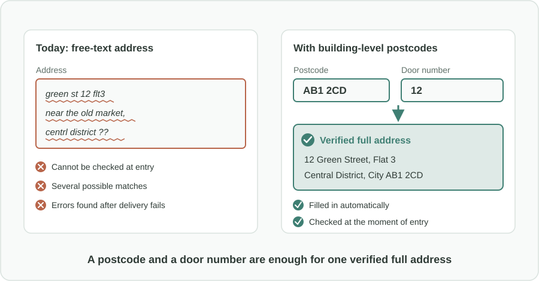
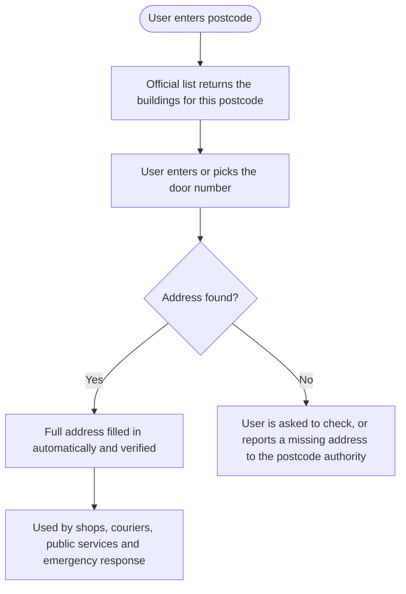

Türkçe: [README.tr.md](README.tr.md)

# Building-Level Postcodes: A Full Address from a Postcode and a Door Number

## Summary

In many countries a postcode covers a whole district or neighborhood, so addresses are typed as long free text and are often wrong or incomplete. This proposal gives **each building (or a small group of buildings) its own unique postcode**, as in the UK system. Then a postcode plus a door number is enough to find the full address. Forms can validate and autofill addresses, and the costly work of correcting bad addresses, which today supports a whole industry, is largely no longer needed.

## Problem

- When a postcode covers a large area, it cannot identify a specific address. People have to type the street, building name, number, neighborhood and district as **free text**.
- Free-text addresses are written in many different ways: spelling mistakes, abbreviations, missing parts, old street names. The same building can appear in dozens of forms.
- Because addresses cannot be **validated** at the moment they are entered, errors are discovered only later, when a parcel does not arrive, a bill goes to the wrong place or a service cannot find the house.
- Significant effort and money go into fixing these errors afterwards. Companies are set up just to clean and correct address data, and organizations run large **address-correction projects**. All of this is a waste caused by a missing system.
- In emergencies, an unclear address costs time exactly when time matters most.

## Proposed Solution

Introduce a detailed postcode system in which the postcode points to a building, not to a whole area:

1. **One postcode per building:** each building, or a small group of neighboring buildings, gets a **unique postcode**. Postcodes stay regionally meaningful: the first part shows the wider area, the last part narrows it down to the building.
2. **Postcode plus door number is enough:** from these two pieces of information, the full official address can be found without typing anything else.
3. **One public address reference:** the postcode authority maintains an official list that links each postcode to its buildings and full addresses, kept up to date as buildings are added, renamed or demolished.
4. **Validation and autofill everywhere:** public services, online shops, banks, couriers and utilities can check the address when it is entered and fill it in automatically, so errors are caught at the start.
5. **Free text becomes the exception:** free-text entry remains only for rare cases, not as the default.

## How It Works

| Step | Today (area-level postcode) | With building-level postcodes |
|---|---|---|
| Entering an address | Type the full address as free text | Enter postcode and door number |
| Checking it | Not possible at entry | Checked instantly against the official list |
| Result | Many spellings for the same place | One standard, verified address |
| Fixing errors | After delivery fails, often by specialist firms | Rarely needed |
| Emergency response | Time lost interpreting the address | Building identified directly |

## Implementation & Phasing

1. **Design and official address reference:** the national postcode authority, with municipalities and the land registry, designs the building-level scheme and builds the official list linking postcodes to buildings and addresses.
2. **Pilot region:** assign building-level postcodes in one city or region and test them with public services, couriers and online shops.
3. **Nationwide rollout:** extend the scheme region by region. Old postcodes remain accepted during a transition period.
4. **Adoption across services:** public forms and major private services switch to postcode plus door number entry with validation and autofill.
5. **Continuous maintenance:** new buildings get a postcode as part of the building permit and address assignment process, so the list stays current.

## Stakeholders & Benefits

- **Citizens:** faster, easier forms and fewer lost deliveries and misdirected letters.
- **E-commerce and logistics companies:** fewer failed deliveries and less money spent on cleaning address data.
- **Postal service and couriers:** clearer routing down to the building.
- **Public services and utilities:** accurate records for billing, notices and service delivery.
- **Emergency services:** quicker, more reliable identification of where help is needed.
- **The wider economy:** resources now spent on correcting addresses can go to productive work, supporting digital government.

## Risks & Mitigations

| Risk | Mitigation |
|---|---|
| People and businesses have to learn new postcodes | Transition period where old postcodes still work; postcodes shown on building plates and official documents |
| The official list becomes out of date | Postcode assignment tied to building permits and address changes; easy reporting of missing addresses |
| Cost of redesigning the postcode system | Pilot region first, then phased rollout |
| Rural or scattered buildings are hard to group | Flexible rule: one building or a small group, decided locally |
| Some services keep using free text | Public services lead the change; validation offered openly so private services can adopt it easily |

**Keywords:** postcode, postal code, address validation, address autofill, digital government, e-commerce, logistics, emergency response, address data quality

## Origin

Originally proposed by Merih İlgör (June 2025); published here as an open project idea.

## License

This work is licensed under CC BY-NC-SA 4.0 for non-commercial use; see [LICENSE](LICENSE). Commercial use requires a revenue-share agreement; see [COMMERCIAL-LICENSE.md](COMMERCIAL-LICENSE.md). Modified versions may not be sold or transferred to third parties as new ideas, and patent-like rights are reserved; see [COMMERCIAL-LICENSE.md](COMMERCIAL-LICENSE.md#derivatives-improvements-and-idea-protection).
