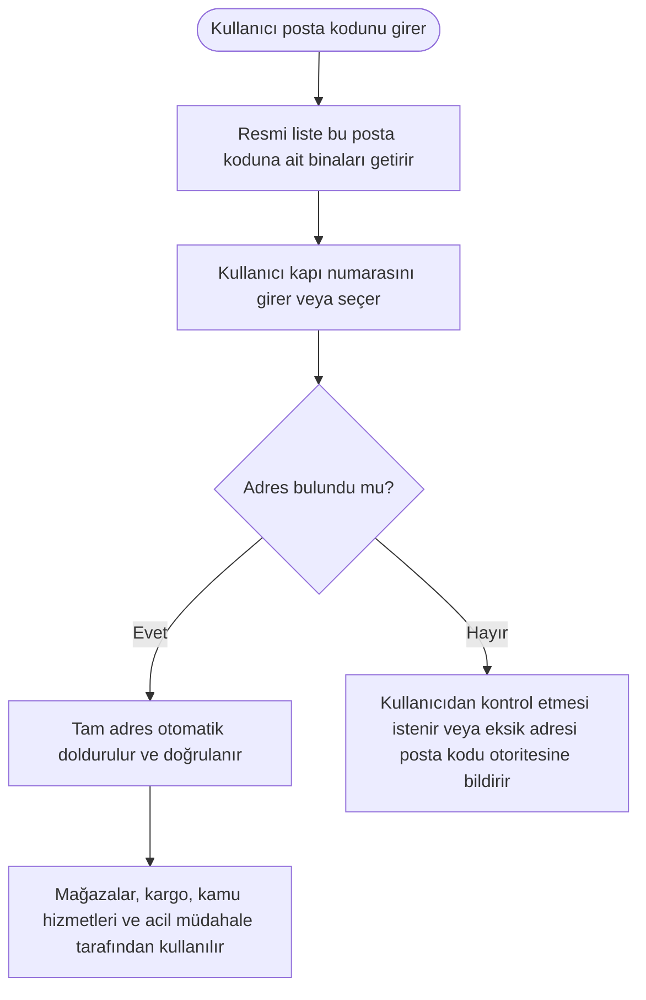

English: [README.md](README.md)

# Bina Düzeyinde Posta Kodu: Posta Kodu ve Kapı Numarasıyla Tam Adres

## Özet

Birçok ülkede bir posta kodu bütün bir ilçeyi veya mahalleyi kapsar; bu yüzden adresler uzun serbest metin olarak yazılır ve sık sık hatalı ya da eksik olur. Bu öneri, Birleşik Krallık'taki sisteme benzer şekilde **her binaya (veya küçük bir bina grubuna) kendine özgü bir posta kodu** verilmesini önerir. Böylece posta kodu ve kapı numarası tam adrese ulaşmak için yeterli olur. Formlar adresi doğrulayıp otomatik doldurabilir; bugün başlı başına bir sektörü besleyen, hatalı adresleri düzeltmeye yönelik maliyetli çalışmalara büyük ölçüde gerek kalmaz.

## Sorun

- Posta kodu geniş bir alanı kapsadığında belirli bir adresi tanımlayamaz. İnsanlar sokağı, bina adını, numarayı, mahalleyi ve ilçeyi **serbest metin** olarak yazmak zorunda kalır.
- Serbest metin adresler çok farklı biçimlerde yazılır: yazım hataları, kısaltmalar, eksik kısımlar, eski sokak adları. Aynı bina onlarca farklı şekilde kayıtlara geçebilir.
- Adresler girildiği anda **doğrulanamadığı** için hatalar ancak sonradan fark edilir: kargo ulaşmaz, fatura yanlış yere gider ya da hizmet evi bulamaz.
- Bu hataları sonradan düzeltmek için ciddi emek ve para harcanır. Yalnızca adres verisini temizlemek ve düzeltmek için firmalar kurulur, kurumlar büyük ölçekli **adres düzeltme projeleri** yürütür. Bunların hepsi, eksik bir sistemin yol açtığı bir israftır.
- Acil durumlarda belirsiz bir adres, zamanın en değerli olduğu anda zaman kaybettirir.

## Önerilen Çözüm

Posta kodunun bütün bir bölgeyi değil, bir binayı gösterdiği ayrıntılı bir posta kodu sistemi kurmak:

1. **Her binaya bir posta kodu:** Her bina veya birbirine komşu küçük bir bina grubu **kendine özgü bir posta kodu** alır. Posta kodları bölgesel olarak anlamlı kalır: ilk kısım geniş bölgeyi gösterir, son kısım binaya kadar daraltır.
2. **Posta kodu ve kapı numarası yeterlidir:** Bu iki bilgiden, başka bir şey yazmadan resmi tam adrese ulaşılabilir.
3. **Tek bir kamusal adres referansı:** Posta kodu otoritesi, her posta kodunu binalarına ve tam adreslerine bağlayan resmi bir liste tutar; binalar eklendikçe, adları değiştikçe veya yıkıldıkça bu liste güncellenir.
4. **Her yerde doğrulama ve otomatik doldurma:** Kamu hizmetleri, çevrim içi mağazalar, bankalar, kargo firmaları ve altyapı hizmetleri adresi girildiği anda kontrol edip otomatik doldurabilir; böylece hatalar en başta yakalanır.
5. **Serbest metin istisna olur:** Serbest metinle adres girişi varsayılan yöntem olmaktan çıkar, yalnızca nadir durumlar için kalır.

## Nasıl Çalışır

| Adım | Bugün (bölge düzeyinde posta kodu) | Bina düzeyinde posta koduyla |
|---|---|---|
| Adres girişi | Tam adres serbest metin olarak yazılır | Posta kodu ve kapı numarası girilir |
| Kontrol | Giriş anında mümkün değil | Resmi listeyle anında kontrol edilir |
| Sonuç | Aynı yer için birçok farklı yazım | Tek, standart ve doğrulanmış adres |
| Hataların düzeltilmesi | Teslimat başarısız olduktan sonra, çoğu zaman uzman firmalarca | Nadiren gerekir |
| Acil müdahale | Adresi yorumlamak için zaman kaybı | Bina doğrudan belirlenir |

## Uygulama ve Fazlandırma

1. **Tasarım ve resmi adres referansı:** Ulusal posta kodu otoritesi, belediyeler ve tapu kadastro birimleriyle birlikte bina düzeyindeki sistemi tasarlar ve posta kodlarını binalara ve adreslere bağlayan resmi listeyi oluşturur.
2. **Pilot bölge:** Bir şehir veya bölgede bina düzeyinde posta kodları verilir ve kamu hizmetleri, kargo firmaları ve çevrim içi mağazalarla test edilir.
3. **Ülke geneline yaygınlaştırma:** Sistem bölge bölge genişletilir. Geçiş döneminde eski posta kodları da kabul edilmeye devam eder.
4. **Hizmetlerde benimsenme:** Kamu formları ve büyük özel hizmetler, doğrulama ve otomatik doldurma ile posta kodu ve kapı numarası girişine geçer.
5. **Sürekli güncelleme:** Yeni binalar, yapı ruhsatı ve adres verme sürecinin bir parçası olarak posta kodu alır; böylece liste güncel kalır.

## Paydaşlar ve Faydalar

- **Vatandaşlar:** Daha hızlı ve kolay formlar, daha az kaybolan kargo ve yanlış yere giden mektup.
- **E-ticaret ve lojistik firmaları:** Daha az başarısız teslimat ve adres verisini temizlemeye daha az harcama.
- **Posta ve kargo hizmetleri:** Bina düzeyine kadar daha net yönlendirme.
- **Kamu hizmetleri ve altyapı kurumları:** Faturalama, tebligat ve hizmet sunumu için doğru kayıtlar.
- **Acil durum hizmetleri:** Yardımın gerektiği yerin daha hızlı ve güvenilir şekilde belirlenmesi.
- **Genel ekonomi:** Bugün adres düzeltmeye harcanan kaynaklar verimli işlere yönelebilir ve dijital devlete katkı sağlar.

## Riskler ve Önlemler

| Risk | Önlem |
|---|---|
| İnsanların ve işletmelerin yeni posta kodlarını öğrenmesi gerekir | Eski posta kodlarının da geçerli olduğu bir geçiş dönemi; posta kodlarının bina tabelalarında ve resmi belgelerde gösterilmesi |
| Resmi liste güncelliğini yitirir | Posta kodu verilmesinin yapı ruhsatı ve adres değişikliklerine bağlanması; eksik adreslerin kolayca bildirilebilmesi |
| Posta kodu sistemini yeniden tasarlamanın maliyeti | Önce pilot bölge, ardından aşamalı yaygınlaştırma |
| Kırsal veya dağınık binaların gruplanması zordur | Esnek kural: tek bina veya küçük bir grup, yerel olarak belirlenir |
| Bazı hizmetler serbest metin kullanmaya devam eder | Değişime kamu hizmetleri öncülük eder; doğrulama herkese açık sunulur, böylece özel hizmetler kolayca benimseyebilir |

**Anahtar kelimeler:** posta kodu, adres doğrulama, adres otomatik doldurma, dijital devlet, e-ticaret, lojistik, acil müdahale, adres verisi kalitesi

## Köken

Merih İlgör tarafından önerilmiştir (Haziran 2025); burada açık bir proje fikri olarak yayımlanmaktadır.

## Lisans

Bu çalışma, ticari olmayan kullanım için CC BY-NC-SA 4.0 lisansı ile lisanslanmıştır; bkz. [LICENSE](LICENSE). Ticari kullanım bir gelir paylaşımı anlaşması gerektirir; bkz. [COMMERCIAL-LICENSE.md](COMMERCIAL-LICENSE.md). Değiştirilmiş sürümler yeni bir fikir olarak satılamaz veya üçüncü kişilere aktarılamaz; patent benzeri haklar saklıdır. Bkz. [COMMERCIAL-LICENSE.md](COMMERCIAL-LICENSE.md#derivatives-improvements-and-idea-protection).
