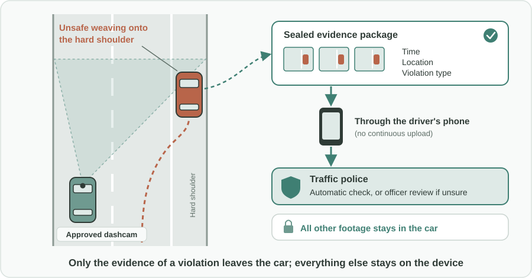
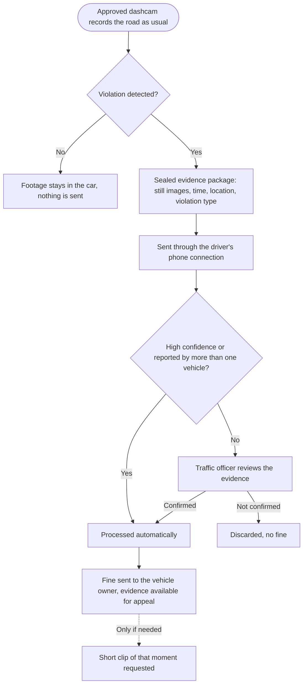

Türkçe: [README.tr.md](README.tr.md)

# Dashcam-Based Traffic Violation Detection: Extending Enforcement Beyond Fixed Cameras

## Summary

Fixed enforcement cameras only see the spot where they are installed. Many of the most dangerous behaviors on the road (unsafe overtaking, lane violations, weaving between lanes, driving on the hard shoulder, tailgating) happen everywhere else. At the same time, many drivers already buy dashcams to have evidence in case of an accident. This proposal turns those dashcams into a road safety network: the traffic police approve selected dashcam models that run a **sealed, tamper-proof violation-detection app**. The camera keeps recording as usual, recognizes traffic violations, and sends **only the relevant evidence** (a few still images, time and location) to the traffic police through the driver's phone connection, where a fine can be issued automatically. To encourage adoption, approved devices are offered to volunteer drivers free of charge or at half price.

## Problem

- Fixed enforcement cameras cover speed, red lights and similar violations **only at the points where they are installed**. Drivers quickly learn where they are and adjust their behavior only there.
- Unsafe overtaking, crossing solid lines, weaving between lanes, unnecessary use of the hard shoulder, dangerous tailgating and similar violations **mostly go unenforced** outside those points, even though they are a common cause of accidents and road rage.
- Patrols cannot be everywhere, and covering every road with fixed cameras is expensive and slow.
- Meanwhile, **many drivers already have a camera in their car**. These cameras see violations every day, but the recordings are only used after an accident, if at all.

## Proposed Solution

Use the cameras that drivers already want in their cars as a trusted, privacy-respecting extension of traffic enforcement:

1. **Approved devices:** the traffic police select and approve specific dashcam models that meet their requirements for image quality, positioning and security.
2. **Sealed detection app:** an official violation-detection app, developed or approved by the traffic police, is installed on these devices. The device is **closed to modification**: the driver cannot alter the app, the recordings or the evidence it produces.
3. **Normal dashcam first:** the device keeps doing its normal job of recording the road for the driver's own protection. Violation detection runs alongside it.
4. **Minimal evidence only:** when the app detects a violation, it sends **only the relevant still images, the time, the location and the violation type** to the traffic police, using the driver's phone connection. There is no continuous upload. A **short video clip** of the relevant moment is sent only if the traffic police request it later.
5. **Tamper-evident evidence:** every evidence package is sealed by the device so that any later change can be detected. Fake or edited evidence is rejected.
6. **Trust score and human review:** each detection carries a confidence level. Detections with **high confidence**, or the same violation reported independently by **more than one vehicle**, can be processed automatically. **Low-confidence** detections go to a **traffic officer for review** before any fine is issued.
7. **Automatic fines:** confirmed violations are processed like fixed-camera violations: the fine is issued and sent to the vehicle owner, with the evidence available for review and appeal.
8. **Incentive for drivers:** to make the approved device the natural choice over ordinary dashcams, it is offered to **volunteer drivers free of charge or at half price**.

## How It Works

| Step | What happens |
|---|---|
| Driving | The approved dashcam records the road like any dashcam; footage stays on the device |
| Violation seen | The sealed app recognizes a violation (for example weaving across a solid line or driving on the hard shoulder) |
| Evidence package | A few still images, time, location and violation type are sealed into a small evidence package |
| Sending | The package travels through the driver's phone connection to the traffic police; nothing else is uploaded |
| Checking | High-confidence or multi-vehicle corroborated cases are processed automatically; low-confidence cases go to an officer |
| Fine | A confirmed violation leads to a fine sent to the vehicle owner, with evidence available for appeal |
| Follow-up | If needed, the traffic police can request a short clip of that moment only |

## Implementation & Phasing

1. **Standards and approval:** the traffic police define the requirements for approved devices and the list of violations the app may detect, together with the data protection authority.
2. **Pilot:** a limited number of volunteer drivers on selected roads use approved devices. In this phase every detection is reviewed by an officer, to measure accuracy and tune the trust score.
3. **Automatic processing for clear cases:** once accuracy is proven, high-confidence and multi-vehicle corroborated detections are processed automatically, while the rest stay under human review.
4. **Wider rollout:** the free or half-price device offer is extended to more volunteers, and additional device models from different manufacturers are approved.
5. **Continuous review:** detection accuracy, appeal outcomes and privacy compliance are published and reviewed regularly.

## Stakeholders & Benefits

- **Road users:** fewer dangerous maneuvers and fewer accidents, because enforcement is no longer limited to known camera spots.
- **Volunteer drivers:** a free or low-cost dashcam that still protects them after an accident, plus the satisfaction of contributing to safer roads.
- **Traffic police:** enforcement coverage across the road network without installing new fixed cameras, and evidence that can be trusted.
- **Dashcam manufacturers:** a new, approved product category with clear requirements.
- **Insurers:** fewer claims caused by aggressive and careless driving.
- **Public authorities:** better road safety at a far lower cost than expanding fixed camera networks.

## Risks & Mitigations

| Risk | Mitigation |
|---|---|
| Wrong fines from false detections | Trust score: only high-confidence or multi-vehicle corroborated cases are automatic; everything else is reviewed by an officer; right of appeal with evidence |
| Manipulated or fake evidence | Sealed, tamper-proof devices and tamper-evident evidence packages; approved models only |
| Privacy of other road users and the driver | No continuous upload; only the minimal evidence of a detected violation is sent; all other footage stays in the car; clear retention limits |
| Drivers see it as spying on each other | Voluntary participation, transparent rules, published accuracy and appeal statistics |
| Data cost for the driver | Only small still images are sent; a short clip only when requested |
| Cost of free or half-price devices | Start with a pilot; scale up as road safety results are demonstrated |

**Keywords:** road safety, traffic enforcement, dashcam, traffic violation detection, automated fines, lane violation, tailgating, hard shoulder, evidence integrity, privacy by design

## Origin

Originally proposed by Merih İlgör (July 2026); published here as an open project idea.

## License

This work is licensed under CC BY-NC-SA 4.0 for non-commercial use; see [LICENSE](LICENSE). Commercial use requires a revenue-share agreement; see [COMMERCIAL-LICENSE.md](COMMERCIAL-LICENSE.md). Modified versions may not be sold or transferred to third parties as new ideas, and patent-like rights are reserved; see [COMMERCIAL-LICENSE.md](COMMERCIAL-LICENSE.md#derivatives-improvements-and-idea-protection).
