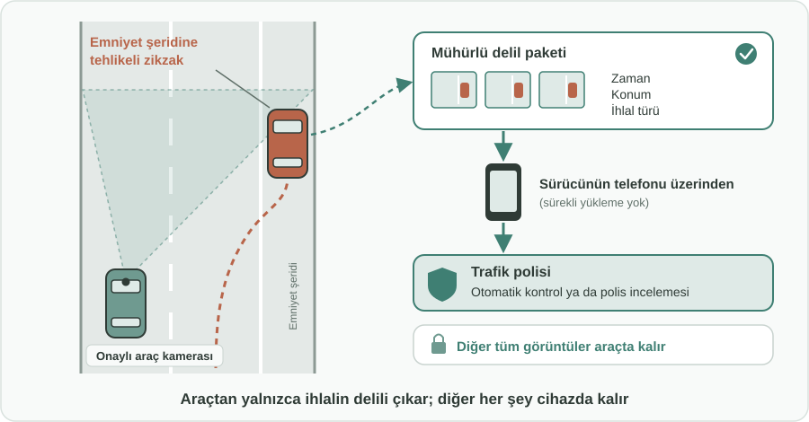
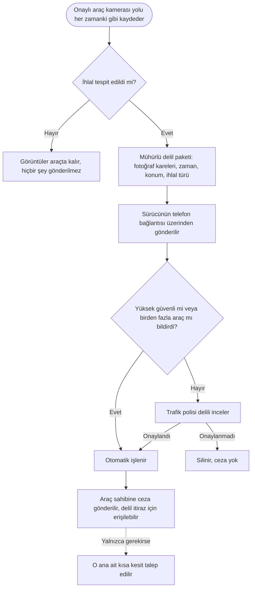

English: [README.md](README.md)

# Araç İçi Kamera ile Trafik İhlali Tespiti: Denetimi Sabit Kameraların Ötesine Taşımak

## Özet

Sabit denetim kameraları yalnızca kuruldukları noktayı görür. Yollardaki en tehlikeli davranışların birçoğu (hatalı sollama, şerit ihlali, şeritler arasında zikzak çizme, emniyet şeridinin gereksiz kullanımı, yakın takip) ise başka her yerde yaşanır. Öte yandan birçok sürücü, kaza anında delil olsun diye zaten araç içi kamera satın alıyor. Bu öneri, bu kameraları bir trafik güvenliği ağına dönüştürür: trafik polisi, **mühürlü ve müdahaleye kapalı bir ihlal tespit uygulaması** çalıştıran belirli araç kamerası modellerini onaylar. Kamera her zamanki gibi kayıt yapmaya devam eder, trafik ihlallerini tanır ve **yalnızca ilgili delili** (birkaç fotoğraf karesi, zaman ve konum) sürücünün telefon bağlantısı üzerinden trafik polisine iletir; ceza otomatik olarak kesilebilir. Yaygınlaşmayı teşvik etmek için onaylı cihazlar gönüllü sürücülere ücretsiz veya yarı fiyatına verilir.

## Sorun

- Sabit denetim kameraları hız, kırmızı ışık ve benzeri ihlalleri **yalnızca kuruldukları noktalarda** tespit eder. Sürücüler bu noktaları kısa sürede öğrenir ve davranışlarını yalnızca orada düzeltir.
- Hatalı sollama, düz çizgiyi geçme, şeritler arasında zikzak çizme, emniyet şeridinin gereksiz kullanımı, tehlikeli yakın takip ve benzeri ihlaller, kaza ve trafik kavgalarının sık görülen sebepleri arasında olmasına rağmen bu noktaların dışında **çoğunlukla denetimsiz kalır**.
- Devriyeler her yerde olamaz; her yolu sabit kameralarla donatmak ise pahalı ve yavaştır.
- Buna karşın **birçok sürücünün aracında zaten bir kamera var**. Bu kameralar her gün ihlallere tanık olur, ancak kayıtlar en fazla bir kazadan sonra kullanılır.

## Önerilen Çözüm

Sürücülerin zaten araçlarında olmasını istediği kameraları, trafik denetiminin güvenilir ve mahremiyete saygılı bir uzantısı olarak kullanmak:

1. **Onaylı cihazlar:** Trafik polisi, görüntü kalitesi, konumlandırma ve güvenlik gerekliliklerini karşılayan belirli araç kamerası modellerini seçer ve onaylar.
2. **Mühürlü tespit uygulaması:** Bu cihazlara trafik polisinin geliştirdiği veya onayladığı resmi bir ihlal tespit uygulaması yüklenir. Cihaz **müdahaleye kapalıdır**: sürücü uygulamayı, kayıtları veya üretilen delili değiştiremez.
3. **Önce normal araç kamerası:** Cihaz, yolu sürücünün kendi güvencesi için kaydetme görevini her zamanki gibi sürdürür. İhlal tespiti bunun yanında çalışır.
4. **Yalnızca asgari delil:** Uygulama bir ihlal tespit ettiğinde, sürücünün telefon bağlantısını kullanarak trafik polisine **yalnızca ilgili fotoğraf karelerini, zamanı, konumu ve ihlal türünü** gönderir. Sürekli bir yükleme yapılmaz. İlgili ana ait **kısa bir video kesiti** yalnızca trafik polisi sonradan talep ederse gönderilir.
5. **Değiştirildiği anlaşılabilen delil:** Her delil paketi cihaz tarafından mühürlenir; böylece sonradan yapılan her değişiklik fark edilir. Sahte veya düzenlenmiş delil reddedilir.
6. **Güven puanı ve insan denetimi:** Her tespitin bir güven düzeyi vardır. **Yüksek güvenli** tespitler veya aynı ihlalin **birden fazla araç** tarafından birbirinden bağımsız olarak bildirilmesi otomatik işleme alınabilir. **Düşük güvenli** tespitler, ceza kesilmeden önce **bir trafik polisinin incelemesine** sunulur.
7. **Otomatik ceza:** Onaylanan ihlaller sabit kamera ihlalleri gibi işlenir: ceza kesilir ve araç sahibine gönderilir; delil inceleme ve itiraz için erişilebilir durumdadır.
8. **Sürücüye teşvik:** Onaylı cihazın sıradan araç kameraları yerine doğal tercih olması için cihaz **gönüllü sürücülere ücretsiz veya yarı fiyatına** sunulur.

## Nasıl Çalışır

| Adım | Ne olur |
|---|---|
| Sürüş | Onaylı araç kamerası yolu diğer araç kameraları gibi kaydeder; görüntüler cihazda kalır |
| İhlal görülür | Mühürlü uygulama bir ihlali tanır (örneğin düz çizgiyi geçerek zikzak çizme veya emniyet şeridinde ilerleme) |
| Delil paketi | Birkaç fotoğraf karesi, zaman, konum ve ihlal türü küçük bir delil paketinde mühürlenir |
| Gönderim | Paket, sürücünün telefon bağlantısı üzerinden trafik polisine gider; başka hiçbir şey yüklenmez |
| Kontrol | Yüksek güvenli veya birden fazla araçla doğrulanan vakalar otomatik işlenir; düşük güvenli vakalar bir polise gider |
| Ceza | Onaylanan ihlal için araç sahibine ceza gönderilir; delil itiraz için erişilebilir |
| Takip | Gerekirse trafik polisi yalnızca o ana ait kısa bir kesit talep edebilir |

## Uygulama ve Fazlandırma

1. **Standartlar ve onay:** Trafik polisi, kişisel verilerin korunmasından sorumlu kurumla birlikte onaylı cihaz gerekliliklerini ve uygulamanın tespit edebileceği ihlallerin listesini belirler.
2. **Pilot:** Seçilen yollarda sınırlı sayıda gönüllü sürücü onaylı cihazları kullanır. Bu aşamada doğruluğu ölçmek ve güven puanını ayarlamak için her tespit bir polis tarafından incelenir.
3. **Net vakalarda otomatik işlem:** Doğruluk kanıtlandığında yüksek güvenli ve birden fazla araçla doğrulanan tespitler otomatik işlenir; diğerleri insan incelemesinde kalır.
4. **Yaygınlaştırma:** Ücretsiz veya yarı fiyatına cihaz teklifi daha fazla gönüllüye genişletilir; farklı üreticilerden ek cihaz modelleri onaylanır.
5. **Sürekli değerlendirme:** Tespit doğruluğu, itiraz sonuçları ve mahremiyete uyum düzenli olarak yayımlanır ve gözden geçirilir.

## Paydaşlar ve Faydalar

- **Yol kullanıcıları:** Denetim artık bilinen kamera noktalarıyla sınırlı olmadığı için daha az tehlikeli manevra ve daha az kaza.
- **Gönüllü sürücüler:** Kazadan sonra da onları koruyan ücretsiz veya düşük maliyetli bir araç kamerası ve daha güvenli yollara katkıda bulunmanın memnuniyeti.
- **Trafik polisi:** Yeni sabit kamera kurmadan yol ağının genelinde denetim kapsamı ve güvenilir delil.
- **Araç kamerası üreticileri:** Gereklilikleri net, onaylı yeni bir ürün kategorisi.
- **Sigorta şirketleri:** Saldırgan ve dikkatsiz sürüşten kaynaklanan hasar taleplerinin azalması.
- **Kamu otoriteleri:** Sabit kamera ağlarını genişletmekten çok daha düşük maliyetle daha iyi trafik güvenliği.

## Riskler ve Önlemler

| Risk | Önlem |
|---|---|
| Hatalı tespitlerden kaynaklanan yanlış cezalar | Güven puanı: yalnızca yüksek güvenli veya birden fazla araçla doğrulanan vakalar otomatik işlenir; diğer her şeyi bir polis inceler; delille itiraz hakkı |
| Manipüle edilmiş veya sahte delil | Mühürlü, müdahaleye kapalı cihazlar ve değiştirildiği anlaşılabilen delil paketleri; yalnızca onaylı modeller |
| Diğer yol kullanıcılarının ve sürücünün mahremiyeti | Sürekli yükleme yok; yalnızca tespit edilen ihlalin asgari delili gönderilir; diğer tüm görüntüler araçta kalır; net saklama süreleri |
| Sürücülerin bunu birbirini gözetleme olarak görmesi | Gönüllü katılım, şeffaf kurallar, yayımlanan doğruluk ve itiraz istatistikleri |
| Sürücü için veri maliyeti | Yalnızca küçük fotoğraf kareleri gönderilir; kısa kesit yalnızca talep edildiğinde |
| Ücretsiz veya yarı fiyatına cihazların maliyeti | Pilotla başlamak; trafik güvenliği sonuçları görüldükçe ölçeği büyütmek |

**Anahtar kelimeler:** trafik güvenliği, trafik denetimi, araç içi kamera, trafik ihlali tespiti, otomatik ceza, şerit ihlali, yakın takip, emniyet şeridi

## Köken

Merih İlgör tarafından önerilmiştir (Temmuz 2026); burada açık bir proje fikri olarak yayımlanmaktadır.

## Lisans

Bu çalışma, ticari olmayan kullanım için CC BY-NC-SA 4.0 lisansı ile lisanslanmıştır; bkz. [LICENSE](LICENSE). Ticari kullanım bir gelir paylaşımı anlaşması gerektirir; bkz. [COMMERCIAL-LICENSE.md](COMMERCIAL-LICENSE.md). Değiştirilmiş sürümler yeni bir fikir olarak satılamaz veya üçüncü kişilere aktarılamaz; patent benzeri haklar saklıdır. Bkz. [COMMERCIAL-LICENSE.md](COMMERCIAL-LICENSE.md#derivatives-improvements-and-idea-protection).
