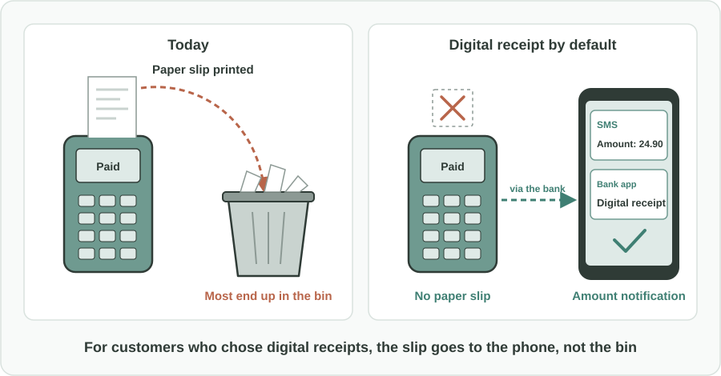
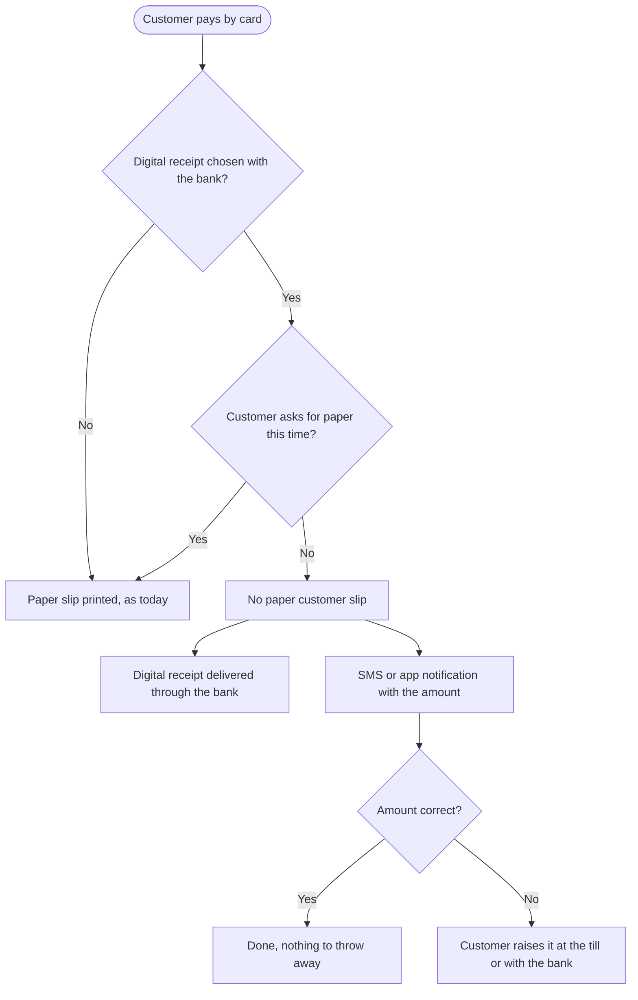

Türkçe: [README.tr.md](README.tr.md)

# Digital Receipt by Default: No Paper Card Slip for Customers Who Chose E-Slips

## Summary

Many card holders have already told their bank that they prefer digital receipts (e-slips). Yet card terminals at shops still print a paper customer slip for almost every payment, and most of those slips are left on the counter or thrown away. This proposal makes the customer's choice count at the till: **for card holders who opted into digital receipts, the terminal does not print the paper customer slip by default**. The receipt is delivered digitally through the card holder's bank, and a short SMS or app notification with the amount lets the customer check the payment right away. A paper slip is still available whenever the customer asks for one.

## Problem

- A paper customer slip is printed for card payments as a matter of routine, even when the customer does not want it.
- Most of these slips are **never taken**, or are thrown away within seconds. This is a daily, repeated waste of paper, thermal paper rolls and printer consumables.
- Card holders who opted into e-slips with their bank still get a paper slip at the till. Their stated preference **does not reach the terminal**.
- Thermal paper is often hard to recycle, and a slip left on the counter can also show partial card and purchase details to others.
- Customers still need a quick way to **check that the right amount was charged**, which is one reason paper slips have been kept.

## Proposed Solution

Link the digital receipt choice the customer already made with their bank to what happens at the card terminal:

1. **Opt-in stays with the customer:** card holders choose "digital receipt" once, through their bank. Nothing changes for anyone who has not chosen it.
2. **No paper customer slip by default:** when an opted-in card is used, the terminal skips printing the customer copy. The merchant's own records are not affected.
3. **Digital receipt through the bank:** the transaction details (merchant, date, amount) are delivered to the customer through their bank's digital channels, where they can be viewed and kept.
4. **Instant amount check:** in addition, the customer receives a short SMS or app notification with the amount, so they can confirm the charge on the spot.
5. **Paper on request:** a customer can always ask for a printed slip at the till, for example for returns or expense claims.

## How It Works

| Situation | What the customer experiences |
|---|---|
| Customer has not opted into digital receipts | Nothing changes. A paper slip is printed as today. |
| Opted-in customer pays by card | No paper slip. Within moments, an SMS or app notification shows the amount. |
| Customer wants to see the receipt later | The full digital receipt is available through the bank's digital channels. |
| Customer needs paper this time | They ask at the till and the slip is printed. |
| The amount in the notification looks wrong | The customer raises it immediately, at the till or with the bank. |

The customer does not need to do anything new at the till. The choice they already made with their bank simply starts to apply.

## Implementation & Phasing

1. **Clarify the rules:** the rule makers for card payments and consumer receipts confirm that, for opted-in customers, a digital receipt plus an amount notification can replace the printed customer slip.
2. **Pilot:** a few banks and payment terminal providers run the default with volunteer customers and merchants, and measure how often customers still ask for paper.
3. **Industry-wide default:** banks pass the customer's digital receipt choice to payments at any terminal, and terminal providers support "no customer slip" for those payments.
4. **Awareness:** banks invite customers to choose digital receipts, and merchants display a short notice at the till that paper slips are available on request.

## Stakeholders & Benefits

- **Customers:** less clutter, a digital record that does not fade, and an instant check of the amount charged.
- **Merchants:** fewer paper rolls to buy and change, and shorter queues at the till.
- **Banks and card issuers:** a clear customer preference they can honor, and a more useful digital record for their customers.
- **Payment terminal providers:** fewer consumables and printer faults to service.
- **The environment:** less paper, less thermal paper waste and less litter around checkouts.
- **Regulators:** a simple, opt-in change that respects consumer choice and reduces waste.

## Risks & Mitigations

| Risk | Mitigation |
|---|---|
| Customers without a phone signal cannot check the amount immediately | The digital receipt stays available through the bank, and a paper slip can always be requested |
| Customers need paper for returns or expense claims | Paper on request at the till, and digital receipts that can be shown or shared later |
| Older or less digital customers feel excluded | Strictly opt-in; nothing changes for customers who do not choose it |
| Notification costs for banks | Use app notifications where possible and SMS only for the amount check the customer asked for |
| Merchant records affected | The change concerns only the customer copy, not the merchant's own records |

**Keywords:** digital receipt, e-slip, paper waste, card payments, payment terminal, consumer choice, sustainability, banking, SMS notification, thermal paper

## Origin

Originally proposed by Merih İlgör (December 2025); published here as an open project idea.

## License

This work is licensed under CC BY-NC-SA 4.0 for non-commercial use; see [LICENSE](LICENSE). Commercial use requires a revenue-share agreement; see [COMMERCIAL-LICENSE.md](COMMERCIAL-LICENSE.md). Modified versions may not be sold or transferred to third parties as new ideas, and patent-like rights are reserved; see [COMMERCIAL-LICENSE.md](COMMERCIAL-LICENSE.md#derivatives-improvements-and-idea-protection).
