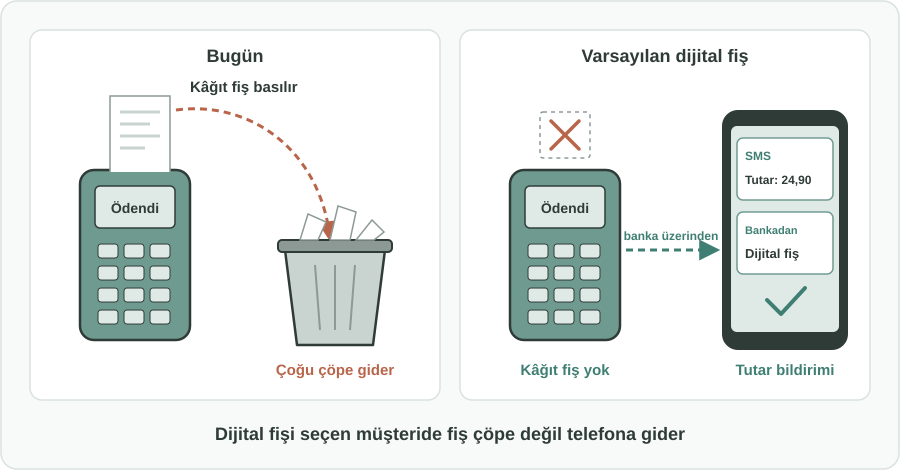
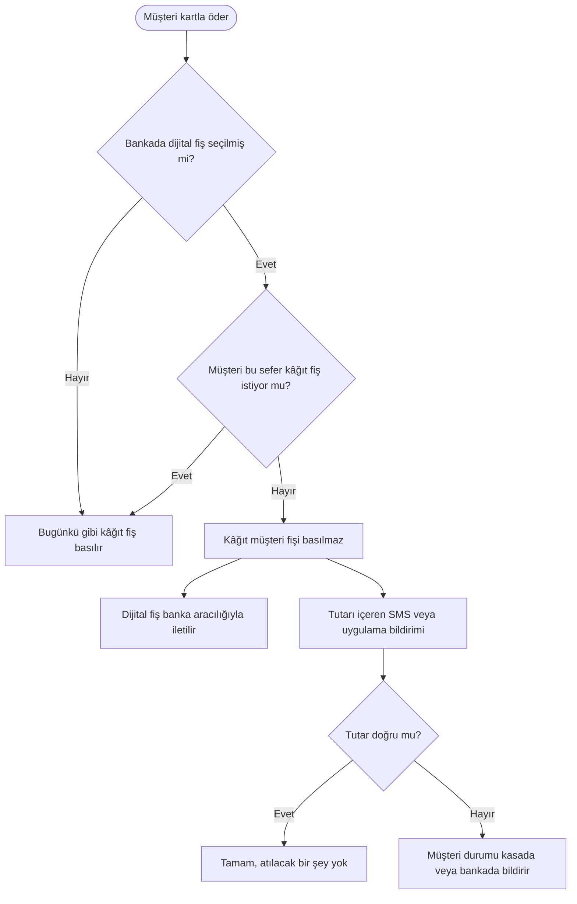

English: [README.md](README.md)

# Varsayılan Dijital Fiş: E-Slip Tercih Eden Müşteriye Kâğıt Kart Fişi Basılmaması

## Özet

Pek çok kart sahibi, bankasına dijital fişi (e-slip) tercih ettiğini zaten bildirmiş durumda. Buna rağmen mağazalardaki kart ödeme cihazları neredeyse her ödemede kâğıt müşteri fişi basıyor ve bu fişlerin çoğu tezgâhta kalıyor ya da çöpe gidiyor. Bu öneri, müşterinin tercihini kasada da geçerli kılar: **dijital fişi tercih etmiş kart sahipleri için ödeme cihazı varsayılan olarak kâğıt müşteri fişi basmaz**. Fiş, kart sahibinin bankası aracılığıyla dijital olarak iletilir; tutarı içeren kısa bir SMS veya uygulama bildirimi de müşterinin ödemeyi hemen kontrol etmesini sağlar. Müşteri istediği her zaman kâğıt fiş alabilir.

## Sorun

- Kartlı ödemelerde kâğıt müşteri fişi, müşteri istemese bile rutin olarak basılır.
- Bu fişlerin çoğu **hiç alınmaz** ya da birkaç saniye içinde atılır. Bu, her gün tekrarlanan bir kâğıt, termal rulo ve yazıcı sarf malzemesi israfıdır.
- Bankasında e-slip seçmiş kart sahipleri bile kasada kâğıt fiş alır. Belirttikleri tercih **ödeme cihazına ulaşmaz**.
- Termal kâğıdın geri dönüşümü çoğu zaman zordur; tezgâhta unutulan bir fiş, kart ve alışveriş bilgilerinin bir kısmını başkalarına da gösterebilir.
- Müşterilerin yine de **doğru tutarın çekildiğini hızlıca kontrol etmeye** ihtiyacı vardır; kâğıt fişin sürdürülmesinin bir nedeni de budur.

## Önerilen Çözüm

Müşterinin bankasında zaten yaptığı dijital fiş tercihini, kart ödeme cihazında olanlarla ilişkilendirmek:

1. **Tercih müşteride kalır:** Kart sahibi "dijital fiş" seçeneğini bir kez, bankası üzerinden seçer. Seçmeyen hiç kimse için bir şey değişmez.
2. **Varsayılan olarak kâğıt müşteri fişi yok:** Tercih yapmış bir kartla ödeme yapıldığında cihaz müşteri nüshasını basmaz. İşyerinin kendi kayıtları bundan etkilenmez.
3. **Banka aracılığıyla dijital fiş:** İşlem bilgileri (işyeri, tarih, tutar) müşteriye bankasının dijital kanalları üzerinden iletilir; burada görüntülenebilir ve saklanabilir.
4. **Anında tutar kontrolü:** Ayrıca müşteriye tutarı içeren kısa bir SMS veya uygulama bildirimi gönderilir; böylece çekilen tutarı hemen doğrulayabilir.
5. **İstenirse kâğıt:** Müşteri, örneğin iade veya masraf beyanı için, kasada her zaman basılı fiş isteyebilir.

## Nasıl Çalışır

| Durum | Müşterinin deneyimi |
|---|---|
| Müşteri dijital fişi tercih etmemiş | Hiçbir şey değişmez. Bugünkü gibi kâğıt fiş basılır. |
| Tercih yapmış müşteri kartla öder | Kâğıt fiş yok. Birkaç saniye içinde tutarı gösteren bir SMS veya uygulama bildirimi gelir. |
| Müşteri fişi daha sonra görmek ister | Dijital fişin tamamı bankanın dijital kanallarında bulunur. |
| Müşterinin bu sefer kâğıda ihtiyacı var | Kasada ister ve fiş basılır. |
| Bildirimdeki tutar yanlış görünüyor | Müşteri durumu hemen kasada veya bankasına bildirir. |

Müşterinin kasada yeni bir şey yapması gerekmez. Bankasında zaten yaptığı tercih artık uygulanmaya başlar.

## Uygulama ve Fazlandırma

1. **Kuralların netleştirilmesi:** Kartlı ödemeler ve tüketici fişleri konusundaki kural koyucular, tercih yapmış müşteriler için dijital fiş ile tutar bildiriminin basılı müşteri fişinin yerini alabileceğini teyit eder.
2. **Pilot:** Birkaç banka ve ödeme cihazı sağlayıcısı, gönüllü müşteri ve işyerleriyle bu varsayılanı dener; müşterilerin ne sıklıkla hâlâ kâğıt istediğini ölçer.
3. **Sektör geneli varsayılan:** Bankalar, müşterinin dijital fiş tercihini her cihazdaki ödemeye taşır; ödeme cihazı sağlayıcıları bu ödemeler için "müşteri fişi yok" seçeneğini destekler.
4. **Farkındalık:** Bankalar müşterilerini dijital fişi seçmeye davet eder; işyerleri kasada, kâğıt fişin istek üzerine verildiğini belirten kısa bir bilgi notu bulundurur.

## Paydaşlar ve Faydalar

- **Müşteriler:** Daha az kâğıt kalabalığı, silinmeyen bir dijital kayıt ve çekilen tutarın anında kontrolü.
- **İşyerleri:** Daha az rulo alımı ve değişimi, kasada daha kısa kuyruklar.
- **Bankalar ve kart çıkaran kuruluşlar:** Uyulabilecek net bir müşteri tercihi ve müşterileri için daha kullanışlı bir dijital kayıt.
- **Ödeme cihazı sağlayıcıları:** Bakımı yapılacak daha az sarf malzemesi ve yazıcı arızası.
- **Çevre:** Daha az kâğıt, daha az termal kâğıt atığı ve kasaların çevresinde daha az çöp.
- **Düzenleyici kurumlar:** Tüketici tercihine saygı gösteren ve israfı azaltan, isteğe bağlı basit bir değişiklik.

## Riskler ve Önlemler

| Risk | Önlem |
|---|---|
| Telefonu çekmeyen müşteri tutarı hemen kontrol edemez | Dijital fiş bankada kalır; her zaman kâğıt fiş istenebilir |
| Müşterinin iade veya masraf beyanı için kâğıda ihtiyacı olur | Kasada istek üzerine kâğıt fiş; dijital fiş sonradan gösterilebilir veya paylaşılabilir |
| Yaşlı veya dijitalle arası zayıf müşteriler dışlanmış hisseder | Tamamen isteğe bağlı; seçmeyen müşteriler için hiçbir şey değişmez |
| Bankalar için bildirim maliyeti | Mümkün olduğunda uygulama bildirimi; SMS yalnızca müşterinin istediği tutar kontrolü için |
| İşyeri kayıtlarının etkilenmesi | Değişiklik yalnızca müşteri nüshasını kapsar, işyerinin kendi kayıtlarını değil |

**Anahtar kelimeler:** dijital fiş, e-slip, kâğıt israfı, kartlı ödeme, POS cihazı, tüketici tercihi, sürdürülebilirlik, SMS bildirimi

## Köken

Merih İlgör tarafından önerilmiştir (Aralık 2025); burada açık bir proje fikri olarak yayımlanmaktadır.

## Lisans

Bu çalışma, ticari olmayan kullanım için CC BY-NC-SA 4.0 lisansı ile lisanslanmıştır; bkz. [LICENSE](LICENSE). Ticari kullanım bir gelir paylaşımı anlaşması gerektirir; bkz. [COMMERCIAL-LICENSE.md](COMMERCIAL-LICENSE.md). Değiştirilmiş sürümler yeni bir fikir olarak satılamaz veya üçüncü kişilere aktarılamaz; patent benzeri haklar saklıdır. Bkz. [COMMERCIAL-LICENSE.md](COMMERCIAL-LICENSE.md#derivatives-improvements-and-idea-protection).
