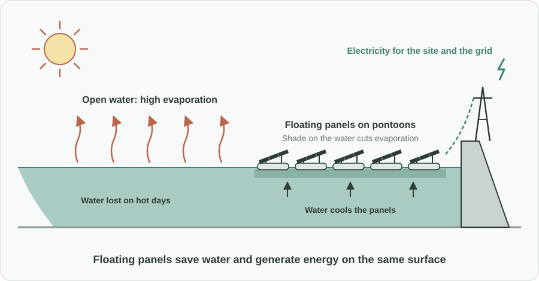
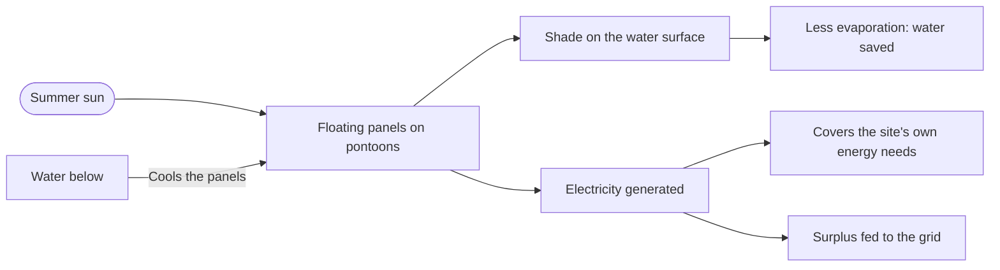

Türkçe: [README.tr.md](README.tr.md)

# Floating Solar on Reservoirs: Saving Water and Generating Energy on the Same Surface

## Summary

On hot summer days, dam reservoirs and the open ponds of water-treatment plants lose a large amount of water to evaporation. This proposal places **floating solar panels on pontoons** over part of these water surfaces. The panels shade the water and reduce evaporation, while producing clean electricity at the same time. One installation delivers two gains, **water and energy**, without taking up any land, and the water underneath keeps the panels cooler so they work more efficiently.

## Problem

- In hot, dry periods, open water surfaces such as dam reservoirs and treatment-plant ponds lose a significant amount of water to **evaporation**, exactly when water is most needed.
- As heat waves become more frequent and longer, this loss becomes a growing risk for the **sustainability of water supplies**, especially in regions under water stress.
- Solar power needs space. Ground-mounted solar farms compete for **land** that could be used for agriculture or left as natural habitat.
- Dams and treatment plants use energy themselves (pumping, treatment, operations), and those costs keep rising.
- Today, the water surface and the energy need are treated as separate problems, although one surface can help solve both.

## Proposed Solution

Install floating solar systems on selected water surfaces that belong to the water infrastructure:

1. **Where:** dam reservoirs and the open ponds and basins of water-treatment plants, starting with those in regions under water stress.
2. **How much:** panels cover **part** of the water surface, not all of it. The share is chosen for each site so that water quality, ecology and the site's normal operation are protected.
3. **Water gain:** the shaded surface loses less water to evaporation, especially on the hottest days.
4. **Energy gain:** the panels produce clean, locally generated electricity. It can first cover the site's own energy needs (pumping, treatment), with any surplus fed to the grid.
5. **No land use:** generation happens on water that is already dedicated to infrastructure, so farmland and natural areas are left untouched.
6. **Better efficiency:** the water surface cools the panels, which helps them produce more energy than they would on hot ground.

## How It Works

| | Open water surface (today) | With floating solar |
|---|---|---|
| Evaporation on hot days | High, water is lost | Lower under the shaded area |
| Energy | None | Clean electricity for the site and the grid |
| Land used | None | None, the panels float on the water |
| Panel temperature | Not applicable | Cooled by the water, better efficiency |
| Site operating costs | Full energy bill | Partly covered by own generation |

## Implementation & Phasing

1. **Site selection and feasibility:** identify reservoirs and treatment ponds where evaporation losses are high and conditions are suitable, and carry out feasibility studies, including water-quality and ecological assessments.
2. **Pilot projects:** install floating solar on a limited area at a few sites and measure the real water savings, energy output and any effects on water quality and wildlife.
3. **Expansion to water-stressed regions:** based on the pilot results, extend the approach first to regions where water security is most at risk.
4. **Standard practice:** consider floating solar as a regular option when planning new reservoirs, treatment plants and renewable-energy programs.

## Stakeholders & Benefits

- **Water utilities and dam operators:** less water lost from reservoirs and lower energy bills.
- **Energy authorities and grid operators:** new clean, local generation capacity without new land.
- **Farmers and rural communities:** farmland is not taken for solar farms, and more water stays available.
- **Environmental agencies:** renewable energy without clearing natural areas, with monitoring built in from the pilot stage.
- **The public:** better water security and energy supply security, especially during heat waves.
- **Investors and industry:** a clear, measurable project model that combines two public goods.

## Risks & Mitigations

| Risk | Mitigation |
|---|---|
| Effects on water quality or aquatic life | Partial coverage only, ecological assessment before installation and monitoring during operation |
| Interference with dam or treatment-plant operations | Site-by-site design with the operator; areas needed for operations stay free |
| Storms, waves and changing water levels | Design for each site's conditions, verified in the pilot stage |
| Upfront cost | Pilot first, then expansion based on measured water and energy gains |
| Conflict with other uses of the water (fishing, recreation) | Consult local users and choose the covered area accordingly |

**Keywords:** floating solar, floating photovoltaics, dam reservoirs, water treatment, evaporation, water security, renewable energy, energy supply security, climate adaptation, land use

## Origin

Originally proposed by Merih İlgör (January 2026); published here as an open project idea.

## License

This work is licensed under CC BY-NC-SA 4.0 for non-commercial use; see [LICENSE](LICENSE). Commercial use requires a revenue-share agreement; see [COMMERCIAL-LICENSE.md](COMMERCIAL-LICENSE.md). Modified versions may not be sold or transferred to third parties as new ideas, and patent-like rights are reserved; see [COMMERCIAL-LICENSE.md](COMMERCIAL-LICENSE.md#derivatives-improvements-and-idea-protection).
