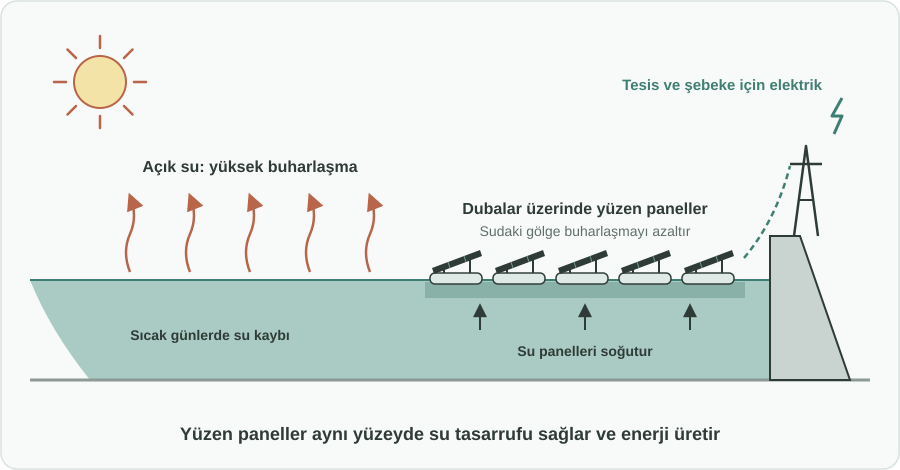
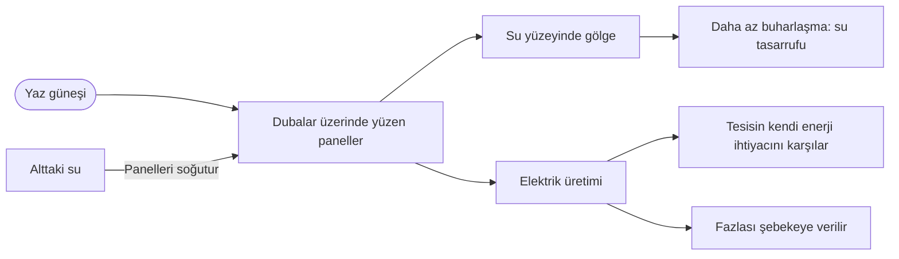

English: [README.md](README.md)

# Barajlarda Yüzen Güneş Panelleri: Aynı Yüzeyde Su Tasarrufu ve Enerji Üretimi

## Özet

Yoğun sıcak yaz günlerinde baraj gölleri ve su arıtma tesislerinin açık havuzları buharlaşma yüzünden büyük miktarda su kaybeder. Bu öneri, bu su yüzeylerinin bir kısmına **duba üzerinde yüzen güneş panelleri** yerleştirilmesini önerir. Paneller suyu gölgeleyerek buharlaşmayı azaltırken aynı anda temiz elektrik üretir. Tek bir kurulum, hiç arazi kullanmadan iki kazanım sağlar: **su ve enerji**. Üstelik alttaki su panelleri serin tutar ve daha verimli çalışmalarını sağlar.

## Sorun

- Sıcak ve kurak dönemlerde baraj gölleri ve arıtma tesisi havuzları gibi açık su yüzeyleri, tam da suya en çok ihtiyaç duyulduğu anda **buharlaşma** yoluyla ciddi miktarda su kaybeder.
- Sıcak hava dalgaları sıklaştıkça ve uzadıkça bu kayıp, özellikle su stresi yaşayan bölgelerde **su kaynaklarının sürdürülebilirliği** için giderek büyüyen bir risk haline gelir.
- Güneş enerjisi alan ister. Karaya kurulan güneş santralleri, tarım için kullanılabilecek ya da doğal alan olarak bırakılabilecek **arazilerle** yarışır.
- Barajlar ve arıtma tesisleri de enerji tüketir (pompalama, arıtma, işletme) ve bu maliyetler artmaya devam eder.
- Bugün su yüzeyi ve enerji ihtiyacı ayrı sorunlar olarak ele alınıyor; oysa tek bir yüzey ikisinin çözümüne de katkı verebilir.

## Önerilen Çözüm

Su altyapısına ait seçilmiş su yüzeylerine yüzen güneş enerjisi sistemleri kurmak:

1. **Nerede:** Baraj gölleri ile su arıtma tesislerinin açık havuzları ve havzaları; öncelik su stresi yaşayan bölgelerde.
2. **Ne kadar:** Paneller su yüzeyinin tamamını değil, **bir kısmını** kaplar. Bu oran, su kalitesi, ekoloji ve tesisin olağan işleyişi korunacak şekilde her alan için ayrıca belirlenir.
3. **Su kazanımı:** Gölgelenen yüzey, özellikle en sıcak günlerde buharlaşmayla daha az su kaybeder.
4. **Enerji kazanımı:** Paneller temiz ve yerli elektrik üretir. Bu elektrik önce tesisin kendi enerji ihtiyacını (pompalama, arıtma) karşılayabilir, fazlası şebekeye verilir.
5. **Arazi kullanımı yok:** Üretim, zaten altyapıya ayrılmış su yüzeyinde yapılır; tarım arazileri ve doğal alanlara dokunulmaz.
6. **Daha yüksek verim:** Su yüzeyi panelleri soğutur; bu da panellerin sıcak toprak üzerinde olacağından daha fazla enerji üretmesine yardımcı olur.

## Nasıl Çalışır

| | Açık su yüzeyi (bugün) | Yüzen güneş panelleriyle |
|---|---|---|
| Sıcak günlerde buharlaşma | Yüksek, su kaybolur | Gölgelenen alanda daha düşük |
| Enerji | Yok | Tesis ve şebeke için temiz elektrik |
| Kullanılan arazi | Yok | Yok, paneller suyun üzerinde yüzer |
| Panel sıcaklığı | Geçerli değil | Suyla soğur, verim artar |
| Tesis işletme maliyeti | Enerji faturasının tamamı | Kendi üretimiyle kısmen karşılanır |

## Uygulama ve Fazlandırma

1. **Alan seçimi ve fizibilite:** Buharlaşma kayıplarının yüksek ve koşulların uygun olduğu baraj gölleri ile arıtma havuzları belirlenir; su kalitesi ve ekolojik değerlendirmeler dahil fizibilite çalışmaları yapılır.
2. **Pilot projeler:** Birkaç alanda sınırlı bir yüzeye yüzen güneş panelleri kurulur; gerçek su tasarrufu, enerji üretimi ve su kalitesi ile canlı yaşamı üzerindeki etkiler ölçülür.
3. **Su stresi yaşayan bölgelere yaygınlaştırma:** Pilot sonuçlarına göre uygulama, önce su güvenliğinin en çok risk altında olduğu bölgelere genişletilir.
4. **Standart uygulama:** Yeni barajlar, arıtma tesisleri ve yenilenebilir enerji programları planlanırken yüzen güneş panelleri olağan bir seçenek olarak değerlendirilir.

## Paydaşlar ve Faydalar

- **Su idareleri ve baraj işletmecileri:** Göllerden daha az su kaybı ve daha düşük enerji faturaları.
- **Enerji otoriteleri ve şebeke işletmecileri:** Yeni arazi gerektirmeyen, temiz ve yerli yeni üretim kapasitesi.
- **Çiftçiler ve kırsal topluluklar:** Tarım arazileri güneş santrallerine ayrılmaz, daha fazla su kullanılabilir kalır.
- **Çevre kurumları:** Doğal alanlar açılmadan yenilenebilir enerji; izleme pilot aşamasından itibaren sürecin parçası.
- **Halk:** Özellikle sıcak hava dalgalarında daha iyi su güvenliği ve enerji arz güvenliği.
- **Yatırımcılar ve sektör:** İki kamu yararını birleştiren, açık ve ölçülebilir bir proje modeli.

## Riskler ve Önlemler

| Risk | Önlem |
|---|---|
| Su kalitesi veya sudaki canlılar üzerinde etkiler | Yalnızca kısmi kaplama, kurulum öncesi ekolojik değerlendirme ve işletme sırasında izleme |
| Baraj veya arıtma tesisi işleyişine müdahale | İşletmeciyle birlikte alan bazında tasarım; işletme için gereken alanlar boş bırakılır |
| Fırtına, dalga ve değişen su seviyeleri | Her alanın koşullarına göre tasarım, pilot aşamasında doğrulama |
| İlk yatırım maliyeti | Önce pilot, ardından ölçülen su ve enerji kazanımlarına göre yaygınlaştırma |
| Suyun diğer kullanımlarıyla çatışma (balıkçılık, rekreasyon) | Yerel kullanıcılara danışılarak kaplanacak alanın belirlenmesi |

**Anahtar kelimeler:** yüzen güneş paneli, yüzer fotovoltaik, baraj gölü, su arıtma, buharlaşma, su güvenliği, yenilenebilir enerji, iklim uyumu

## Köken

Merih İlgör tarafından önerilmiştir (Ocak 2026); burada açık bir proje fikri olarak yayımlanmaktadır.

## Lisans

Bu çalışma, ticari olmayan kullanım için CC BY-NC-SA 4.0 lisansı ile lisanslanmıştır; bkz. [LICENSE](LICENSE). Ticari kullanım bir gelir paylaşımı anlaşması gerektirir; bkz. [COMMERCIAL-LICENSE.md](COMMERCIAL-LICENSE.md). Değiştirilmiş sürümler yeni bir fikir olarak satılamaz veya üçüncü kişilere aktarılamaz; patent benzeri haklar saklıdır. Bkz. [COMMERCIAL-LICENSE.md](COMMERCIAL-LICENSE.md#derivatives-improvements-and-idea-protection).
