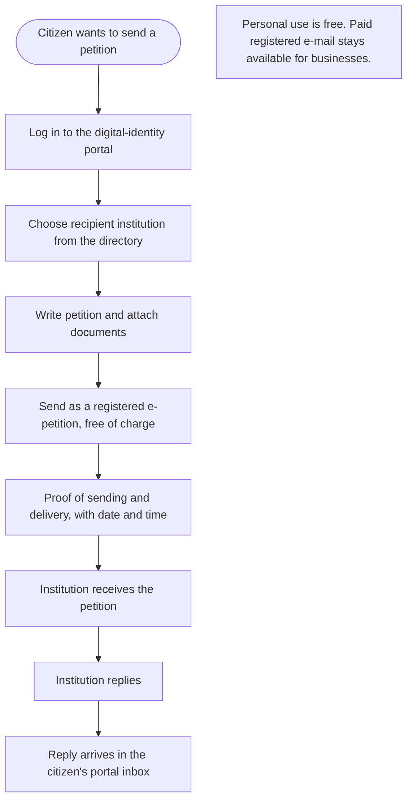

Türkçe: [README.tr.md](README.tr.md)

# Free Registered E-Petitions for Every Citizen: Legally Valid Petitions Through the Digital-Identity Login

## Summary

Citizens already log in to the government's digital-identity portal to handle taxes, health records, court files and many other public services. Yet when a citizen wants to send a **registered, legally valid electronic petition** to a public or private institution, they usually have to buy a paid registered e-mail package and often pay again for an electronic signature. This proposal makes sending registered e-petitions, and receiving the replies, a **free citizenship right** through the same digital-identity login. Some parliaments already let citizens submit petitions online for free with this kind of login; the proposal extends that idea to every institution a citizen needs to reach.

## Problem

- The right to petition is a basic civic right, but its legally valid electronic form often **costs money**. A citizen needs a paid registered e-mail account with send and receive packages.
- On top of that, an **electronic signature** usually requires a separate, paid certificate. Together these costs put an everyday right behind a paywall.
- The identity check that these paid products provide is largely **already done** by the government's digital-identity portal, which citizens use every day.
- People who cannot or do not want to pay fall back on paper petitions, post and in-person visits. These are slower, harder to track and harder for people with limited mobility or who live far from offices.
- Institutions receive petitions through a mix of channels (paper, plain e-mail, web forms, registered e-mail), which makes it harder to prove what was sent, when, and to whom.

## Proposed Solution

Offer a **free registered e-petition service inside the government's digital-identity portal**, for personal (non-commercial) use by every citizen:

1. **Log in with the identity you already have:** the citizen signs in to the digital-identity portal as usual. This login is accepted as proof of who sent the petition, so no extra signature product is needed.
2. **Write and send:** the citizen chooses the recipient institution from a directory (public institutions and the private organizations that are already required to accept registered electronic mail), writes the petition and attaches documents.
3. **Registered delivery:** the petition is delivered with the same legal effect as registered electronic mail: proof of sending, proof of delivery, and an exact date and time.
4. **Replies in one place:** the institution's reply arrives in the citizen's inbox in the same portal, with a notification. The whole exchange stays available as a record.
5. **Free as a right:** sending and receiving within this personal service is free of charge. Paid registered e-mail products remain available for businesses and high-volume use.

## How It Works

| Step | What the citizen does | What happens |
|---|---|---|
| 1. Log in | Signs in to the digital-identity portal | Identity is confirmed, as for any other public service |
| 2. Choose recipient | Picks an institution from the directory | Only institutions that accept registered electronic mail are listed |
| 3. Write and attach | Writes the petition, adds documents | The petition is linked to the verified sender |
| 4. Send | Presses send | Delivery is registered with proof of sending, delivery, date and time |
| 5. Receive reply | Gets a notification | The reply appears in the portal inbox and is kept with the petition |

For the citizen, sending a legally valid petition becomes as simple as any other task in the digital-identity portal, and costs nothing.

## Implementation & Phasing

1. **Recognize the login as a valid signature:** the legal framework recognizes a petition sent through the digital-identity portal as equivalent, in evidential value, to one sent by registered electronic mail with an electronic signature.
2. **Public institutions first:** the service starts with petitions to public institutions, which are already connected to the portal.
3. **Extend to private institutions:** it then extends to the private organizations that are already required to receive registered electronic mail (for example companies, banks and utilities).
4. **Replies and archive:** institutions reply through the same channel, and citizens keep a searchable record of their petitions and replies.
5. **Review:** usage, response times and misuse are reviewed periodically, and fair-use limits are adjusted if needed.

## Stakeholders & Benefits

- **Citizens:** a free, simple and legally valid way to exercise the right to petition, with proof of what was sent and when.
- **People with limited mobility, low income, or living far from offices:** equal access to a right that no longer depends on paying or travelling.
- **Public institutions:** fewer paper petitions, a single trackable channel and clear delivery records.
- **Private institutions:** petitions and complaints arrive through a channel they already have to support, with a verified sender.
- **Government and legislators:** stronger digital rights and more trust in e-government, built on an identity system that already exists.
- **Registered e-mail providers:** keep their business and high-volume customers; the free service covers only personal petitions.

## Risks & Mitigations

| Risk | Mitigation |
|---|---|
| Free sending leads to spam or mass petitions | Fair-use limits per citizen and per day; clear rules against abuse; the verified sender discourages misuse |
| Loss of revenue for registered e-mail providers | The free service is limited to personal petitions; business and high-volume use stays paid |
| Doubts about the legal validity of a login instead of a signature | A clear legal rule that recognizes the portal login as the sender's verified identity for petitions |
| Private institutions not ready to receive or reply | Phased roll-out, starting with public institutions, then private organizations already required to accept registered electronic mail |
| Account misuse if someone else knows the login | The portal's existing security measures, notifications for every petition sent, and the option to report misuse |

**Keywords:** e-petition, right to petition, registered e-mail, electronic signature, digital identity, e-government, digital rights, free public service, citizen participation

## Origin

Originally proposed by Merih İlgör (November 2025); published here as an open project idea.

## License

This work is licensed under CC BY-NC-SA 4.0 for non-commercial use; see [LICENSE](LICENSE). Commercial use requires a revenue-share agreement; see [COMMERCIAL-LICENSE.md](COMMERCIAL-LICENSE.md). Modified versions may not be sold or transferred to third parties as new ideas, and patent-like rights are reserved; see [COMMERCIAL-LICENSE.md](COMMERCIAL-LICENSE.md#derivatives-improvements-and-idea-protection).
