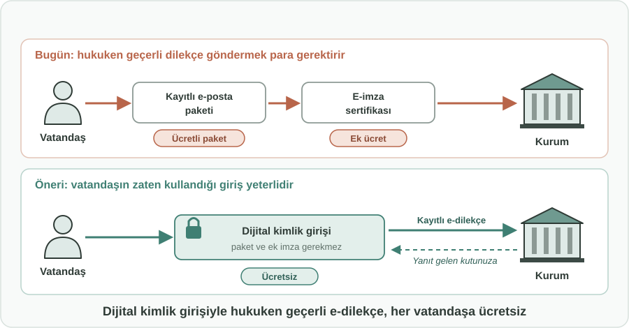
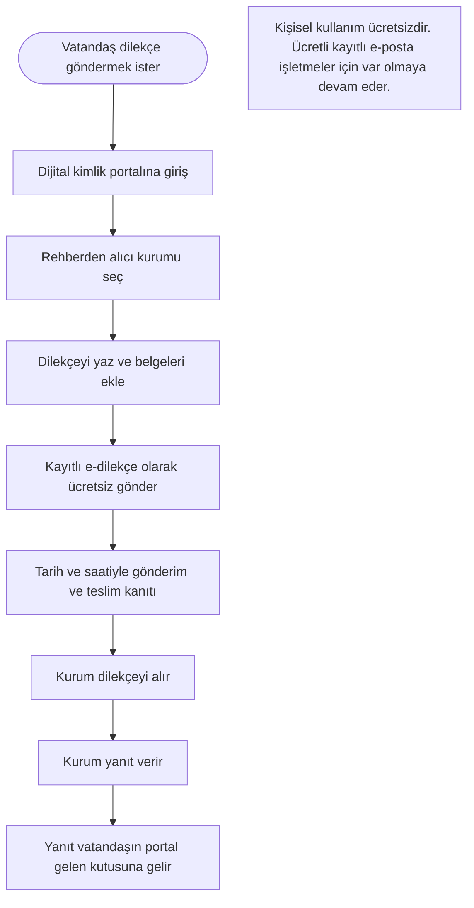

English: [README.md](README.md)

# Her Vatandaşa Ücretsiz Kayıtlı E-Dilekçe: Dijital Kimlik Girişiyle Hukuken Geçerli Dilekçe

## Özet

Vatandaşlar vergi, sağlık kayıtları, dava dosyaları ve daha birçok kamu hizmeti için zaten devletin dijital kimlik portalına giriş yapıyor. Buna rağmen bir vatandaş kamu veya özel bir kuruma **kayıtlı ve hukuken geçerli bir elektronik dilekçe** göndermek istediğinde, genellikle ücretli bir kayıtlı e-posta paketi satın almak, çoğu zaman da elektronik imza için ayrıca ödeme yapmak zorunda kalıyor. Bu öneri, kayıtlı e-dilekçe göndermeyi ve yanıtları almayı, aynı dijital kimlik girişi üzerinden **ücretsiz bir vatandaşlık hakkı** haline getirir. Bazı parlamentolar vatandaşların bu tür bir girişle çevrimiçi ve ücretsiz dilekçe vermesine zaten izin veriyor; öneri bu yaklaşımı vatandaşın ulaşması gereken tüm kurumlara genişletir.

## Sorun

- Dilekçe hakkı temel bir vatandaşlık hakkıdır; ancak hukuken geçerli elektronik biçimi çoğu zaman **ücretlidir**. Vatandaşın gönderim ve alım paketleri olan ücretli bir kayıtlı e-posta hesabına ihtiyacı vardır.
- Bunun üzerine **elektronik imza** genellikle ayrı ve ücretli bir sertifika gerektirir. Bu maliyetler birlikte, gündelik bir hakkı ödeme duvarının arkasına koyar.
- Bu ücretli ürünlerin sağladığı kimlik doğrulaması, vatandaşların her gün kullandığı devletin dijital kimlik portalı tarafından büyük ölçüde **zaten yapılmaktadır**.
- Ödeme yapamayan veya yapmak istemeyen kişiler kâğıt dilekçeye, postaya ve yüz yüze başvuruya döner. Bunlar daha yavaştır, takibi daha zordur; hareket kısıtı olanlar veya kurumlara uzak yaşayanlar için daha da zordur.
- Kurumlar dilekçeleri birbirinden farklı kanallardan (kâğıt, düz e-posta, web formları, kayıtlı e-posta) alır; bu da neyin, ne zaman ve kime gönderildiğini kanıtlamayı zorlaştırır.

## Önerilen Çözüm

Her vatandaşın kişisel (ticari olmayan) kullanımı için **devletin dijital kimlik portalı içinde ücretsiz bir kayıtlı e-dilekçe hizmeti** sunmak:

1. **Zaten sahip olduğunuz kimlikle giriş:** Vatandaş dijital kimlik portalına her zamanki gibi giriş yapar. Bu giriş, dilekçeyi kimin gönderdiğinin kanıtı olarak kabul edilir; ek bir imza ürününe gerek kalmaz.
2. **Yaz ve gönder:** Vatandaş alıcı kurumu bir rehberden seçer (kamu kurumları ve kayıtlı elektronik posta almakla zaten yükümlü olan özel kuruluşlar), dilekçesini yazar ve belgelerini ekler.
3. **Kayıtlı teslim:** Dilekçe, kayıtlı elektronik postayla aynı hukuki etkiyle teslim edilir: gönderim kanıtı, teslim kanıtı ve kesin tarih ile saat.
4. **Yanıtlar tek yerde:** Kurumun yanıtı, bildirimle birlikte vatandaşın aynı portaldaki gelen kutusuna gelir. Tüm yazışma bir kayıt olarak erişilebilir kalır.
5. **Hak olarak ücretsiz:** Bu kişisel hizmet kapsamında gönderim ve alım ücretsizdir. Ücretli kayıtlı e-posta ürünleri işletmeler ve yüksek hacimli kullanım için var olmaya devam eder.

## Nasıl Çalışır

| Adım | Vatandaşın yaptığı | Ne olur |
|---|---|---|
| 1. Giriş | Dijital kimlik portalına giriş yapar | Kimlik, diğer tüm kamu hizmetlerinde olduğu gibi doğrulanır |
| 2. Alıcı seçimi | Rehberden bir kurum seçer | Yalnızca kayıtlı elektronik posta kabul eden kurumlar listelenir |
| 3. Yazma ve ek | Dilekçeyi yazar, belgeleri ekler | Dilekçe doğrulanmış gönderene bağlanır |
| 4. Gönderim | Gönder'e basar | Teslim; gönderim, teslim, tarih ve saat kanıtıyla kayıt altına alınır |
| 5. Yanıt alma | Bildirim alır | Yanıt portal gelen kutusunda görünür ve dilekçeyle birlikte saklanır |

Vatandaş için hukuken geçerli bir dilekçe göndermek, dijital kimlik portalındaki diğer işlemler kadar kolay ve ücretsiz hale gelir.

## Uygulama ve Fazlandırma

1. **Girişin geçerli imza olarak tanınması:** Hukuki çerçeve, dijital kimlik portalı üzerinden gönderilen bir dilekçeyi, delil değeri bakımından elektronik imzalı kayıtlı elektronik postayla gönderilmiş bir dilekçeye eşdeğer kabul eder.
2. **Önce kamu kurumları:** Hizmet, portala zaten bağlı olan kamu kurumlarına gönderilen dilekçelerle başlar.
3. **Özel kurumlara genişleme:** Ardından kayıtlı elektronik posta almakla zaten yükümlü olan özel kuruluşları (örneğin şirketler, bankalar ve altyapı hizmeti sağlayıcıları) kapsayacak şekilde genişletilir.
4. **Yanıtlar ve arşiv:** Kurumlar aynı kanal üzerinden yanıt verir; vatandaşlar dilekçelerinin ve yanıtların aranabilir bir kaydını tutar.
5. **Değerlendirme:** Kullanım, yanıt süreleri ve kötüye kullanım düzenli olarak değerlendirilir; gerekirse adil kullanım sınırları güncellenir.

## Paydaşlar ve Faydalar

- **Vatandaşlar:** Neyin ne zaman gönderildiğinin kanıtıyla birlikte, dilekçe hakkını kullanmanın ücretsiz, basit ve hukuken geçerli bir yolu.
- **Hareket kısıtı olanlar, düşük gelirliler ve kurumlara uzak yaşayanlar:** Artık ödemeye veya yolculuğa bağlı olmayan bir hakka eşit erişim.
- **Kamu kurumları:** Daha az kâğıt dilekçe, tek ve takip edilebilir bir kanal, net teslim kayıtları.
- **Özel kurumlar:** Dilekçe ve şikâyetler, zaten desteklemek zorunda oldukları bir kanaldan ve doğrulanmış bir gönderenden gelir.
- **Devlet ve yasa koyucular:** Zaten var olan bir kimlik sistemi üzerine kurulu, daha güçlü dijital haklar ve e-devlete daha fazla güven.
- **Kayıtlı e-posta hizmet sağlayıcıları:** İşletme ve yüksek hacimli müşterilerini korur; ücretsiz hizmet yalnızca kişisel dilekçeleri kapsar.

## Riskler ve Önlemler

| Risk | Önlem |
|---|---|
| Ücretsiz gönderim istenmeyen veya toplu dilekçelere yol açar | Vatandaş başına ve günlük adil kullanım sınırları; kötüye kullanıma karşı açık kurallar; doğrulanmış gönderen kötüye kullanımı caydırır |
| Kayıtlı e-posta hizmet sağlayıcılarının gelir kaybı | Ücretsiz hizmet kişisel dilekçelerle sınırlıdır; işletme ve yüksek hacimli kullanım ücretli kalır |
| İmza yerine girişin hukuki geçerliliği konusunda tereddüt | Portal girişini, dilekçeler için gönderenin doğrulanmış kimliği olarak tanıyan açık bir hukuki kural |
| Özel kurumların dilekçe almaya veya yanıtlamaya hazır olmaması | Önce kamu kurumlarıyla başlayıp sonra kayıtlı elektronik posta almakla zaten yükümlü özel kuruluşlara genişleyen kademeli geçiş |
| Girişi başka birinin bilmesi halinde hesabın kötüye kullanılması | Portalın mevcut güvenlik önlemleri, gönderilen her dilekçe için bildirim ve kötüye kullanımı bildirme imkânı |

**Anahtar kelimeler:** e-dilekçe, dilekçe hakkı, kayıtlı elektronik posta, elektronik imza, dijital kimlik, e-devlet, dijital haklar, ücretsiz kamu hizmeti

## Köken

Merih İlgör tarafından önerilmiştir (Kasım 2025); burada açık bir proje fikri olarak yayımlanmaktadır.

## Lisans

Bu çalışma, ticari olmayan kullanım için CC BY-NC-SA 4.0 lisansı ile lisanslanmıştır; bkz. [LICENSE](LICENSE). Ticari kullanım bir gelir paylaşımı anlaşması gerektirir; bkz. [COMMERCIAL-LICENSE.md](COMMERCIAL-LICENSE.md). Değiştirilmiş sürümler yeni bir fikir olarak satılamaz veya üçüncü kişilere aktarılamaz; patent benzeri haklar saklıdır. Bkz. [COMMERCIAL-LICENSE.md](COMMERCIAL-LICENSE.md#derivatives-improvements-and-idea-protection).
