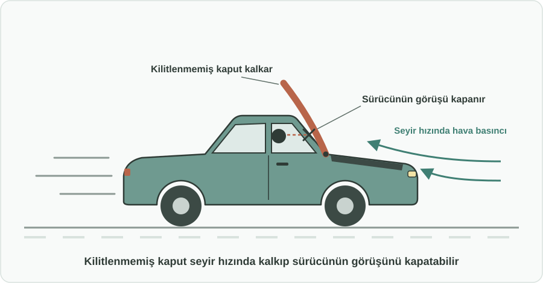
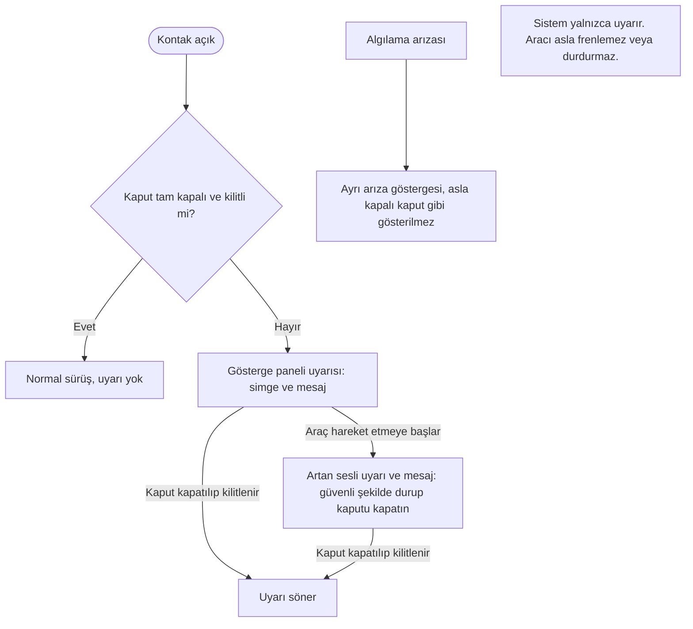

English: [README.md](README.md)

# Seyir Sırasında Açık Kaput Uyarısı: Kilitlenmemiş Kaputun Neden Olduğu Kazaların Önlenmesi

## Özet

Araçlar kapı veya bagaj açık kaldığında sürücüyü zaten uyarıyor. Kaput da aynı korumayı hak ediyor. Bu öneri, **açık kaput uyarısını** standart bir güvenlik özelliği haline getirir: kaput tam kapanıp kilitlenmediğinde araç sürücüyü uyarır, araç hareket etmeye başladığında ise uyarı daha ısrarcı hale gelir. Amaç basit: açık kalmış bir kaput seyir sırasında kalkıp sürücünün görüşünü kapatarak kazaya sebep olmamalı.

## Sorun

- Kaput sık açılır: yağ ve antifriz kontrolü, cam suyu ekleme, akü takviyesi, servis, oto yıkama. Kaputu yarım kapatmak ya da tam kilitlenmeden bırakmak kolaydır.
- Tam kilitlenmemiş bir kaputu sürücü koltuğundan fark etmek **zor veya imkânsızdır**. Kaputun kenarı alçakta durur ve araç park halindeyken normal görünür.
- Seyir hızında hava basıncı kilitlenmemiş kaputu kaldırabilir. Kaput kalkarsa **ön camı bir anda tamamen kapatır**. Sürücü hiçbir uyarı olmadan görüşünü kaybeder; bu da panikle frene basmaya, kontrol kaybına ve çarpışmalara yol açabilir, hem araçtakileri hem de diğer yol kullanıcılarını tehlikeye atar.
- Sürücülerin çoğu kapı açık uyarısına alışkındır, ancak kaput bu korumanın çoğu zaman dışında kalır ya da birçok araçta bu uyarı bulunmaz.

## Önerilen Çözüm

Kaputu, kapılar için zaten var olan "açık kalan kapak" uyarı mantığına dahil etmek:

1. **Algılama:** Araç, kaputun **tam kapalı ve kilitli** olup olmadığını bilir. Yarım kapalı durumu (emniyet mandalına oturmuş ama tam kilitlenmemiş) da "kapalı değil" olarak tanır.
2. **Park halinde uyarı:** Kaput tam kilitli değilken araç çalıştırıldığında veya kontak açıldığında, tıpkı kapı açık uyarısı gibi net bir **gösterge paneli uyarısı (simge ve mesaj)** görünür.
3. **Hareket halinde artan uyarı:** Araç kaput tam kilitli değilken hareket etmeye başlarsa uyarı **şiddetlenir**: sürekli sesli uyarı ve sürücüye güvenli şekilde durup kaputu kapatmasını söyleyen daha belirgin bir mesaj.
4. **Ani müdahale yok:** Sistem uyarır ama aracı kendi kendine frenlemez veya durdurmaz; böylece trafikte yeni bir tehlike yaratmaz.

## Nasıl Çalışır

| Durum | Sürücünün gördüğü |
|---|---|
| Kaput tam kapalı ve kilitli | Hiçbir şey. Normal sürüş. |
| Kontak açık, kaput tam kilitli değil | Gösterge panelinde simge ve mesaj: "Kaput açık" |
| Araç hareket ediyor, kaput tam kilitli değil | Sürekli sesli uyarı ve belirgin mesaj: "Kaput açık, güvenli şekilde durup kaputu kapatın" |
| Algılamanın kendisi arızalı | Ayrı bir arıza göstergesi; böylece bozuk bir uyarı asla kapalı kaput sanılmaz |

Deneyim, sürücülerin zaten bildiği kapı açık uyarısını bilinçli olarak taklit eder; yeni bir alışkanlık veya eğitim gerekmez.

## Uygulama ve Fazlandırma

1. **Gönüllü uygulama:** Üreticiler açık kaput uyarısını, kapı açık uyarısında olduğu gibi yeni modellere bir güvenlik özelliği olarak ekler.
2. **Yeni modeller için standart:** Uyarı, yeni modellerin araç tip onayında zorunlu hale gelir.
3. **Tüm yeni araçlar:** Zorunluluk, yeni tescil edilen tüm araçları kapsayacak şekilde genişletilir.
4. **Mevcut araçlar ve muayene:** Mevcut araçlar için basit bir sonradan takma seçeneği teşvik edilir; periyodik araç muayenesinde, bu özelliğe sahip araçlarda uyarının çalıştığı kontrol edilir.

## Paydaşlar ve Faydalar

- **Sürücüler ve yolcular:** Ön görüşün aniden ve tamamen kaybolmasına karşı koruma.
- **Diğer yol kullanıcıları:** Kaputu kalktığı için aniden fren yapan veya yön değiştiren araçların sebep olduğu kazaların azalması.
- **Servisler, oto yıkamalar ve yol yardım hizmetleri:** Kaputun açıldığı işlerden sonra daha az sorumluluk riski.
- **Üreticiler:** Sürücülerin zaten bildiği bir uyarıyı genişleten, düşük maliyetli ve anlatması kolay bir güvenlik özelliği.
- **Sigorta şirketleri:** Önlenebilir bir kaza türünden kaynaklanan hasar taleplerinin azalması.
- **Düzenleyici kurumlar:** Araç güvenlik gerekliliklerine basit ve ölçülebilir bir ekleme.

## Riskler ve Önlemler

| Risk | Önlem |
|---|---|
| Yanlış "kaput açık" uyarıları sürücüyü rahatsız eder | Güvenilir algılama; algılama sorunları için ayrı bir arıza göstergesi |
| Sürücüler uyarıyı görmezden gelir | Araç hareket edince uyarı şiddetlenir ve kaput kapanana kadar devam eder |
| Otomatik müdahale kendisi tehlike yaratabilir | Sistem yalnızca uyarır; aracı asla frenlemez veya durdurmaz |
| Üreticiler ve araç sahipleri için maliyet | Yeni modellerden başlayarak kademeli geçiş |

**Anahtar kelimeler:** trafik güvenliği, araç güvenliği, kaput, sürücü uyarısı, kaza önleme, tip onayı, otomotiv standartları

## Köken

Merih İlgör tarafından önerilmiştir (Eylül 2026); burada açık bir proje fikri olarak yayımlanmaktadır.

## Lisans

Bu çalışma, ticari olmayan kullanım için CC BY-NC-SA 4.0 lisansı ile lisanslanmıştır; bkz. [LICENSE](LICENSE). Ticari kullanım bir gelir paylaşımı anlaşması gerektirir; bkz. [COMMERCIAL-LICENSE.md](COMMERCIAL-LICENSE.md). Değiştirilmiş sürümler yeni bir fikir olarak satılamaz veya üçüncü kişilere aktarılamaz; patent benzeri haklar saklıdır. Bkz. [COMMERCIAL-LICENSE.md](COMMERCIAL-LICENSE.md#derivatives-improvements-and-idea-protection).
