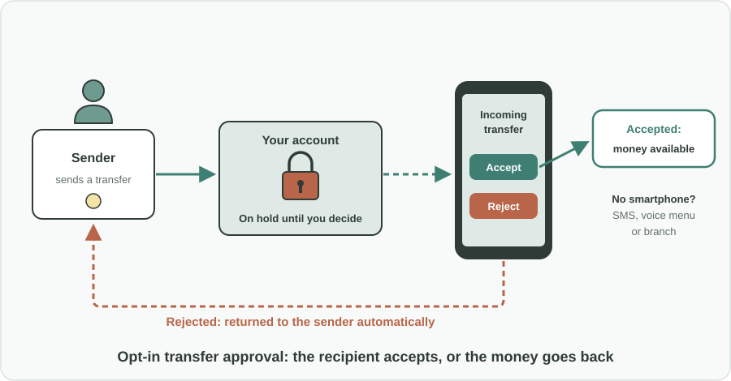
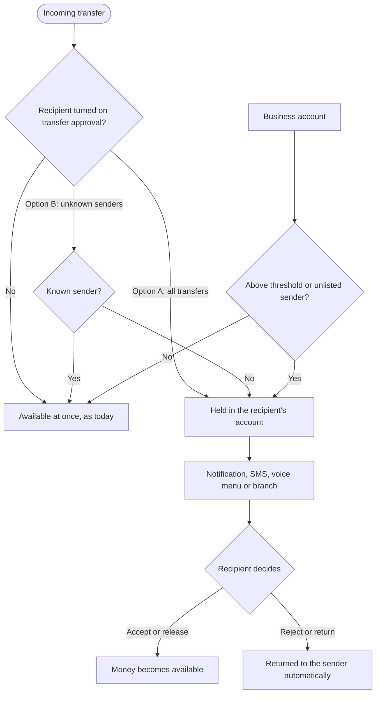

Türkçe: [README.tr.md](README.tr.md)

# Incoming Transfer Approval: Letting Recipients Accept or Return Money Before It Lands

## Summary

Today, anyone who knows your account number can send money into your account, and it becomes spendable at once, whether you expected it or not. Money sent by mistake, money pushed into accounts as part of a fraud, and money from unknown sources all land the same way. This proposal gives recipients an **optional control over incoming transfers**. Individuals can choose to **hold incoming transfers until they accept them**, or to **automatically hold transfers from unknown senders** and release or return them later. People who do not use mobile banking can decide by SMS, a phone voice menu or at a branch. Businesses can use **rule-based approval**, such as an amount threshold or a list of known senders. Everything is opt-in, and instant payments stay instant for everyone who does not choose it.

## Problem

- An incoming transfer is completed on the **sender's instruction alone**. The recipient has no say in whether money enters their account.
- **Wrong transfers** (a mistyped account number, the wrong person selected) put the recipient in an awkward position: the money is spendable, but it is not theirs, and returning it can be slow and unclear.
- Fraudsters can **push money into someone's account** and then pressure them to "send it back" or pass it on, turning ordinary people into unwitting links in a fraud or money-laundering chain.
- Money from an **unknown source** can create legal, tax and reconciliation problems for both individuals and companies.
- Businesses receive many payments every day. They need control over unexpected or unusually large incoming amounts, but **approving each one by hand would stop their work**.

## Proposed Solution

An **opt-in** control over incoming transfers, offered by banks and supported by the rules of the payment system:

### For individuals (the account holder chooses)

- **Option A: Pending model.** An incoming transfer reaches the account but stays **on hold (not spendable) until the recipient accepts it**.
  - Mobile banking users get a notification with the sender and amount, and can accept or reject.
  - People who do not use mobile banking can accept or reject **by SMS or through a phone voice menu**, or at a **branch**.
  - If the recipient rejects, the money is **returned to the sender automatically**.
- **Option B: Automatic hold for unknown senders.** Transfers from senders the recipient does not know are **held automatically**. Transfers from known senders arrive as usual. Later, the recipient can **release or return** a held transfer through the mobile app, a branch or the call center.

### For businesses (optional, rule-based)

Instead of approving every payment, businesses set rules:

- **Amount threshold:** transfers above an amount the business chooses need manual approval; smaller ones arrive as usual.
- **Known-sender list:** transfers from listed senders are accepted automatically; others are held.
- **Approval inside accounting workflows:** held transfers appear in the approval flow the finance team already uses.

### Principles

- **Opt-in only:** nothing changes for anyone who does not turn it on.
- **Instant payments stay instant:** the transfer still completes immediately; only its availability to the recipient waits for their decision.
- **Clear outcomes:** every held transfer ends in either "accepted" or "returned to sender".

## How It Works

| Situation | What the recipient experiences |
|---|---|
| Feature not turned on | Nothing changes. Money arrives and is available at once. |
| Option A, any incoming transfer | Notification: sender and amount, with Accept or Reject. The money is on hold until they decide. |
| Option B, transfer from a known sender | Arrives and is available as usual. |
| Option B, transfer from an unknown sender | Held automatically. The recipient can release or return it later. |
| Recipient does not use mobile banking | Decides by SMS, phone voice menu or at a branch. |
| Recipient rejects or returns a transfer | The money goes back to the sender automatically. |
| Business account, transfer above its threshold or from an unlisted sender | Held for approval in the company's usual approval flow. |

## Implementation & Phasing

1. **Rules for the payment system:** the central bank or payment-system operator defines how a held incoming transfer works: how it is shown, how long it can stay on hold, and how an automatic return to the sender is handled.
2. **Pilot with Option B:** banks start with the automatic hold for unknown senders, which needs the fewest changes and does not slow instant payments.
3. **Option A and non-mobile channels:** banks add the full pending model, with SMS, phone voice menu and branch options for people who do not use mobile banking.
4. **Business rules:** banks offer amount thresholds, known-sender lists and approval inside accounting workflows for business accounts.
5. **Review:** the regulator and banks review wrong-transfer and fraud cases after launch and adjust default hold times and rules.

## Stakeholders & Benefits

- **Individuals:** control over what enters their account, protection from mistakes and from being pulled into fraud.
- **Senders:** a quick, automatic return when they send money to the wrong person.
- **Businesses:** control over unexpected or large incoming payments without slowing daily work, and cleaner reconciliation.
- **Banks:** fewer disputes over wrong transfers, fewer accounts misused in fraud, and a clear security feature for customers.
- **The central bank and payment-system operator:** a safer payment system that keeps its speed.
- **Law enforcement and financial regulators:** fewer accounts used as unwitting links in fraud and money-laundering chains.

## Risks & Mitigations

| Risk | Mitigation |
|---|---|
| Instant payments become slower | The transfer still completes instantly; only its availability waits, and only for recipients who opted in |
| A recipient forgets to respond and money stays on hold | Reminders, and a clear rule for what happens after the maximum hold time |
| People without smartphones are left out | SMS, phone voice menu and branch options |
| Businesses are overwhelmed by approvals | Rule-based model with thresholds and known-sender lists instead of approving every payment |
| Fraudsters abuse returns | Returns go only to the original sending account, never to a new account named by someone else |
| Salaries, pensions or benefits are held by mistake | Recipients can mark regular payers as known senders, and banks can suggest them |

**Keywords:** instant payments, bank transfers, recipient approval, wrong transfer, fraud prevention, money mule, consumer protection, payment systems, banking security, business accounts

## Origin

Originally proposed by Merih İlgör (December 2025); published here as an open project idea.

## License

This work is licensed under CC BY-NC-SA 4.0 for non-commercial use; see [LICENSE](LICENSE). Commercial use requires a revenue-share agreement; see [COMMERCIAL-LICENSE.md](COMMERCIAL-LICENSE.md). Modified versions may not be sold or transferred to third parties as new ideas, and patent-like rights are reserved; see [COMMERCIAL-LICENSE.md](COMMERCIAL-LICENSE.md#derivatives-improvements-and-idea-protection).
