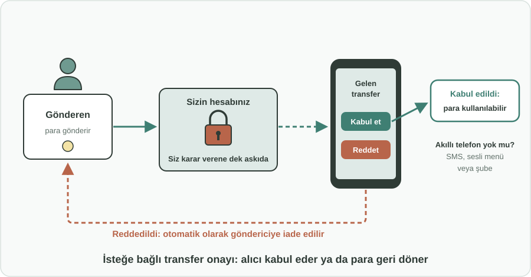
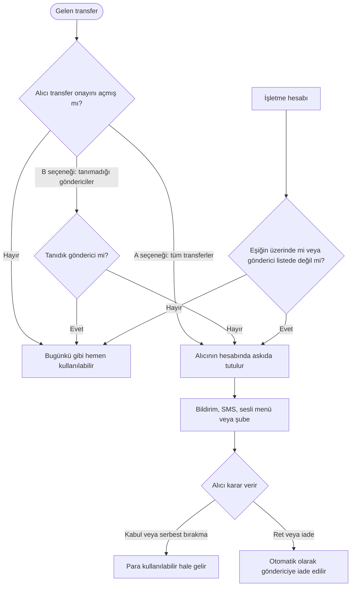

English: [README.md](README.md)

# Gelen Transfer Onayı: Alıcının Parayı Hesaba Geçmeden Kabul Etmesi veya İade Etmesi

## Özet

Bugün hesap numaranızı bilen herkes hesabınıza para gönderebilir ve bu para, bekleseniz de beklemeseniz de hemen kullanılabilir hale gelir. Yanlışlıkla gönderilen para, bir dolandırıcılık kapsamında hesaplara yatırılan para ve kaynağı bilinmeyen para aynı şekilde hesaba geçer. Bu öneri, alıcılara **gelen transferler üzerinde isteğe bağlı bir kontrol** verir. Bireyler **gelen transferleri kabul edene kadar askıda tutmayı** ya da **tanımadıkları göndericilerden gelen transferleri otomatik olarak bloke edip** daha sonra serbest bırakmayı veya iade etmeyi seçebilir. Mobil bankacılık kullanmayanlar kararlarını SMS, telefonla sesli menü veya şube üzerinden verebilir. İşletmeler, tutar eşiği veya tanımlı gönderici listesi gibi **kural bazlı onay** kullanabilir. Her şey isteğe bağlıdır; bunu seçmeyen herkes için anlık ödemeler anlık kalır.

## Sorun

- Gelen bir transfer **yalnızca gönderenin talimatıyla** tamamlanır. Alıcının, hesabına para girip girmeyeceği konusunda söz hakkı yoktur.
- **Yanlış transferler** (yanlış yazılmış hesap numarası, yanlış seçilen kişi) alıcıyı zor durumda bırakır: para harcanabilir durumdadır ama ona ait değildir ve iadesi yavaş ve belirsiz olabilir.
- Dolandırıcılar birinin hesabına **para yatırıp** ardından o kişiyi parayı "geri göndermesi" veya başka bir hesaba aktarması için baskı altına alabilir; böylece sıradan insanlar farkında olmadan bir dolandırıcılık veya kara para aklama zincirinin halkası haline gelir.
- **Kaynağı bilinmeyen** para, hem bireyler hem şirketler için hukuki, vergisel ve mutabakat sorunları yaratabilir.
- İşletmelere her gün çok sayıda ödeme gelir. Beklenmedik veya alışılmadık büyüklükteki tutarlar üzerinde kontrole ihtiyaç duyarlar, ancak **her birini elle onaylamak işlerini durdurur**.

## Önerilen Çözüm

Bankalar tarafından sunulan ve ödeme sisteminin kurallarıyla desteklenen, gelen transferler üzerinde **isteğe bağlı** bir kontrol:

### Bireyler için (seçim hesap sahibinindir)

- **A seçeneği: Askıda transfer modeli.** Gelen transfer hesaba ulaşır, ancak **alıcı kabul edene kadar askıda (kullanılamaz) kalır**.
  - Mobil bankacılık kullananlara gönderici ve tutarı içeren bir bildirim gelir; kabul edebilir veya reddedebilirler.
  - Mobil bankacılık kullanmayanlar **SMS ile veya telefonla sesli menü üzerinden** ya da **şubede** kabul veya ret verebilir.
  - Alıcı reddederse para **otomatik olarak göndericiye iade edilir**.
- **B seçeneği: Tanımadığı göndericiler için otomatik bloke.** Alıcının tanımadığı göndericilerden gelen transferler **otomatik olarak bloke edilir**. Tanıdık göndericilerden gelen transferler her zamanki gibi hesaba geçer. Alıcı daha sonra bloke edilen transferi mobil uygulama, şube veya çağrı merkezi üzerinden **serbest bırakabilir veya iade edebilir**.

### İşletmeler için (isteğe bağlı, kural bazlı)

İşletmeler her ödemeyi tek tek onaylamak yerine kurallar belirler:

- **Tutar eşiği:** İşletmenin belirlediği tutarın üzerindeki transferler elle onay gerektirir; daha küçük olanlar her zamanki gibi hesaba geçer.
- **Tanımlı gönderici listesi:** Listedeki göndericilerden gelen transferler otomatik kabul edilir; diğerleri bloke edilir.
- **Muhasebe iş akışlarında onay:** Bloke edilen transferler, finans ekibinin zaten kullandığı onay akışında görünür.

### İlkeler

- **Yalnızca isteğe bağlı:** Açmayan hiç kimse için hiçbir şey değişmez.
- **Anlık ödemeler anlık kalır:** Transfer yine anında tamamlanır; yalnızca paranın alıcı tarafından kullanılabilmesi onun kararını bekler.
- **Net sonuçlar:** Askıdaki her transfer ya "kabul edildi" ya da "göndericiye iade edildi" ile sonuçlanır.

## Nasıl Çalışır

| Durum | Alıcının deneyimi |
|---|---|
| Özellik açık değil | Hiçbir şey değişmez. Para gelir ve hemen kullanılabilir. |
| A seçeneği, gelen her transfer | Bildirim: gönderici ve tutar, Kabul et veya Reddet seçenekleriyle. Para, alıcı karar verene kadar askıdadır. |
| B seçeneği, tanıdık göndericiden transfer | Her zamanki gibi hesaba geçer ve kullanılabilir. |
| B seçeneği, tanımadığı göndericiden transfer | Otomatik olarak bloke edilir. Alıcı daha sonra serbest bırakabilir veya iade edebilir. |
| Alıcı mobil bankacılık kullanmıyor | Kararını SMS, telefonla sesli menü veya şube üzerinden verir. |
| Alıcı bir transferi reddeder veya iade eder | Para otomatik olarak göndericiye geri döner. |
| İşletme hesabı, eşiğin üzerinde veya listede olmayan göndericiden transfer | Şirketin olağan onay akışında onay için bekletilir. |

## Uygulama ve Fazlandırma

1. **Ödeme sistemi kuralları:** Merkez bankası veya ödeme sistemi işletmecisi, askıdaki bir gelen transferin nasıl işleyeceğini tanımlar: nasıl gösterileceği, ne kadar süre askıda kalabileceği ve göndericiye otomatik iadenin nasıl yapılacağı.
2. **B seçeneğiyle pilot:** Bankalar, en az değişiklik gerektiren ve anlık ödemeleri yavaşlatmayan, tanımadığı göndericiler için otomatik bloke seçeneğiyle başlar.
3. **A seçeneği ve mobil dışı kanallar:** Bankalar, mobil bankacılık kullanmayanlar için SMS, telefonla sesli menü ve şube seçenekleriyle birlikte tam askıda transfer modelini ekler.
4. **İşletme kuralları:** Bankalar işletme hesapları için tutar eşikleri, tanımlı gönderici listeleri ve muhasebe iş akışlarında onay sunar.
5. **Değerlendirme:** Düzenleyici kurum ve bankalar, uygulamaya geçtikten sonra yanlış transfer ve dolandırıcılık vakalarını inceler; varsayılan askı sürelerini ve kuralları günceller.

## Paydaşlar ve Faydalar

- **Bireyler:** Hesaplarına ne girdiği üzerinde kontrol; hatalara ve dolandırıcılığa alet edilmeye karşı koruma.
- **Göndericiler:** Parayı yanlış kişiye gönderdiklerinde hızlı ve otomatik iade.
- **İşletmeler:** Günlük işleri yavaşlatmadan beklenmedik veya büyük gelen ödemeler üzerinde kontrol ve daha temiz mutabakat.
- **Bankalar:** Yanlış transferlere ilişkin daha az anlaşmazlık, dolandırıcılıkta kötüye kullanılan daha az hesap ve müşterilere sunulacak net bir güvenlik özelliği.
- **Merkez bankası ve ödeme sistemi işletmecisi:** Hızından ödün vermeyen daha güvenli bir ödeme sistemi.
- **Kolluk ve finansal düzenleyiciler:** Dolandırıcılık ve kara para aklama zincirlerinde farkında olmadan kullanılan daha az hesap.

## Riskler ve Önlemler

| Risk | Önlem |
|---|---|
| Anlık ödemeler yavaşlar | Transfer yine anında tamamlanır; yalnızca kullanılabilirlik bekler ve bu yalnızca özelliği açan alıcılar için geçerlidir |
| Alıcı yanıt vermeyi unutur ve para askıda kalır | Hatırlatmalar ve azami askı süresinden sonra ne olacağına dair net bir kural |
| Akıllı telefonu olmayanlar dışarıda kalır | SMS, telefonla sesli menü ve şube seçenekleri |
| İşletmeler onaylar altında boğulur | Her ödemeyi onaylamak yerine eşik ve tanımlı gönderici listeleriyle kural bazlı model |
| Dolandırıcılar iadeyi kötüye kullanır | İade yalnızca parayı gönderen asıl hesaba yapılır, asla başkasının bildirdiği yeni bir hesaba yapılmaz |
| Maaş, emekli aylığı veya sosyal yardımlar yanlışlıkla bloke edilir | Alıcılar düzenli ödeme yapanları tanıdık gönderici olarak işaretleyebilir; bankalar bunları önerebilir |

**Anahtar kelimeler:** anlık ödemeler, para transferi, alıcı onayı, yanlış transfer, dolandırıcılık önleme, tüketici koruma, ödeme sistemleri, bankacılık güvenliği

## Köken

Merih İlgör tarafından önerilmiştir (Aralık 2025); burada açık bir proje fikri olarak yayımlanmaktadır.

## Lisans

Bu çalışma, ticari olmayan kullanım için CC BY-NC-SA 4.0 lisansı ile lisanslanmıştır; bkz. [LICENSE](LICENSE). Ticari kullanım bir gelir paylaşımı anlaşması gerektirir; bkz. [COMMERCIAL-LICENSE.md](COMMERCIAL-LICENSE.md). Değiştirilmiş sürümler yeni bir fikir olarak satılamaz veya üçüncü kişilere aktarılamaz; patent benzeri haklar saklıdır. Bkz. [COMMERCIAL-LICENSE.md](COMMERCIAL-LICENSE.md#derivatives-improvements-and-idea-protection).
