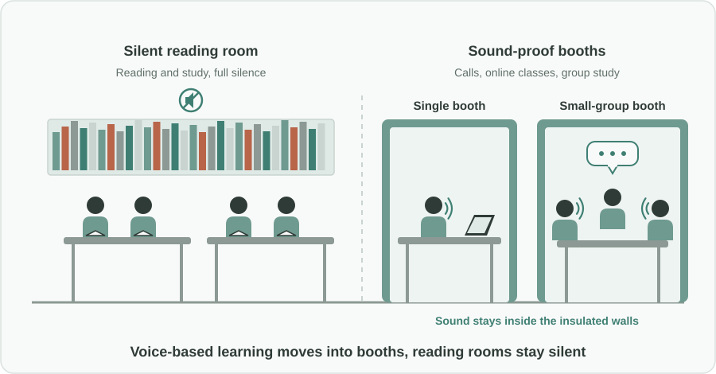
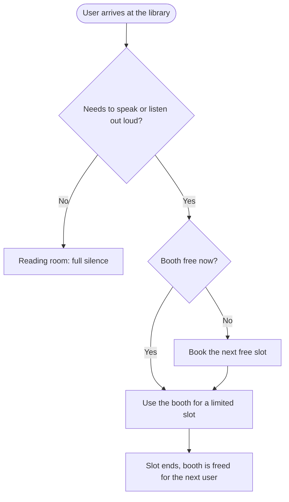

Türkçe: [README.tr.md](README.tr.md)

# Sound-Proof Booths in Public Libraries: Voice-Based Learning Without Breaking the Silence

## Summary

Libraries are built around silence, but more and more learning and work now happens out loud: language apps, recorded lectures, online classes, video meetings and phone calls. This proposal adds **sound-proof booths** for one person or a small group to public and national libraries, wherever the space set aside for reading allows it. Inside a booth, people can speak freely. Outside, the reading rooms stay quiet. The library keeps its core role and also becomes a place for modern, voice-based learning.

## Problem

- Silence is the basic rule of a library reading room, and for good reason: many people come to read and study in a calm place.
- At the same time, learning methods have changed. Many users need to **listen and speak**: practicing pronunciation with a language app, following a recorded lecture, joining an online class or exam, attending a video meeting, or making a short call.
- Today these users have poor options. They whisper and still disturb others, they step out into corridors or stairwells, or they leave the library and study somewhere else.
- The result is lost for both sides: readers are disturbed, and people who need their voice cannot use a public learning space that is otherwise ideal for them.

## Proposed Solution

Create **sound-insulated booths** inside libraries, sized for individual use or for a small group, so that voice-based activities have their own place:

1. **Only where capacity allows:** booths are added where the reading area has spare capacity, so seats for silent reading are not sacrificed. Libraries first look at how their reading space is actually used.
2. **Two sizes:** single booths for calls, online classes and language practice, and small-group booths for study groups and short meetings.
3. **Clear rules:** speaking is allowed only inside booths. Reading rooms stay fully silent, and signs make the difference obvious.
4. **Fair access:** booths can be booked for a limited time slot, with walk-in use when free, so a few users cannot occupy them all day.
5. **Basic comfort:** a desk, a seat, power, good lighting and ventilation, so a booth is a real place to learn and not a cupboard.

## How It Works

| User need | Where it happens |
|---|---|
| Silent reading and study | Reading rooms, as today |
| Language practice, listening to lectures out loud | Single booth |
| Online class, exam or video meeting | Single booth |
| Short phone call | Single booth, or a short walk-in slot |
| Study group or small team discussion | Small-group booth |

## Implementation & Phasing

1. **Usage review:** libraries review how their reading space is used and where there is spare capacity.
2. **Pilot:** a few large libraries install a small number of booths and track demand, booking patterns and user feedback, including feedback from silent readers.
3. **Rollout:** booth numbers and sizes are adjusted to the pilot results and extended to other libraries where capacity allows.
4. **Standard design:** new library buildings and major renovations plan booth space from the start.

## Stakeholders & Benefits

- **Students and lifelong learners:** a free public place for voice-based learning, online classes and exams.
- **Silent readers:** fewer whispers and phone conversations in reading rooms.
- **Remote workers and job seekers:** a quiet, private place for interviews and meetings.
- **Libraries:** better use of existing space, more visitors and a modern role in the community.
- **Local and national governments:** support for digital learning using buildings they already own.

## Risks & Mitigations

| Risk | Mitigation |
|---|---|
| Booths reduce seats for silent reading | Booths only where reading capacity allows; usage review before installation |
| Sound still leaks into reading rooms | Proper sound insulation and placement away from the quietest areas |
| A few users occupy booths all day | Time-limited slots and a simple booking system |
| Booths used for purposes unrelated to learning or work | Clear usage rules and staff oversight |
| Installation and upkeep cost | Pilot first, then rollout sized to measured demand |

**Keywords:** public libraries, sound-proof booths, quiet study, voice-based learning, online classes, remote work, language learning, lifelong learning, library design

## Origin

Originally proposed by Merih İlgör (June 2025); published here as an open project idea.

## License

This work is licensed under CC BY-NC-SA 4.0 for non-commercial use; see [LICENSE](LICENSE). Commercial use requires a revenue-share agreement; see [COMMERCIAL-LICENSE.md](COMMERCIAL-LICENSE.md). Modified versions may not be sold or transferred to third parties as new ideas, and patent-like rights are reserved; see [COMMERCIAL-LICENSE.md](COMMERCIAL-LICENSE.md#derivatives-improvements-and-idea-protection).
