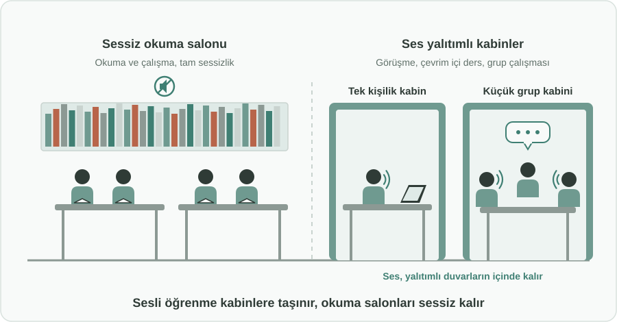
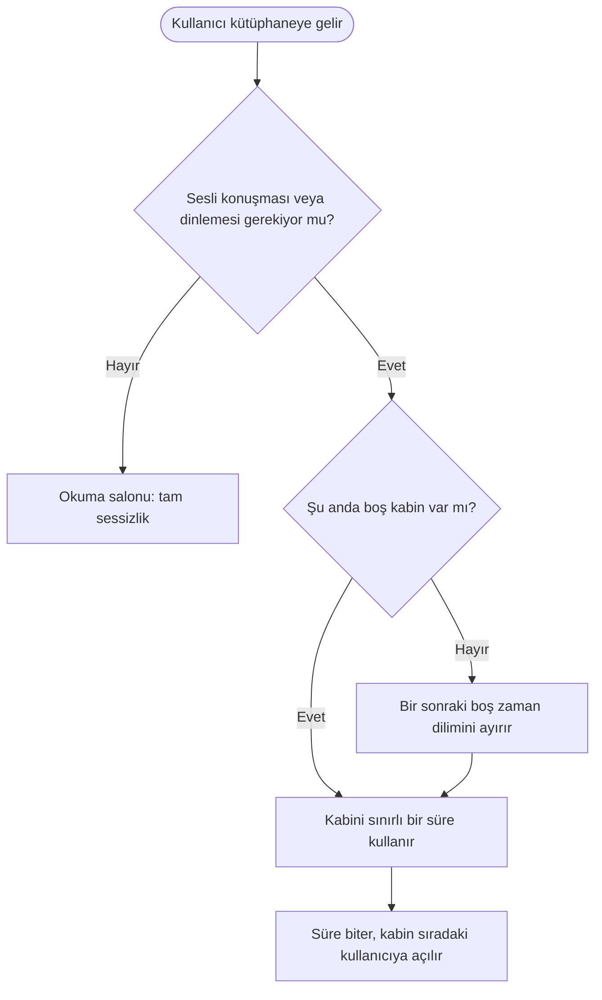

English: [README.md](README.md)

# Halk Kütüphanelerinde Ses Yalıtımlı Kabinler: Sessizliği Bozmadan Sesli Öğrenme

## Özet

Kütüphaneler sessizlik üzerine kuruludur, ancak öğrenmenin ve çalışmanın giderek daha büyük bir kısmı artık sesli yapılıyor: dil uygulamaları, kayıtlı dersler, çevrim içi sınıflar, görüntülü toplantılar ve telefon görüşmeleri. Bu öneri, okuma için ayrılan alanın elverdiği yerlerde, halk ve millet kütüphanelerine tek kişilik veya küçük grup için **ses yalıtımlı kabinler** eklenmesini önerir. Kabinin içinde insanlar rahatça konuşabilir; dışarıda ise okuma salonları sessiz kalır. Kütüphane asıl işlevini korurken sesli ve çağdaş öğrenme için de bir mekâna dönüşür.

## Sorun

- Sessizlik, kütüphane okuma salonlarının temel kuralıdır ve bunun iyi bir nedeni vardır: birçok kişi sakin bir ortamda okumak ve çalışmak için gelir.
- Öte yandan öğrenme yöntemleri değişti. Pek çok kullanıcının **dinlemesi ve konuşması** gerekiyor: dil uygulamasıyla telaffuz çalışmak, kayıtlı bir dersi takip etmek, çevrim içi bir derse veya sınava katılmak, görüntülü bir toplantıya girmek ya da kısa bir görüşme yapmak.
- Bugün bu kullanıcıların seçenekleri kötü: fısıldayarak konuşup yine de başkalarını rahatsız ediyorlar, koridorlara veya merdiven boşluklarına çıkıyorlar ya da kütüphaneden ayrılıp başka bir yerde çalışıyorlar.
- Sonuçta iki taraf da kaybediyor: okuyucular rahatsız oluyor, sesini kullanması gerekenler ise aslında kendileri için ideal olan bir kamusal öğrenme alanından yararlanamıyor.

## Önerilen Çözüm

Sesli etkinliklerin kendine ait bir yeri olması için kütüphanelerin içinde, bireysel kullanıma veya küçük gruplara uygun **ses yalıtımlı kabinler** oluşturmak:

1. **Yalnızca kapasite elverdiğinde:** Kabinler, okuma alanında boş kapasite bulunan yerlere eklenir; böylece sessiz okuma için ayrılan koltuklardan feragat edilmez. Kütüphaneler önce okuma alanlarının fiilen nasıl kullanıldığına bakar.
2. **İki boyut:** Görüşmeler, çevrim içi dersler ve dil pratiği için tek kişilik kabinler; çalışma grupları ve kısa toplantılar için küçük grup kabinleri.
3. **Açık kurallar:** Konuşmaya yalnızca kabinlerin içinde izin verilir. Okuma salonları tamamen sessiz kalır ve tabelalar bu farkı açıkça gösterir.
4. **Adil erişim:** Kabinler sınırlı süreli zaman dilimleri için rezerve edilebilir, boşsa doğrudan kullanılabilir; böylece birkaç kullanıcı kabinleri bütün gün işgal edemez.
5. **Temel konfor:** Masa, oturak, priz, iyi aydınlatma ve havalandırma; kabin bir dolap değil, gerçek bir öğrenme alanı olur.

## Nasıl Çalışır

| Kullanıcı ihtiyacı | Nerede karşılanır |
|---|---|
| Sessiz okuma ve çalışma | Bugün olduğu gibi okuma salonları |
| Dil pratiği, dersleri sesli dinleme | Tek kişilik kabin |
| Çevrim içi ders, sınav veya görüntülü toplantı | Tek kişilik kabin |
| Kısa telefon görüşmesi | Tek kişilik kabin veya kısa süreli doğrudan kullanım |
| Çalışma grubu veya küçük ekip görüşmesi | Küçük grup kabini |

## Uygulama ve Fazlandırma

1. **Kullanım incelemesi:** Kütüphaneler okuma alanlarının nasıl kullanıldığını ve nerede boş kapasite olduğunu inceler.
2. **Pilot uygulama:** Birkaç büyük kütüphane az sayıda kabin kurar; talebi, rezervasyon alışkanlıklarını ve sessiz okuyucular dahil kullanıcı geri bildirimlerini izler.
3. **Yaygınlaştırma:** Kabin sayısı ve boyutları pilot sonuçlarına göre ayarlanır ve kapasitenin elverdiği diğer kütüphanelere genişletilir.
4. **Standart tasarım:** Yeni kütüphane binaları ve büyük tadilatlar, kabin alanını baştan planlar.

## Paydaşlar ve Faydalar

- **Öğrenciler ve yaşam boyu öğrenenler:** Sesli öğrenme, çevrim içi dersler ve sınavlar için ücretsiz bir kamusal alan.
- **Sessiz okuyucular:** Okuma salonlarında daha az fısıltı ve telefon konuşması.
- **Uzaktan çalışanlar ve iş arayanlar:** Mülakatlar ve toplantılar için sessiz ve mahremiyeti olan bir yer.
- **Kütüphaneler:** Mevcut alanın daha iyi kullanımı, daha fazla ziyaretçi ve toplumda çağdaş bir rol.
- **Yerel ve merkezi yönetimler:** Zaten sahip oldukları binalarla dijital öğrenmeye destek.

## Riskler ve Önlemler

| Risk | Önlem |
|---|---|
| Kabinler sessiz okuma koltuklarını azaltır | Kabinler yalnızca okuma kapasitesinin elverdiği yerlerde; kurulumdan önce kullanım incelemesi |
| Ses yine de okuma salonlarına sızar | Doğru ses yalıtımı ve en sessiz alanlardan uzak konumlandırma |
| Birkaç kullanıcı kabinleri bütün gün işgal eder | Süre sınırlı kullanım ve basit bir rezervasyon sistemi |
| Kabinler öğrenme veya iş dışı amaçlarla kullanılır | Açık kullanım kuralları ve personel gözetimi |
| Kurulum ve bakım maliyeti | Önce pilot, ardından ölçülen talebe göre yaygınlaştırma |

**Anahtar kelimeler:** halk kütüphaneleri, millet kütüphaneleri, ses yalıtımlı kabin, sessiz çalışma, sesli öğrenme, çevrim içi ders, uzaktan çalışma, yaşam boyu öğrenme

## Köken

Merih İlgör tarafından önerilmiştir (Haziran 2025); burada açık bir proje fikri olarak yayımlanmaktadır.

## Lisans

Bu çalışma, ticari olmayan kullanım için CC BY-NC-SA 4.0 lisansı ile lisanslanmıştır; bkz. [LICENSE](LICENSE). Ticari kullanım bir gelir paylaşımı anlaşması gerektirir; bkz. [COMMERCIAL-LICENSE.md](COMMERCIAL-LICENSE.md). Değiştirilmiş sürümler yeni bir fikir olarak satılamaz veya üçüncü kişilere aktarılamaz; patent benzeri haklar saklıdır. Bkz. [COMMERCIAL-LICENSE.md](COMMERCIAL-LICENSE.md#derivatives-improvements-and-idea-protection).
