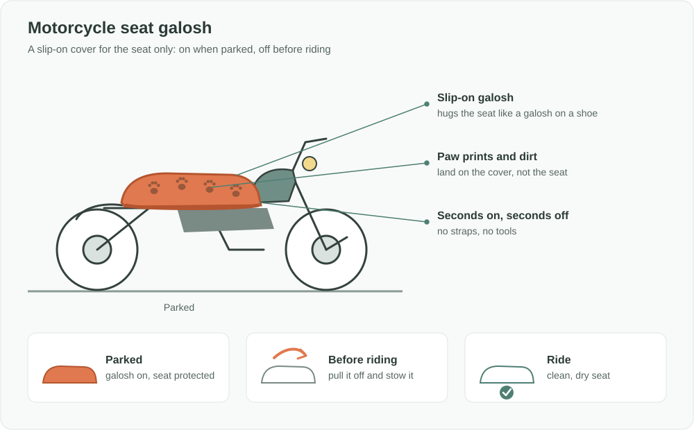

Türkçe: [README.tr.md](README.tr.md)

# Motorcycle Seat Galosh: A Slip-On Cover That Keeps Parked Seats Clean

## Summary

Cats love the soft, warm seats of parked motorcycles and scooters, and they leave paw prints, dirt and hair behind. The **Motorcycle Seat Galosh** is a slip-on cover for the seat only, **like a galosh for a shoe**. It goes over the seat in seconds when the bike is parked and comes off just as fast before riding. The seat stays clean and hygienic, with none of the hassle of a full motorcycle cover.

## Problem

- Motorcycles and scooters are usually parked outdoors: on the street, in front of homes, at work.
- **Cats are drawn to soft, warm seats**, especially right after a ride. They sit and sleep on them and leave **paw prints, dirt and hair**.
- The rider then either has to clean the seat before every ride or sit on a dirty seat. Keeping the seat clean and hygienic is a common, everyday annoyance for motorcycle owners.
- Full motorcycle covers exist, but they are bulky and slow to put on and take off, so most riders don't use them for everyday parking or short stops.

## Proposed Solution

A **seat-only, galosh-style slip-on cover**:

1. **Galosh principle:** just as a galosh slips over a shoe, the cover slips over the seat and hugs it without straps or tools.
2. **Seconds on, seconds off:** it is fitted when the bike is parked and removed before riding.
3. **Seat only:** it covers just the part that gets dirty and that the rider touches, so it stays small and light.
4. **Compact:** it folds small enough to carry on the bike or in a pocket, so it is always at hand.
5. **Easy to clean:** paw prints and dirt end up on the cover, which can simply be shaken out or washed.
6. **Stays in place:** it fits snugly enough that wind does not blow it off while the bike is parked.

## How It Works

| Moment | What the rider does | Result |
|---|---|---|
| Parking | Slips the galosh over the seat | Cats and dirt meet the cover, not the seat |
| While parked | Nothing | The seat stays clean |
| Before riding | Pulls the galosh off and stows it | A clean, dry seat to sit on |
| Cover gets dirty | Shakes it out or washes it | Ready to use again |

## Implementation & Phasing

1. **Prototype:** make prototypes for the most common seat shapes and test fit, speed of use and how well they keep the seat clean.
2. **Sizes:** offer a small range of sizes covering scooters, standard motorcycles and larger touring seats.
3. **Retail launch:** sell through motorcycle accessory shops, dealers and online marketplaces.
4. **Partnerships:** offer it as a gift or accessory with new motorcycle and scooter sales, and to delivery and courier fleets.

## Stakeholders & Benefits

- **Riders:** a clean, hygienic seat every time, without cleaning before each ride.
- **Couriers and delivery riders:** who park many times a day and need a clean seat quickly.
- **Motorcycle dealers and accessory shops:** a low-cost, easy-to-understand add-on product.
- **Manufacturers:** a simple new product line with a clear everyday use.
- **Cats and neighbours:** fewer conflicts between riders and street cats, because the problem is solved without chasing cats away.

## Risks & Mitigations

| Risk | Mitigation |
|---|---|
| The rider forgets to remove it before riding | A visible colour or tag that says "remove before riding", and a design that is obvious when it is still on |
| It blows away or slips off while parked | A snug, galosh-style fit around the seat |
| It gets lost or stolen | Low cost, and it can be stowed on the bike |
| Full covers and fitted seat covers already exist | This idea is seat-only, fits in seconds and can be carried everywhere, which suits everyday parking |

**Keywords:** motorcycle accessories, scooter, seat cover, galosh, street cats, parking, hygiene, cleanliness, couriers, consumer product

## Origin

Originally drafted by Merih İlgör (February 2026) as the example idea on the Vestinno innovation marketplace; published here as an open project idea.

## License

This work is licensed under CC BY-NC-SA 4.0 for non-commercial use; see [LICENSE](LICENSE). Commercial use requires a revenue-share agreement; see [COMMERCIAL-LICENSE.md](COMMERCIAL-LICENSE.md). Modified versions may not be sold or transferred to third parties as new ideas, and patent-like rights are reserved; see [COMMERCIAL-LICENSE.md](COMMERCIAL-LICENSE.md#derivatives-improvements-and-idea-protection).
