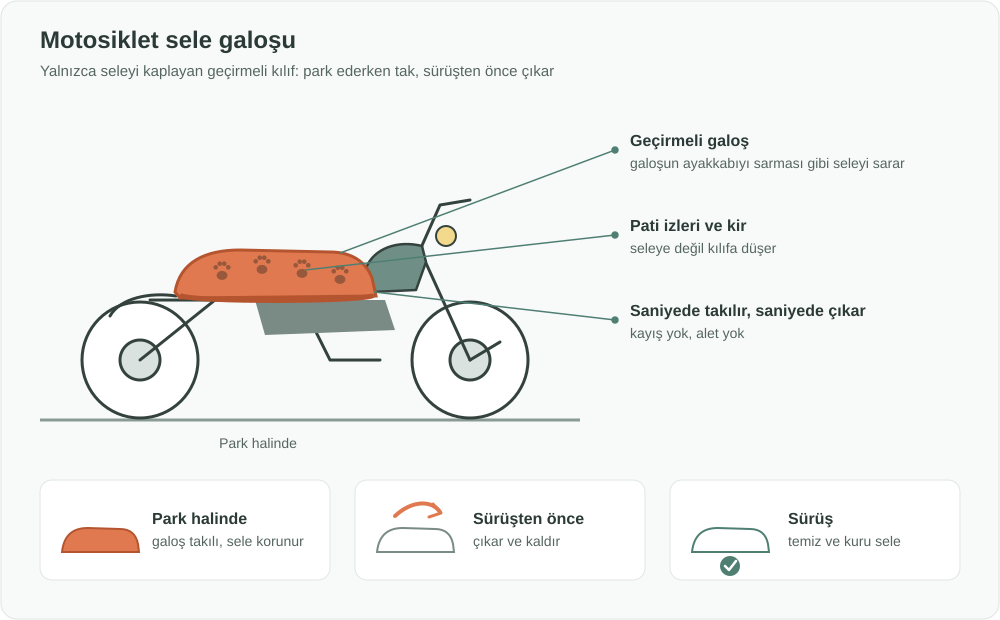

English: [README.md](README.md)

# Motosiklet Sele Galoşu: Park Halindeki Seleyi Temiz Tutan Geçirmeli Kılıf

## Özet

Kediler park halindeki motosiklet ve scooterların yumuşak, sıcak selelerini çok sever; geride pati izi, kir ve tüy bırakırlar. **Motosiklet Sele Galoşu**, yalnızca seleyi saran, **ayakkabı galoşu gibi** geçirmeli bir kılıftır. Motosiklet park edildiğinde saniyeler içinde selenin üzerine geçirilir, sürüşten önce de aynı hızla çıkarılır. Tam motosiklet brandasının zahmeti olmadan sele temiz ve hijyenik kalır.

## Sorun

- Motosikletler ve scooterlar genellikle açık havada park edilir: sokakta, evin önünde, iş yerinde.
- **Kediler yumuşak ve sıcak selelere yönelir**, özellikle sürüşten hemen sonra. Üzerine oturur, uyurlar ve **pati izi, kir ve tüy** bırakırlar.
- Sürücü ya her sürüşten önce seleyi temizlemek ya da kirli seleye oturmak zorunda kalır. Seleyi temiz ve hijyenik tutmak, motosiklet sahipleri için yaygın ve günlük bir sorundur.
- Tam motosiklet brandaları var, ancak hacimli ve takıp çıkarması yavaş olduğu için sürücülerin çoğu bunları günlük park ve kısa duraklamalarda kullanmaz.

## Önerilen Çözüm

**Yalnızca seleyi kaplayan, galoş tarzı geçirmeli bir kılıf:**

1. **Galoş prensibi:** Galoşun ayakkabının üzerine geçmesi gibi kılıf da selenin üzerine geçer; kayış veya alet gerektirmeden seleyi sarar.
2. **Saniyede takılır, saniyede çıkar:** Motosiklet park edilince takılır, sürüşten önce çıkarılır.
3. **Sadece sele:** Yalnızca kirlenen ve sürücünün temas ettiği bölümü kapladığı için küçük ve hafif kalır.
4. **Kompakt:** Motosiklette veya cepte taşınacak kadar küçük katlanır; her zaman el altındadır.
5. **Kolay temizlenir:** Pati izleri ve kir kılıfta kalır; silkelenir ya da yıkanır.
6. **Yerinde durur:** Park halindeyken rüzgârın uçurmayacağı kadar sıkı oturur.

## Nasıl Çalışır

| An | Sürücünün yaptığı | Sonuç |
|---|---|---|
| Park ederken | Galoşu selenin üzerine geçirir | Kediler ve kir seleye değil kılıfa gelir |
| Park halindeyken | Hiçbir şey | Sele temiz kalır |
| Sürüşten önce | Galoşu çıkarıp kaldırır | Oturmak için temiz ve kuru bir sele |
| Kılıf kirlendiğinde | Silkeler ya da yıkar | Yeniden kullanıma hazır |

## Uygulama ve Fazlandırma

1. **Prototip:** En yaygın sele şekilleri için prototipler yapılır; oturma, kullanım hızı ve seleyi ne kadar temiz tuttuğu test edilir.
2. **Bedenler:** Scooter, standart motosiklet ve daha büyük touring seleleri kapsayan birkaç beden sunulur.
3. **Satışa çıkış:** Motosiklet aksesuar mağazaları, bayiler ve çevrimiçi pazar yerleri üzerinden satış.
4. **İş birlikleri:** Yeni motosiklet ve scooter satışlarında hediye veya aksesuar olarak; kurye ve teslimat filolarına sunulması.

## Paydaşlar ve Faydalar

- **Sürücüler:** Her sürüşten önce temizlik yapmadan, her seferinde temiz ve hijyenik bir sele.
- **Kuryeler ve teslimat sürücüleri:** Günde defalarca park edip hızla temiz bir seleye ihtiyaç duyanlar.
- **Motosiklet bayileri ve aksesuar mağazaları:** Düşük maliyetli, anlatması kolay bir ek ürün.
- **Üreticiler:** Günlük kullanımı net, basit yeni bir ürün grubu.
- **Kediler ve komşular:** Sorun kedileri kovalamadan çözüldüğü için sürücüler ile sokak kedileri arasında daha az sürtüşme.

## Riskler ve Önlemler

| Risk | Önlem |
|---|---|
| Sürücünün sürüşten önce çıkarmayı unutması | "Sürüşten önce çıkarın" yazan dikkat çekici bir renk veya etiket; takılıyken belli olan bir tasarım |
| Park halindeyken uçması veya kayması | Seleyi saran, galoş tarzı sıkı oturma |
| Kaybolması veya çalınması | Düşük maliyet; motosiklette saklanabilmesi |
| Tam brandaların ve sabit sele kılıflarının zaten bulunması | Bu fikir yalnızca seleyi kaplar, saniyeler içinde takılır ve her yere taşınabilir; günlük park için uygundur |

**Anahtar kelimeler:** motosiklet aksesuarı, scooter, sele kılıfı, galoş, sokak kedileri, park, hijyen, temizlik, kurye, tüketici ürünü

## Köken

Merih İlgör tarafından Vestinno inovasyon pazar yerindeki örnek fikir olarak hazırlanmıştır (Şubat 2026); burada açık bir proje fikri olarak yayımlanmaktadır.

## Lisans

Bu çalışma, ticari olmayan kullanım için CC BY-NC-SA 4.0 lisansı ile lisanslanmıştır; bkz. [LICENSE](LICENSE). Ticari kullanım bir gelir paylaşımı anlaşması gerektirir; bkz. [COMMERCIAL-LICENSE.md](COMMERCIAL-LICENSE.md).
