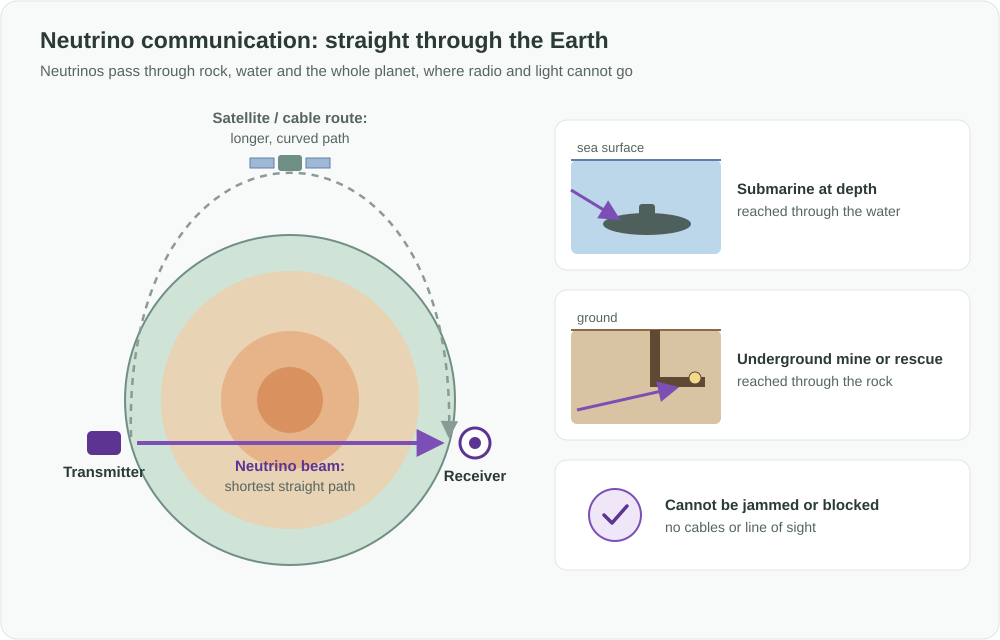

Türkçe: [README.tr.md](README.tr.md)

# Neutrino Communication: Sending Signals Straight Through the Earth

## Summary

Every telecommunication method in use today relies on light or radio. Both are stopped by rock, deep water, ice and the planet itself, so signals must travel around obstacles: up to satellites, along cables on the seabed, or through relay stations. **Neutrinos** are elementary particles that barely interact with matter. They pass straight through mountains, oceans and the entire Earth almost unaffected. This project proposes developing **neutrino transmitters and receivers as a new telecommunication method**: a way to send messages where no other signal can reach, and to link two points on the planet along the shortest possible path, straight through it.

## Problem

- **Radio and light cannot penetrate deep water.** Submarines at depth can receive only a few characters per minute, or have to rise toward the surface to communicate, which compromises their safety and mission.
- **Underground spaces are cut off.** Mines, tunnels, deep shelters and collapsed buildings lose contact with the surface in exactly the situations where communication matters most, such as accidents and rescues.
- **Global links take the long way round.** A message between opposite sides of the world travels around the curve of the Earth through cables, routers and satellites. The straight line through the planet is much shorter but unusable with light or radio.
- **Signals can be blocked or jammed.** Radio links can be jammed, and cables and satellites can be cut or disabled.
- **Some places have no line of sight at all:** polar and ice stations, and in the long term spacecraft hidden behind a planet.

## Proposed Solution

Use **neutrino beams as a carrier of information**:

1. **Transmitter:** a source produces a stream of neutrinos that can be switched on and off, or varied, in a controlled pattern. That pattern carries the message.
2. **Straight path:** the beam is aimed at the receiver and travels in a straight line through whatever lies in between (rock, water, ice or the whole planet) without needing cables, relays or line of sight.
3. **Receiver:** a detector at the destination registers the rare neutrinos that interact with it and reconstructs the pattern, and therefore the message.
4. **New uses first, not replacement:** neutrino links are not meant to replace fiber or radio. They target the places and needs those methods cannot serve.

## How It Works

| Situation | Today | With neutrino communication |
|---|---|---|
| Submarine at depth | Very slow, or must approach the surface | Messages reach it at depth, through the water |
| Mine, tunnel or rescue site | Cut off when cables and radio fail | A signal can reach it through the rock |
| Link between distant points on Earth | Long, curved path via cables and satellites | Shortest straight path through the planet |
| Jamming or cut cables | Link can be disrupted | Practically impossible to block or jam |

The principle has already been demonstrated in research. In 2012 a team at Fermilab in the United States sent a short message, the word "neutrino", using a neutrino beam through hundreds of meters of solid rock to a detector, at a very low data rate. The challenge now is to turn that proof of principle into a practical communication method.

## Implementation & Phasing

1. **Research demonstrations:** repeat and extend the existing proof of principle over longer distances and through more challenging paths, and improve reliability and data rate.
2. **Critical low-rate signaling:** very short, high-value messages where nothing else works, for example alerts to submarines at depth, emergency signals to underground sites, and precise time and clock synchronization.
3. **Fixed long-distance links:** permanent through-the-Earth links between large facilities, offering a shorter path and a channel that cannot be jammed.
4. **Smaller, cheaper receivers:** as research makes receivers smaller and more sensitive, expand to more sites and more applications, including polar stations and, in the long term, deep space.

## Stakeholders & Benefits

- **Maritime and defense organizations:** contact with submarines at depth without exposing them.
- **Mining, tunneling and civil protection:** a lifeline to underground workers and trapped people during accidents and disasters.
- **Telecom and finance:** a shorter physical path between distant points, valuable where every millisecond counts.
- **Critical infrastructure:** a backup channel that cannot be jammed or cut when cables or satellites fail.
- **Science and space agencies:** links to polar stations today and, in the long term, to spacecraft behind planets.
- **Research institutions and industry:** a new field of telecommunication with long-term scientific and economic value.

## Risks & Mitigations

| Risk | Mitigation |
|---|---|
| Neutrinos interact so rarely that today's transmitters need very large facilities and receivers are very large | Start with fixed, high-value links between large facilities; invest in research toward smaller, more sensitive receivers |
| Very low data rates | Focus first on short, critical messages and time synchronization, where even a few bits matter |
| High cost | Share facilities between research and communication; prioritize uses where no alternative exists |
| A beam passes through everything in its path and cannot be shielded | Encrypt the content; in practice, receiving the signal requires a very large dedicated detector precisely in the beam's path, which makes casual interception extremely difficult |
| The idea is not new in principle | This project focuses on turning it into a practical telecom method with clear use cases and a roadmap, rather than claiming a first invention |

## References

- Neutrino communication has been discussed in scientific literature since the 1970s, including proposals for communicating with submarines.
- 2012: researchers at Fermilab sent the word "neutrino" with a neutrino beam through hundreds of meters of rock to a detector, the first demonstration of communication using neutrinos.

**Keywords:** neutrino communication, telecommunications, through-Earth communication, submarine communication, underground communication, mine rescue, anti-jamming, low-latency links, particle physics, frontier technology

## Origin

Originally proposed by Merih İlgör (October 2026); published here as an open project idea.

## License

This work is licensed under CC BY-NC-SA 4.0 for non-commercial use; see [LICENSE](LICENSE). Commercial use requires a revenue-share agreement; see [COMMERCIAL-LICENSE.md](COMMERCIAL-LICENSE.md). Modified versions may not be sold or transferred to third parties as new ideas, and patent-like rights are reserved; see [COMMERCIAL-LICENSE.md](COMMERCIAL-LICENSE.md#derivatives-improvements-and-idea-protection).
