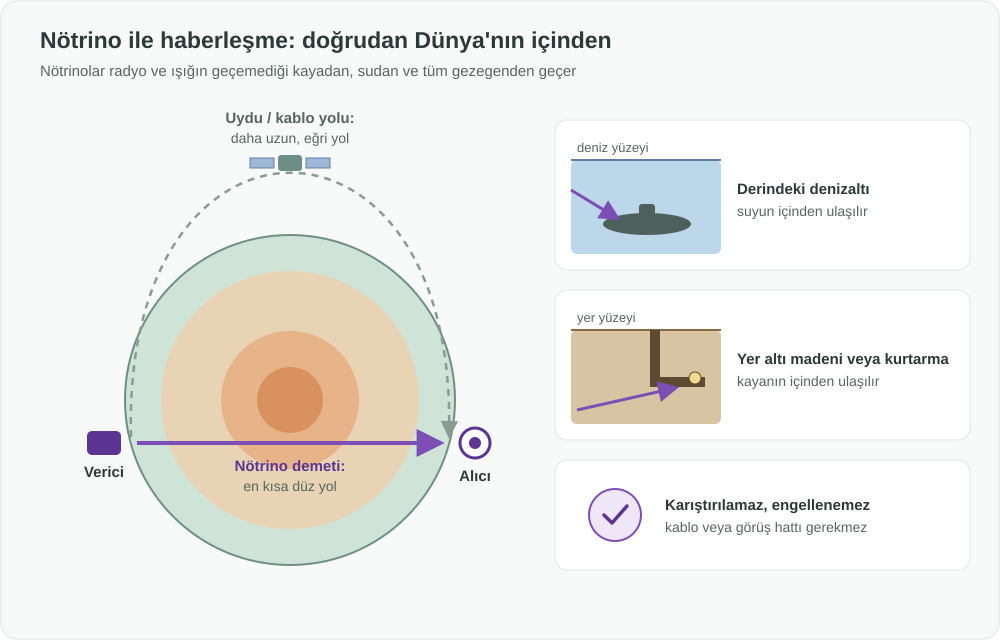

English: [README.md](README.md)

# Nötrino ile Haberleşme: Sinyalleri Doğrudan Dünya'nın İçinden Göndermek

## Özet

Bugün kullanılan bütün haberleşme yöntemleri ışığa veya radyo dalgalarına dayanır. İkisi de kaya, derin su, buz ve gezegenin kendisi tarafından durdurulur; bu yüzden sinyaller engellerin etrafından dolaşmak zorundadır: uydulara çıkarak, deniz tabanındaki kablolarla ya da aktarma istasyonlarıyla. **Nötrinolar** maddeyle neredeyse hiç etkileşime girmeyen temel parçacıklardır. Dağların, okyanusların ve tüm Dünya'nın içinden neredeyse hiç etkilenmeden geçerler. Bu proje, **nötrino vericilerini ve alıcılarını yeni bir haberleşme yöntemi olarak** geliştirmeyi önerir: başka hiçbir sinyalin ulaşamadığı yerlere mesaj göndermenin ve gezegendeki iki noktayı mümkün olan en kısa yoldan, doğrudan içinden geçerek birbirine bağlamanın bir yolu.

## Sorun

- **Radyo ve ışık derin suya işlemez.** Derindeki denizaltılar dakikada yalnızca birkaç karakter alabilir ya da haberleşmek için yüzeye yaklaşmak zorunda kalır; bu da güvenliklerini ve görevlerini tehlikeye atar.
- **Yer altı alanları iletişimden kopar.** Madenler, tüneller, derin sığınaklar ve çökmüş binalar; kaza ve kurtarma gibi iletişimin en çok önem taşıdığı anlarda yüzeyle bağlantısını kaybeder.
- **Küresel bağlantılar uzun yoldan gider.** Dünya'nın karşı taraflarındaki iki nokta arasındaki bir mesaj, kablolar, yönlendiriciler ve uydular üzerinden gezegenin eğrisini dolaşarak ilerler. Gezegenin içinden geçen düz çizgi çok daha kısadır ama ışık veya radyo ile kullanılamaz.
- **Sinyaller engellenebilir veya karıştırılabilir.** Radyo bağlantıları karıştırılabilir (jamming); kablolar ve uydular kesilebilir veya devre dışı bırakılabilir.
- **Bazı yerlerde hiç görüş hattı yoktur:** Kutup ve buz istasyonları, uzun vadede ise bir gezegenin arkasında kalan uzay araçları.

## Önerilen Çözüm

**Nötrino demetlerini bilgi taşıyıcısı olarak** kullanmak:

1. **Verici:** Bir kaynak, kontrollü bir desenle açılıp kapatılabilen ya da değiştirilebilen bir nötrino akışı üretir. Bu desen mesajı taşır.
2. **Düz yol:** Demet alıcıya yöneltilir ve aradaki her şeyin (kaya, su, buz ya da gezegenin tamamı) içinden düz bir çizgi halinde geçer; kablo, aktarma istasyonu veya görüş hattı gerekmez.
3. **Alıcı:** Hedefteki bir dedektör, kendisiyle etkileşime giren nadir nötrinoları kaydeder ve deseni, dolayısıyla mesajı yeniden oluşturur.
4. **Önce yeni kullanımlar, yerine geçmek değil:** Nötrino bağlantılarının amacı fiber veya radyonun yerini almak değildir. Bu yöntemlerin hizmet veremediği yerleri ve ihtiyaçları hedefler.

## Nasıl Çalışır

| Durum | Bugün | Nötrino haberleşmesi ile |
|---|---|---|
| Derindeki denizaltı | Çok yavaş ya da yüzeye yaklaşmak zorunda | Mesajlar suyun içinden, derinlikteyken ulaşır |
| Maden, tünel veya kurtarma alanı | Kablo ve radyo çökünce iletişim kopar | Sinyal kayanın içinden ulaşabilir |
| Dünya'daki uzak noktalar arası bağlantı | Kablo ve uydular üzerinden uzun, eğri yol | Gezegenin içinden en kısa düz yol |
| Karıştırma (jamming) veya kesilen kablolar | Bağlantı bozulabilir | Engellenmesi veya karıştırılması pratikte imkânsız |

İlke araştırmalarda zaten gösterilmiştir. 2012'de ABD'deki Fermilab'da bir ekip, bir nötrino demetiyle kısa bir mesajı ("neutrino" kelimesini) yüzlerce metre kalınlığındaki kayanın içinden bir dedektöre, çok düşük bir veri hızıyla göndermiştir. Şimdiki zorluk, bu ilke kanıtını pratik bir haberleşme yöntemine dönüştürmektir.

## Uygulama ve Fazlandırma

1. **Araştırma gösterimleri:** Mevcut ilke kanıtını daha uzun mesafelerde ve daha zorlu yollarda tekrarlamak ve genişletmek; güvenilirliği ve veri hızını artırmak.
2. **Kritik, düşük hızlı sinyalleşme:** Başka hiçbir şeyin işe yaramadığı çok kısa ve yüksek değerli mesajlar: örneğin derindeki denizaltılara uyarılar, yer altı alanlarına acil durum sinyalleri ve hassas zaman ve saat senkronizasyonu.
3. **Sabit uzun mesafe bağlantıları:** Büyük tesisler arasında, daha kısa bir yol ve karıştırılamayan bir kanal sunan kalıcı, Dünya'nın içinden geçen bağlantılar.
4. **Daha küçük ve ucuz alıcılar:** Araştırmalar alıcıları küçültüp daha hassas hale getirdikçe, kutup istasyonları ve uzun vadede derin uzay dahil olmak üzere daha fazla noktaya ve uygulamaya yayılmak.

## Paydaşlar ve Faydalar

- **Denizcilik ve savunma kurumları:** Denizaltılarla, onları açığa çıkarmadan, derinlikteyken iletişim.
- **Madencilik, tünelcilik ve sivil savunma:** Kaza ve afetlerde yer altındaki çalışanlara ve mahsur kalanlara bir can simidi.
- **Telekomünikasyon ve finans:** Her milisaniyenin önemli olduğu durumlarda uzak noktalar arasında daha kısa fiziksel bir yol.
- **Kritik altyapı:** Kablolar veya uydular çöktüğünde karıştırılamayan ve kesilemeyen bir yedek kanal.
- **Bilim ve uzay ajansları:** Bugün kutup istasyonlarıyla, uzun vadede gezegenlerin arkasındaki uzay araçlarıyla bağlantı.
- **Araştırma kurumları ve sanayi:** Uzun vadeli bilimsel ve ekonomik değeri olan yeni bir haberleşme alanı.

## Riskler ve Önlemler

| Risk | Önlem |
|---|---|
| Nötrinolar o kadar nadir etkileşir ki bugünkü vericiler çok büyük tesisler gerektirir ve alıcılar çok büyüktür | Büyük tesisler arasındaki sabit, yüksek değerli bağlantılarla başlamak; daha küçük ve hassas alıcılara yönelik araştırmalara yatırım yapmak |
| Çok düşük veri hızları | Önce birkaç bitin bile önemli olduğu kısa, kritik mesajlara ve zaman senkronizasyonuna odaklanmak |
| Yüksek maliyet | Tesisleri araştırma ve haberleşme arasında paylaşmak; alternatifi olmayan kullanımlara öncelik vermek |
| Demet yolundaki her şeyin içinden geçer ve perdelenemez | İçeriği şifrelemek; pratikte sinyali almak, tam demet yolunda çok büyük ve özel bir dedektör gerektirdiği için gelişigüzel dinlemeyi son derece zorlaştırır |
| Fikir ilke olarak yeni değildir | Bu proje, ilk buluş iddiasında bulunmak yerine fikri net kullanım alanları ve bir yol haritasıyla pratik bir haberleşme yöntemine dönüştürmeye odaklanır |

## Referanslar

- Nötrino ile haberleşme, denizaltılarla iletişim önerileri dahil olmak üzere 1970'lerden bu yana bilimsel literatürde tartışılmaktadır.
- 2012: Fermilab'daki araştırmacılar bir nötrino demetiyle "neutrino" kelimesini yüzlerce metre kayanın içinden bir dedektöre göndererek, nötrino kullanan ilk haberleşme gösterimini gerçekleştirmiştir.

**Anahtar kelimeler:** nötrino haberleşmesi, telekomünikasyon, Dünya'nın içinden haberleşme, denizaltı haberleşmesi, yer altı haberleşmesi, maden kurtarma, karıştırmaya dayanıklı iletişim, düşük gecikmeli bağlantı, parçacık fiziği, öncü teknoloji

## Köken

Merih İlgör tarafından önerilmiştir (Ekim 2026); burada açık bir proje fikri olarak yayımlanmaktadır.

## Lisans

Bu çalışma, ticari olmayan kullanım için CC BY-NC-SA 4.0 lisansı ile lisanslanmıştır; bkz. [LICENSE](LICENSE). Ticari kullanım bir gelir paylaşımı anlaşması gerektirir; bkz. [COMMERCIAL-LICENSE.md](COMMERCIAL-LICENSE.md). Değiştirilmiş sürümler yeni bir fikir olarak satılamaz veya üçüncü kişilere aktarılamaz; patent benzeri haklar saklıdır. Bkz. [COMMERCIAL-LICENSE.md](COMMERCIAL-LICENSE.md#derivatives-improvements-and-idea-protection).
