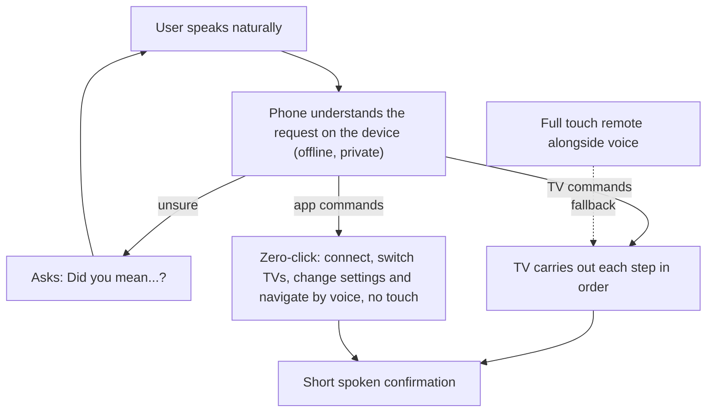

Türkçe: [README.tr.md](README.tr.md)

# RemoteBite: Private, Offline AI Voice Control for Your Smart TV

## Summary

**RemoteBite** is a smartphone TV remote you can run entirely by voice. The user speaks naturally, for example *"mute and go to channel 5 then open the guide"* or *"connect to my TV"*, and the app understands the request, carries out each step on the TV and confirms by voice.

Everything happens **on the phone**. After a one-time download, voice control works fully offline: no audio leaves the device, no usage data goes to a server and nobody has to pay for a cloud service.

The end goal is **"zero-click" control**: every action in the app, from finding and connecting to a TV and waking it from standby to changing channels by name, changing settings and moving between screens, can be done by voice alone. A full touch remote sits alongside, so voice and touch cover the same ground.

A working prototype of the voice core exists. Zero-click control is the next milestone.

## Problem

- **Remotes rely on small buttons.** Channel digits, colour keys, input selection and settings menus all need precise taps and a clear view of the screen. People who struggle with small buttons, or with seeing them, have no real alternative.
- **Voice remotes usually depend on the cloud.** Mainstream voice assistants send audio to remote servers. That raises privacy concerns, needs an internet connection and adds running costs for whoever operates the service.
- **Simple voice commands are not enough.** Real requests are often compound ("mute and switch to channel 5"), use names instead of numbers ("put on Show TV") or state a goal instead of a step ("volume to 20"). Basic voice control either fails or does the wrong thing.
- **Voice rarely reaches the whole app.** Where voice exists, it usually covers only basic remote keys. Connecting to a TV, managing several TVs, changing settings and moving between screens still need touch.
- **TVs do not report their state.** A phone remote usually cannot ask the TV for its current volume, channel or power state, so a request like "set volume to 20" cannot simply be looked up and applied.

## The Idea

- **Talk to your TV the way you talk to a person.** Free-form, compound and name-based requests are understood and carried out step by step, with a short spoken confirmation.
- **Private by design.** Listening, understanding and acting all happen on the phone, with no internet needed after the first download.
- **Voice for everything, not just the buttons.** Connecting, switching TVs, changing settings and navigating the app all work by voice, from any screen.
- **Safe and forgiving.** When unsure, the assistant asks *"Did you mean…?"* instead of guessing. Risky changes, such as switching the app language, need a spoken confirmation. The app learns from the user's corrections and adapts to their accent and wording.
- **Works around the TV's silence.** The app keeps track of the likely volume, mute state and recent channels, and the user can correct it by voice ("the volume is 35").
- **Nobody left out.** On older or lower-end phones that cannot run the full voice understanding, common voice commands keep working instead of the feature being switched off.

## What Users Can Do by Voice

| Area | Examples |
|---|---|
| **Volume** | "Turn it up", "Volume up 5 times", "Set volume to 30", "Mute", "The volume is 35" |
| **Channels** | "Channel 42", "Go to ESPN", "Next channel", "Go back to what I was watching", "Show the channel list" |
| **Playback** | "Pause", "Resume", "Skip ahead 30 seconds", "Record" |
| **Power** | "Turn off the TV", "Turn on the TV", "Set a sleep timer" |
| **Navigation and keys** | "Press OK", "Open the guide", "Go home", "Press red" |
| **Apps, inputs and subtitles** | "Open Netflix", "Switch to HDMI 2", "Enable captions", typing text on the TV |
| **Connection** | "Connect to my TV", "Switch to the living room TV", "Disconnect" |
| **Moving around the app** | "Go to settings", "Show my TVs", "Open the remote" |
| **Settings** | "Turn off haptic feedback", "Change the language to Turkish", "Set the wake word to hey remote" |
| **Voice feature itself** | "Download the AI model", "Delete the speech model" |

Several requests can be combined in one sentence and run in order. A conversational mode lets the user talk back and forth with the assistant, and on iPhone the system's voice shortcuts can trigger the same commands.

## The Zero-Click Experience

1. **First launch.** The app offers the one-time voice download, with a Wi-Fi-only option and a storage check.
2. **Connect by voice.** *"Connect to my TV"* finds the TV on the home network, pairs with it and opens the remote without a single tap. *"Turn on the TV"* wakes a saved TV from standby.
3. **Control by voice.** *"Switch the channel to Show TV"* finds the saved channel, tunes to it and confirms. *"Mute and go to channel 5 then open the guide"* does all three in order.
4. **Configure by voice.** *"Change the language to Turkish"* asks for confirmation first, then applies the change.
5. **Move around by voice.** Voice works on every screen. An optional setting (off by default) starts listening as soon as the app opens.

## Privacy and Offline Use

- No audio, usage data or analytics leave the phone.
- The internet is needed only for the one-time download. After that everything works in airplane mode, except finding and connecting to TVs, which needs the home network (Wi-Fi without internet is enough).

## A Full Remote Alongside Voice

- **TV manager:** available and saved TVs in one list, one-tap switching, and pairing remembered across restarts.
- **Wake from standby:** turn on a saved TV over the network and reconnect automatically.
- **Three remote layouts:** a classic remote, a *Smart* page of named channel buttons with logos and swipe gestures for volume and channel, and a *Navigate* page with a touchpad, keyboard input and quick Home / Back / Search / Menu buttons.
- **Named inputs:** a grid of input sources the user can rename, such as "PlayStation" for HDMI 2.
- **Flexible connection:** connect directly when automatic discovery does not work, including over a VPN, with automatic reconnection when the link drops.
- **Personal settings:** remote layout, long-press timing, haptic feedback, language, and resetting or exporting smart channels.
- **Many languages:** the interface is available in 18 languages.

## Phasing

| Phase | Milestone |
|---|---|
| **1. Remote foundation** | A complete touch remote: saved TVs, TV manager, wake from standby, three layouts, named inputs, settings, reliable reconnection and 18 interface languages. |
| **2. Private voice core** | Basic TV commands by voice, fully on the phone, with spoken confirmations, learning from corrections, a conversational mode, iPhone voice shortcuts, and a fallback that keeps voice working on less capable phones. |
| **3. Better listening** | More accurate recognition, a hands-free wake phrase, an optional fully offline speech recognizer and a visible "I'm hearing you" indicator. |
| **4. Voice for the whole app** | Connection, extra keys, app navigation, settings and management of the voice feature itself, all reachable by voice, with confirmation for risky changes. |
| **5. Smarter conversations** | Compound commands, awareness of the user's saved TV and channel names, and follow-up questions for confirmation or clarification. |
| **6. Zero-click everywhere** | Voice on every screen, connecting and waking TVs by voice, and optional listening on app launch. |
| **7. Knowing the TV's state** | Target volume ("volume to 20"), voice correction of the estimate and "last channel". |
| **8. Real-world validation** | Testing with real people, phones and TVs in several languages. |

The zero-click milestone is reached when, on real phones with a real TV, a user can: connect with no touches after setup, change channels by name, set a target volume, give compound commands, change settings and navigate by voice, wake the TV, still use voice on a less capable phone, and do all of this in airplane mode after the download.

## Stakeholders & Benefits

| Stakeholder | Benefit |
|---|---|
| **TV viewers** | Natural-language control of the TV and the app, including compound and name-based requests, without hunting for buttons. |
| **People who struggle with small buttons or with seeing them** | Every action, from connecting to the TV to changing settings, can be done by voice, with spoken confirmation of what happened. |
| **Privacy-conscious users** | No audio or usage data leaves the phone. The assistant works offline. |
| **Multilingual households** | The interface in 18 languages, with voice commands in many of them. |
| **Users with older or lower-end phones** | Common voice commands stay available even where the full voice understanding cannot run. |
| **App publisher** | No server costs for voice, and a small app download because the voice feature is fetched after install. |
| **Open-source and on-device AI community** | A concrete example of private, offline AI voice control in an everyday consumer app. |

## Risks & Mitigations

| Risk | Mitigation |
|---|---|
| **Many older or lower-end phones cannot run the full voice understanding** | Common voice commands still work on those phones instead of voice being switched off. |
| **Understanding gets less reliable as users ask for more** | The AI only interprets the request; the app itself decides the concrete steps, and uncertain requests get a follow-up question instead of a guess. |
| **Misheard or unclear commands** | The assistant asks *"Did you mean…?"*, says when it did not understand, and learns from the user's corrections. |
| **Risky changes made by mistake** (language switch, deleting the voice feature, changing the wake phrase) | An explicit spoken confirmation before applying them. |
| **The TV cannot report volume, channel or power state** | Estimated state, voice correction and channel memory. The limitation is stated openly. |
| **The one-time download fails or is too large for the connection or phone** | Automatic retries, a storage check, Wi-Fi-only by default and clear spoken or on-screen errors. |
| **Only Samsung TVs are supported in practice** | The design leaves room for other brands; support for them is not built yet. |

## Acknowledgements

The basic remote-control foundation is based on an MIT-licensed open-source Samsung TV remote project by mazen-salah; the ideas described here are the additions on top of it.

**Keywords:** voice control, smart TV, accessibility, offline AI, on-device AI, privacy, hands-free, assistive technology, remote control

## Origin

Originally designed by Merih İlgör (2026); published here as an open project idea.

## License

This document and the project idea it describes are licensed under CC BY-NC-SA 4.0 for non-commercial use (see [LICENSE](LICENSE)). Commercial use requires a revenue-share agreement (see [COMMERCIAL-LICENSE.md](COMMERCIAL-LICENSE.md)). Third-party components, including the MIT-licensed remote-control base and the language and speech models, remain under their own licenses.
