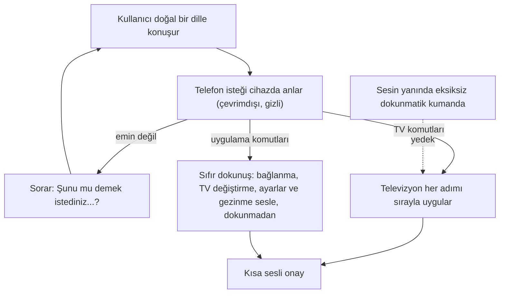

English: [README.md](README.md)

# RemoteBite: Akıllı Televizyonunuz İçin Gizli ve Çevrimdışı Yapay Zekâ Sesli Kontrol

## Özet

**RemoteBite**, tamamen sesle yönetilebilen bir akıllı telefon TV kumandasıdır. Kullanıcı doğal bir dille konuşur, örneğin *"sesi kapat, 5. kanala geç, sonra rehberi aç"* ya da *"televizyonuma bağlan"* der. Uygulama isteği anlar, her adımı televizyonda uygular ve sesli olarak onaylar.

Her şey **telefonda** gerçekleşir. Tek seferlik bir indirmeden sonra sesli kontrol tamamen çevrimdışı çalışır: ses kaydı cihazdan çıkmaz, kullanım verisi hiçbir sunucuya gönderilmez ve kimsenin bir bulut hizmeti için ödeme yapması gerekmez.

Nihai hedef **"sıfır dokunuş" (zero-click) kontroldür**: televizyonu bulup bağlanmaktan, bekleme modundan uyandırmaya, kanalı adıyla değiştirmekten ayarları değiştirmeye ve ekranlar arasında geçmeye kadar uygulamadaki her işlem yalnızca sesle yapılabilir. Yanında eksiksiz bir dokunmatik kumanda da bulunur, böylece ses ve dokunmatik kontrol aynı kapsamı sunar.

Sesli çekirdeğin çalışan bir prototipi mevcuttur. Sıfır dokunuş kontrolü bir sonraki kilometre taşıdır.

## Problem

- **Kumandalar küçük düğmelere dayanır.** Kanal rakamları, renkli tuşlar, giriş seçimi ve ayar menüleri hassas dokunuş ve ekranı net görmeyi gerektirir. Küçük düğmelere basmakta ya da onları görmekte zorlananların gerçek bir alternatifi yoktur.
- **Sesli kumandalar genellikle buluta bağımlıdır.** Yaygın sesli asistanlar sesi uzak sunuculara gönderir. Bu durum gizlilik kaygısı doğurur, internet bağlantısı gerektirir ve hizmeti işletene sürekli maliyet yükler.
- **Basit sesli komutlar yetmez.** Gerçek istekler çoğu zaman bileşiktir ("sesi kapat ve 5. kanala geç"), numara yerine ad kullanır ("Show TV'yi aç") ya da bir adım yerine bir hedef belirtir ("sesi 20 yap"). Basit sesli kontrol ya başarısız olur ya da yanlış şeyi yapar.
- **Ses nadiren uygulamanın tamamına ulaşır.** Sesli kontrol olsa bile genellikle yalnızca temel kumanda tuşlarını kapsar. Televizyona bağlanmak, birden fazla televizyonu yönetmek, ayarları değiştirmek ve ekranlar arasında geçmek hâlâ dokunmatik gerektirir.
- **Televizyonlar durumlarını bildirmez.** Telefon kumandası genellikle televizyona o anki ses düzeyini, kanalı ya da açık/kapalı durumunu soramaz. Bu nedenle "sesi 20 yap" gibi bir istek basitçe öğrenilip uygulanamaz.

## Fikir

- **Televizyonunuzla bir insanla konuşur gibi konuşun.** Serbest, bileşik ve ada dayalı istekler anlaşılır, adım adım uygulanır ve kısa bir sesli onayla bildirilir.
- **Tasarımı gereği gizli.** Dinleme, anlama ve uygulama tamamen telefonda gerçekleşir. İlk indirmeden sonra internet gerekmez.
- **Sadece düğmeler için değil, her şey için ses.** Bağlanma, televizyonlar arasında geçiş, ayarları değiştirme ve uygulama içinde gezinme her ekrandan sesle yapılabilir.
- **Güvenli ve hoşgörülü.** Emin olmadığında asistan tahmin yürütmek yerine *"Şunu mu demek istediniz…?"* diye sorar. Uygulama dilini değiştirmek gibi riskli değişiklikler sesli onay ister. Uygulama kullanıcının düzeltmelerinden öğrenir ve onun aksanına ve ifade biçimine uyum sağlar.
- **Televizyonun sessizliğini telafi eder.** Uygulama muhtemel ses düzeyini, sessiz durumunu ve son kanalları takip eder. Kullanıcı bunu sesle düzeltebilir ("ses 35'te").
- **Kimse dışarıda kalmaz.** Tam sesli anlamayı çalıştıramayan eski ya da düşük donanımlı telefonlarda özellik kapatılmaz, sık kullanılan sesli komutlar çalışmaya devam eder.

## Kullanıcıların Sesle Yapabilecekleri

| Alan | Örnekler |
|---|---|
| **Ses** | "Sesi aç", "Sesi 5 kez aç", "Sesi 30 yap", "Sessize al", "Ses 35'te" |
| **Kanallar** | "42. kanal", "ESPN'e geç", "Sonraki kanal", "İzlediğim kanala geri dön", "Kanal listesini göster" |
| **Oynatma** | "Duraklat", "Devam et", "30 saniye ileri atla", "Kaydet" |
| **Güç** | "Televizyonu kapat", "Televizyonu aç", "Uyku zamanlayıcısı kur" |
| **Gezinme ve tuşlar** | "Tamam'a bas", "Rehberi aç", "Ana ekrana git", "Kırmızıya bas" |
| **Uygulamalar, giriş ve altyazı** | "Netflix'i aç", "HDMI 2'ye geç", "Altyazıyı aç", televizyona metin yazma |
| **Bağlantı** | "Televizyonuma bağlan", "Salondaki televizyona geç", "Bağlantıyı kes" |
| **Uygulama içinde gezinme** | "Ayarlara git", "Televizyonlarımı göster", "Kumandayı aç" |
| **Ayarlar** | "Dokunsal geri bildirimi kapat", "Dili Türkçe yap", "Uyandırma kelimesini hey kumanda yap" |
| **Sesli özelliğin kendisi** | "Yapay zekâ modelini indir", "Konuşma modelini sil" |

Birden fazla istek tek cümlede birleştirilebilir ve sırayla uygulanır. Sohbet modu kullanıcının asistanla karşılıklı konuşmasını sağlar. iPhone'da sistemin sesli kısayolları da aynı komutları tetikleyebilir.

## Sıfır Dokunuş Deneyimi

1. **İlk açılış.** Uygulama, yalnızca Wi-Fi seçeneği ve depolama alanı kontrolüyle birlikte tek seferlik sesli özellik indirmesini önerir.
2. **Sesle bağlanma.** *"Televizyonuma bağlan"* komutu ev ağındaki televizyonu bulur, onunla eşleşir ve tek bir dokunuş olmadan kumanda ekranını açar. *"Televizyonu aç"* kayıtlı bir televizyonu bekleme modundan uyandırır.
3. **Sesle kontrol.** *"Kanalı Show TV'ye çevir"* kayıtlı kanalı bulur, ona geçer ve onaylar. *"Sesi kapat, 5. kanala geç, sonra rehberi aç"* üçünü de sırayla yapar.
4. **Sesle ayar.** *"Dili Türkçe yap"* önce onay ister, sonra değişikliği uygular.
5. **Sesle gezinme.** Ses her ekranda çalışır. İsteğe bağlı bir ayar (varsayılan olarak kapalı) uygulama açılır açılmaz dinlemeyi başlatır.

## Gizlilik ve Çevrimdışı Kullanım

- Hiçbir ses kaydı, kullanım verisi ya da analitik telefondan çıkmaz.
- İnternet yalnızca tek seferlik indirme için gerekir. Bundan sonra her şey uçak modunda da çalışır. Tek istisna televizyonları bulmak ve onlara bağlanmaktır, bunun için ev ağı gerekir (internetsiz Wi-Fi yeterlidir).

## Sesin Yanında Eksiksiz Bir Kumanda

- **TV yöneticisi:** erişilebilir ve kayıtlı televizyonlar tek listede, tek dokunuşla geçiş, uygulama yeniden başlatıldığında da hatırlanan eşleştirme.
- **Bekleme modundan uyandırma:** kayıtlı bir televizyonu ağ üzerinden açar ve otomatik olarak yeniden bağlanır.
- **Üç kumanda düzeni:** klasik kumanda, ad ve logolu kanal düğmeleri ile ses ve kanal için kaydırma hareketleri sunan *Akıllı* sayfa, dokunmatik yüzey, klavye girişi ve hızlı Ana Ekran / Geri / Arama / Menü düğmeleri sunan *Gezinme* sayfası.
- **Adlandırılabilir girişler:** kullanıcının yeniden adlandırabildiği giriş kaynakları ızgarası, örneğin HDMI 2 için "PlayStation".
- **Esnek bağlantı:** otomatik keşif çalışmadığında VPN üzerinden de dahil doğrudan bağlanma, bağlantı koptuğunda otomatik yeniden bağlanma.
- **Kişisel ayarlar:** kumanda düzeni, uzun basma süresi, dokunsal geri bildirim, dil, akıllı kanalları sıfırlama ve dışa aktarma.
- **Birçok dil:** arayüz 18 dilde kullanılabilir.

## Aşamalar

| Aşama | Kilometre taşı |
|---|---|
| **1. Kumanda temeli** | Eksiksiz bir dokunmatik kumanda: kayıtlı televizyonlar, TV yöneticisi, bekleme modundan uyandırma, üç düzen, adlandırılabilir girişler, ayarlar, güvenilir yeniden bağlanma ve 18 arayüz dili. |
| **2. Gizli ses çekirdeği** | Tamamen telefonda çalışan temel sesli TV komutları: sesli onaylar, düzeltmelerden öğrenme, sohbet modu, iPhone sesli kısayolları ve daha az yetenekli telefonlarda sesi çalışır tutan bir yedek. |
| **3. Daha iyi dinleme** | Daha doğru tanıma, eller serbest uyandırma ifadesi, isteğe bağlı tamamen çevrimdışı konuşma tanıyıcı ve görünür bir "sizi duyuyorum" göstergesi. |
| **4. Uygulamanın tamamı için ses** | Bağlantı, ek tuşlar, uygulama içi gezinme, ayarlar ve sesli özelliğin kendisinin yönetimi sesle yapılabilir. Riskli değişiklikler için onay istenir. |
| **5. Daha akıllı konuşmalar** | Bileşik komutlar, kullanıcının kayıtlı televizyon ve kanal adlarının bilinmesi, onay ya da açıklama için takip soruları. |
| **6. Her yerde sıfır dokunuş** | Her ekranda ses, televizyonlara sesle bağlanma ve onları sesle uyandırma, uygulama açılışında isteğe bağlı dinleme. |
| **7. Televizyonun durumunu bilmek** | Hedef ses düzeyi ("sesi 20 yap"), tahminin sesle düzeltilmesi ve "son kanal". |
| **8. Gerçek dünyada doğrulama** | Birden fazla dilde gerçek kişiler, telefonlar ve televizyonlarla test. |

Sıfır dokunuş kilometre taşı, gerçek telefonlarda ve gerçek bir televizyonla bir kullanıcı şunları yapabildiğinde tamamlanmış olur: kurulumdan sonra hiç dokunmadan bağlanmak, kanalı adıyla değiştirmek, hedef ses düzeyi belirlemek, bileşik komutlar vermek, sesle ayar değiştirmek ve gezinmek, televizyonu uyandırmak, daha az yetenekli bir telefonda da sesi kullanabilmek ve indirmeden sonra bunların hepsini uçak modunda yapmak.

## Paydaşlar ve Faydalar

| Paydaş | Fayda |
|---|---|
| **Televizyon izleyicileri** | Bileşik ve ada dayalı istekler de dahil olmak üzere, düğme aramadan doğal dille televizyonu ve uygulamayı kontrol etme. |
| **Küçük düğmelere basmakta ya da onları görmekte zorlananlar** | Televizyona bağlanmaktan ayar değiştirmeye kadar her işlem sesle yapılabilir ve ne olduğu sesli olarak onaylanır. |
| **Gizliliğe önem veren kullanıcılar** | Hiçbir ses kaydı ya da kullanım verisi telefondan çıkmaz. Asistan çevrimdışı çalışır. |
| **Çok dilli haneler** | 18 dilde arayüz ve bu dillerin birçoğunda sesli komutlar. |
| **Eski ya da düşük donanımlı telefon kullananlar** | Tam sesli anlamanın çalışamadığı cihazlarda da sık kullanılan sesli komutlar kullanılabilir kalır. |
| **Uygulama yayıncısı** | Sesli özellik için sunucu maliyeti yoktur. Sesli özellik kurulumdan sonra indirildiği için uygulama indirmesi küçük kalır. |
| **Açık kaynak ve cihaz üzerinde yapay zekâ topluluğu** | Gündelik bir tüketici uygulamasında gizli ve çevrimdışı yapay zekâ sesli kontrolüne somut bir örnek. |

## Riskler ve Önlemler

| Risk | Önlem |
|---|---|
| **Birçok eski ya da düşük donanımlı telefon tam sesli anlamayı çalıştıramıyor** | Bu telefonlarda sesli kontrol kapatılmaz, sık kullanılan sesli komutlar çalışmaya devam eder. |
| **Kullanıcılar daha fazlasını istedikçe anlama daha az güvenilir hâle geliyor** | Yapay zekâ yalnızca isteği yorumlar, somut adımlara uygulamanın kendisi karar verir. Emin olunamayan isteklerde tahmin yerine takip sorusu sorulur. |
| **Yanlış duyulan ya da belirsiz komutlar** | Asistan *"Şunu mu demek istediniz…?"* diye sorar, anlamadığında bunu söyler ve kullanıcının düzeltmelerinden öğrenir. |
| **Yanlışlıkla yapılan riskli değişiklikler** (dil değişikliği, sesli özelliğin silinmesi, uyandırma ifadesinin değiştirilmesi) | Uygulamadan önce açık bir sesli onay. |
| **Televizyon ses düzeyini, kanalı ya da açık/kapalı durumunu bildiremiyor** | Tahmini durum, sesle düzeltme ve kanal hafızası. Bu kısıt açıkça belirtilir. |
| **Tek seferlik indirme başarısız oluyor ya da bağlantı veya telefon için çok büyük** | Otomatik yeniden deneme, depolama alanı kontrolü, varsayılan olarak yalnızca Wi-Fi ve anlaşılır sesli ya da ekrandaki hata mesajları. |
| **Pratikte yalnızca Samsung televizyonlar destekleniyor** | Tasarım başka markalara yer bırakır, ancak onlar için destek henüz yapılmamıştır. |

## Teşekkür

Temel kumanda altyapısı, mazen-salah'ın MIT lisanslı açık kaynak Samsung TV kumanda projesine dayanır. Burada anlatılan fikirler bu altyapının üzerine yapılan eklemelerdir.

**Anahtar kelimeler:** sesli kontrol, akıllı televizyon, erişilebilirlik, çevrimdışı yapay zekâ, gizlilik, eller serbest, kumanda

## Köken

İlk olarak Merih İlgör tarafından tasarlanmıştır (2026). Burada açık bir proje fikri olarak yayımlanmaktadır.

## Lisans

Bu belge ve anlattığı proje fikri, ticari olmayan kullanım için CC BY-NC-SA 4.0 lisansı altındadır (bkz. [LICENSE](LICENSE)). Ticari kullanım için gelir paylaşımı anlaşması gerekir (bkz. [COMMERCIAL-LICENSE.md](COMMERCIAL-LICENSE.md)). MIT lisanslı kumanda altyapısı ile dil ve konuşma modelleri dahil olmak üzere üçüncü taraf bileşenler kendi lisanslarına tabidir. Değiştirilmiş sürümler yeni bir fikir olarak satılamaz veya üçüncü kişilere aktarılamaz; patent benzeri haklar saklıdır. Bkz. [COMMERCIAL-LICENSE.md](COMMERCIAL-LICENSE.md#derivatives-improvements-and-idea-protection).
