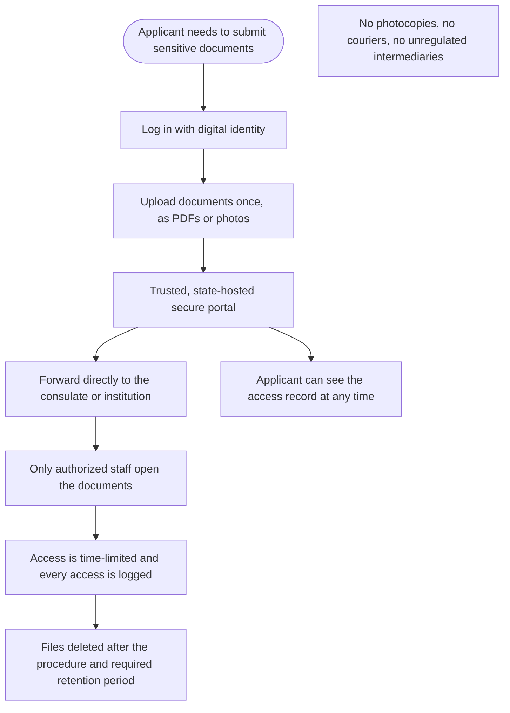

Türkçe: [README.tr.md](README.tr.md)

# Secure Document-Upload Portal for Official Applications: Sensitive Documents Without Photocopies and Intermediaries

## Summary

Visa applications and many other official procedures ask for highly sensitive documents: passports, identity cards, tax numbers, employer details, and information about parents and other family members. Today these documents are photocopied, scanned and passed through copy shops, couriers and intermediaries before they reach a consulate or institution, and copies are often left behind at every step. This proposal creates a **trusted, state-hosted secure document-upload portal**: the applicant logs in with their digital identity, uploads the documents once, and the portal forwards them directly to the consulate or institution. Only authorized staff can see them, access is time-limited and logged, and the files are deleted after use. Once the portal is in place, making its use a **legal requirement after an appropriate transition period** multiplies the benefit. Any country, or a union of countries, can adopt it.

## Problem

- Official applications, especially visa applications, require documents that together describe a person's whole identity: passport and identity card copies, tax numbers, employer and income details, and data about parents and relatives.
- These documents travel as **photocopies, scans and photos** through many hands: copy shops, couriers, application intermediaries and other third parties. Copies are often kept, forgotten on devices, or thrown away without care.
- If they reach people with bad intentions, this information can be used for **identity theft, fraud and impersonation**.
- The applicant has **no control and no visibility**: they cannot know who saw their documents, how many copies exist, or whether they were ever deleted.
- The same documents are handed over again and again for each new application, multiplying the number of copies in circulation.
- Institutions receive documents through mixed channels, which makes it hard for them to prove that data was handled safely.

## Proposed Solution

A **secure document-upload portal**, hosted by a trusted public authority, acting as a safe go-between for applicants and the institutions that need their documents:

1. **Log in with digital identity:** the applicant signs in with the government's digital identity, with strong verification.
2. **Upload once:** the applicant uploads the required documents as PDFs or photos, from a phone or computer, and selects the application they belong to.
3. **Direct, secure forwarding:** the portal forwards the documents straight to the consulate or institution handling the application. No paper copies and no unregulated intermediaries are needed.
4. **Only authorized staff:** only authorized staff of the receiving institution can open the documents, and only for that application.
5. **Time-limited access:** the institution's access ends automatically when the processing period is over.
6. **Every access logged:** the portal records who opened which document and when. The applicant can see this record, and it is open to independent audits.
7. **Data minimization and deletion:** institutions ask only for the documents they really need, and files are deleted once the procedure and any legally required retention period are complete.
8. **Legal requirement after a transition period:** once the portal works reliably, the law requires institutions to accept sensitive documents through such a secure channel, after an appropriate transition period.

## How It Works

| Step | What the applicant does | What happens |
|---|---|---|
| 1. Log in | Signs in with digital identity | Identity is verified with strong authentication |
| 2. Upload | Uploads documents once, as PDFs or photos | Documents are stored securely and linked to one application |
| 3. Forward | Confirms the recipient consulate or institution | The portal sends the documents directly; no copies are made along the way |
| 4. Review | Nothing to do | Only authorized staff of the recipient can open the documents, for a limited time |
| 5. Check | Opens the access record | Sees who opened which document and when |
| 6. Close | Nothing to do | Access ends and files are deleted after the procedure and any required retention period |

For the applicant, the experience is simple: upload once, from home, and know exactly who has seen the documents.

## Implementation & Phasing

1. **Pilot with consulates:** start with visa applications at a small number of consulates, where the volume of sensitive documents is high and the risk is clear.
2. **Extend to public institutions:** open the portal to other public procedures that require sensitive documents.
3. **Common rules:** set shared rules on which documents may be requested, who may access them, for how long, and when they are deleted, in line with existing data-protection law.
4. **Cross-border use:** countries, or a union of countries, agree on common standards so that one country's portal can safely forward documents to another country's consulates, and harmonized rules avoid fragmentation between members.
5. **Legal requirement:** after an appropriate transition period, the use of a secure channel like this becomes mandatory for procedures that involve sensitive personal documents.
6. **Independent audits:** regular security reviews and independent audits, with public reporting.

## Stakeholders & Benefits

- **Applicants and their families:** far less exposure of sensitive data, less risk of identity theft and fraud, no trips to copy shops, and a clear record of who saw their documents.
- **Consulates and public institutions:** complete, readable documents through one channel, less paper handling and a clear way to show that data was handled safely.
- **Data-protection authorities:** a controlled, auditable channel instead of copies spread across many third parties.
- **Governments and unions of countries:** stronger personal-data protection, more trust in public institutions, and a common standard across borders when adopted jointly.
- **Society:** fewer fraud cases built on stolen identity documents.

## Risks & Mitigations

| Risk | Mitigation |
|---|---|
| A central portal becomes an attractive target for attackers | Strong security by design, time-limited access, deletion after use, regular independent security reviews and audits |
| Staff misuse their access | Access only for the specific application, every access logged and visible to the applicant, penalties for misuse |
| Applicants without digital skills or devices are left out | Assisted upload points at public offices, and a paper alternative during the transition period |
| Institutions ask for more documents than needed | Data-minimization rules that define which documents each procedure may require |
| Different national rules make cross-border use hard | Common standards agreed between countries or within a union of countries |
| Intermediary businesses lose part of their work | They can still help applicants use the portal, without keeping copies of documents |

**Keywords:** personal data protection, identity theft, fraud prevention, visa application, secure document upload, digital identity, e-government, privacy, data minimization, consulate

## Origin

Originally proposed by Merih İlgör (December 2025); published here as an open project idea.

## License

This work is licensed under CC BY-NC-SA 4.0 for non-commercial use; see [LICENSE](LICENSE). Commercial use requires a revenue-share agreement; see [COMMERCIAL-LICENSE.md](COMMERCIAL-LICENSE.md). Modified versions may not be sold or transferred to third parties as new ideas, and patent-like rights are reserved; see [COMMERCIAL-LICENSE.md](COMMERCIAL-LICENSE.md#derivatives-improvements-and-idea-protection).
