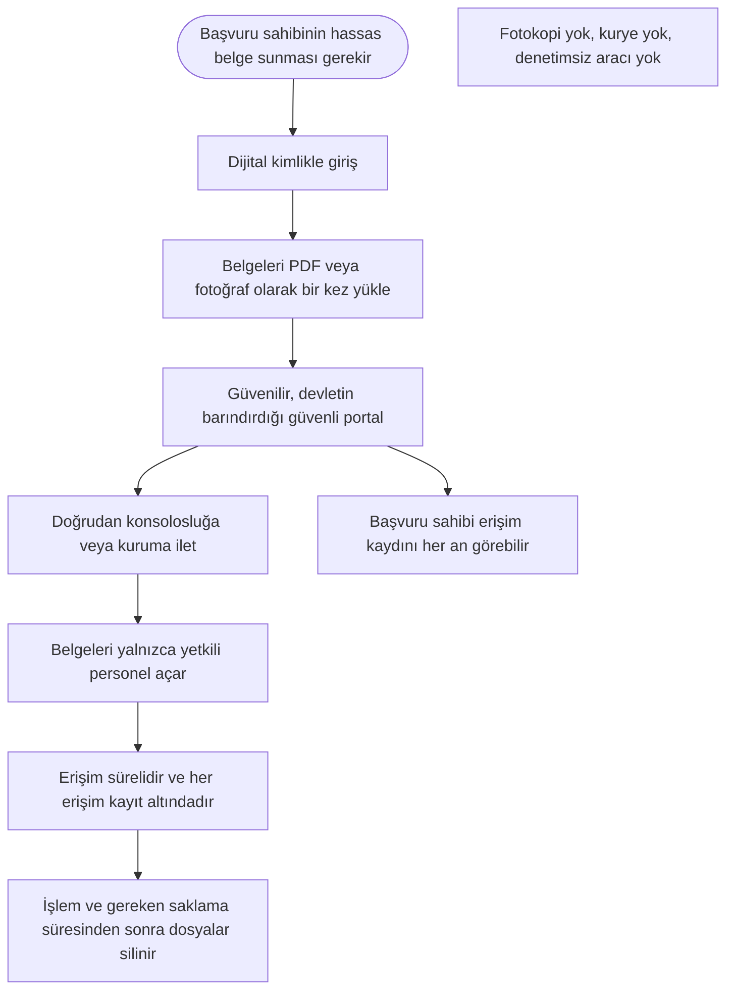

English: [README.md](README.md)

# Resmi Başvurular İçin Güvenli Belge Yükleme Portalı: Fotokopi ve Aracı Olmadan Hassas Belgeler

## Özet

Vize başvuruları ve diğer birçok resmi işlem son derece hassas belgeler ister: pasaport, kimlik kartı, vergi numarası, çalışılan kurumun bilgileri, anne, baba ve diğer yakınlara ilişkin bilgiler. Bugün bu belgeler bir konsolosluğa veya kuruma ulaşmadan önce fotokopiyle çoğaltılır, taranır ve kırtasiyeler, kuryeler ve aracılar üzerinden elden ele dolaşır; çoğu zaman her adımda geride kopyalar kalır. Bu öneri, **güvenilir ve devletin barındırdığı bir güvenli belge yükleme portalı** kurar: başvuru sahibi dijital kimliğiyle giriş yapar, belgeleri bir kez yükler ve portal belgeleri doğrudan konsolosluğa veya kuruma iletir. Belgeleri yalnızca yetkili personel görebilir, erişim süreli ve kayıt altındadır, dosyalar işlem bitince silinir. Portal kurulduktan sonra kullanımının **uygun bir geçiş süresinin ardından yasal zorunluluk** haline getirilmesi faydayı katlar. Her ülke ya da ülkeler birliği bu modeli benimseyebilir.

## Sorun

- Resmi başvurular, özellikle vize başvuruları, bir araya geldiğinde kişinin tüm kimliğini ortaya koyan belgeler ister: pasaport ve kimlik kartı kopyaları, vergi numarası, işveren ve gelir bilgileri, anne, baba ve yakınlara ilişkin veriler.
- Bu belgeler **fotokopi, tarama ve fotoğraf** olarak birçok elden geçer: kırtasiyeler, kuryeler, başvuru aracıları ve diğer üçüncü kişiler. Kopyalar çoğu zaman saklanır, cihazlarda unutulur ya da özen gösterilmeden atılır.
- Bu bilgiler kötü niyetli kişilerin eline geçerse **kimlik hırsızlığı, dolandırıcılık ve başkasının yerine geçme** amacıyla kullanılabilir.
- Başvuru sahibinin **hiçbir kontrolü ve görünürlüğü yoktur**: belgelerini kimin gördüğünü, kaç kopya olduğunu ya da silinip silinmediğini bilemez.
- Aynı belgeler her yeni başvuruda tekrar tekrar verilir; dolaşımdaki kopya sayısı katlanarak artar.
- Kurumlar belgeleri farklı kanallardan alır; bu da verilerin güvenle işlendiğini kanıtlamalarını zorlaştırır.

## Önerilen Çözüm

Güvenilir bir kamu otoritesi tarafından barındırılan ve başvuru sahipleriyle belgelere ihtiyaç duyan kurumlar arasında güvenli bir ara nokta görevi gören bir **güvenli belge yükleme portalı**:

1. **Dijital kimlikle giriş:** Başvuru sahibi devletin dijital kimliğiyle, güçlü doğrulamayla giriş yapar.
2. **Tek seferlik yükleme:** Başvuru sahibi gerekli belgeleri telefonundan veya bilgisayarından PDF ya da fotoğraf olarak yükler ve ait oldukları başvuruyu seçer.
3. **Doğrudan ve güvenli iletim:** Portal belgeleri, başvuruyu yürüten konsolosluğa veya kuruma doğrudan iletir. Kâğıt kopyaya ve denetimsiz aracılara gerek kalmaz.
4. **Yalnızca yetkili personel:** Belgeleri yalnızca alıcı kurumun yetkili personeli ve yalnızca o başvuru için açabilir.
5. **Süreli erişim:** Kurumun erişimi, işlem süresi sona erdiğinde kendiliğinden kapanır.
6. **Her erişim kayıt altında:** Portal, hangi belgeyi kimin ve ne zaman açtığını kaydeder. Başvuru sahibi bu kaydı görebilir; kayıt bağımsız denetimlere açıktır.
7. **Veri en aza indirme ve silme:** Kurumlar yalnızca gerçekten ihtiyaç duydukları belgeleri ister; dosyalar işlem ve yasal olarak gereken saklama süresi tamamlandığında silinir.
8. **Geçiş süresinden sonra yasal zorunluluk:** Portal güvenilir şekilde çalışır hale geldiğinde yasa, uygun bir geçiş süresinin ardından kurumların hassas belgeleri bu tür güvenli bir kanal üzerinden kabul etmesini zorunlu kılar.

## Nasıl Çalışır

| Adım | Başvuru sahibinin yaptığı | Ne olur |
|---|---|---|
| 1. Giriş | Dijital kimlikle giriş yapar | Kimlik güçlü doğrulamayla teyit edilir |
| 2. Yükleme | Belgeleri PDF veya fotoğraf olarak bir kez yükler | Belgeler güvenle saklanır ve tek bir başvuruya bağlanır |
| 3. İletim | Alıcı konsolosluğu veya kurumu onaylar | Portal belgeleri doğrudan gönderir; yol boyunca kopya oluşmaz |
| 4. İnceleme | Bir şey yapmasına gerek yoktur | Belgeleri yalnızca alıcının yetkili personeli, sınırlı bir süre için açabilir |
| 5. Kontrol | Erişim kaydını açar | Hangi belgeyi kimin ve ne zaman açtığını görür |
| 6. Kapanış | Bir şey yapmasına gerek yoktur | İşlem ve gereken saklama süresi bitince erişim kapanır ve dosyalar silinir |

Başvuru sahibi için deneyim basittir: evden bir kez yükler ve belgelerini tam olarak kimin gördüğünü bilir.

## Uygulama ve Fazlandırma

1. **Konsolosluklarla pilot uygulama:** Hassas belge hacminin yüksek ve riskin açık olduğu vize başvurularıyla, az sayıda konsoloslukta başlanır.
2. **Kamu kurumlarına genişleme:** Portal, hassas belge gerektiren diğer kamu işlemlerine açılır.
3. **Ortak kurallar:** Hangi belgelerin istenebileceği, kimin ne kadar süreyle erişebileceği ve belgelerin ne zaman silineceği konusunda, mevcut kişisel verilerin korunması mevzuatıyla uyumlu ortak kurallar belirlenir.
4. **Sınır ötesi kullanım:** Ülkeler ya da ülkeler birliği, bir ülkenin portalının belgeleri başka bir ülkenin konsolosluklarına güvenle iletebilmesi için ortak standartlarda anlaşır; uyumlu kurallar üyeler arasında parçalanmayı önler.
5. **Yasal zorunluluk:** Uygun bir geçiş süresinin ardından, hassas kişisel belgeler içeren işlemlerde bu tür güvenli bir kanalın kullanılması zorunlu hale gelir.
6. **Bağımsız denetimler:** Düzenli güvenlik incelemeleri ve bağımsız denetimler yapılır, sonuçlar kamuya raporlanır.

## Paydaşlar ve Faydalar

- **Başvuru sahipleri ve aileleri:** Hassas verilerin çok daha az açığa çıkması, daha düşük kimlik hırsızlığı ve dolandırıcılık riski, kırtasiyeye gitmeye gerek kalmaması ve belgelerini kimin gördüğüne dair net bir kayıt.
- **Konsolosluklar ve kamu kurumları:** Tek bir kanaldan eksiksiz ve okunaklı belgeler, daha az kâğıt işi ve verilerin güvenle işlendiğini göstermenin net bir yolu.
- **Kişisel verileri koruma otoriteleri:** Birçok üçüncü kişiye dağılmış kopyalar yerine denetlenebilir, kontrollü bir kanal.
- **Hükümetler ve ülkeler birlikleri:** Daha güçlü kişisel veri koruması, kamu kurumlarına daha fazla güven ve birlikte benimsendiğinde sınırlar ötesinde ortak bir standart.
- **Toplum:** Çalınmış kimlik belgelerine dayanan daha az dolandırıcılık vakası.

## Riskler ve Önlemler

| Risk | Önlem |
|---|---|
| Merkezi bir portal saldırganlar için cazip bir hedef haline gelir | Tasarımdan itibaren güçlü güvenlik, süreli erişim, kullanım sonrası silme, düzenli bağımsız güvenlik incelemeleri ve denetimler |
| Personelin erişim yetkisini kötüye kullanması | Yalnızca ilgili başvuru için erişim, başvuru sahibinin görebildiği erişim kaydı, kötüye kullanıma yaptırım |
| Dijital becerisi veya cihazı olmayan başvuru sahiplerinin dışarıda kalması | Kamu binalarında destekli yükleme noktaları ve geçiş süresi boyunca kâğıt alternatifi |
| Kurumların gerekenden fazla belge istemesi | Her işlem için hangi belgelerin istenebileceğini tanımlayan veri en aza indirme kuralları |
| Farklı ulusal kuralların sınır ötesi kullanımı zorlaştırması | Ülkeler arasında ya da bir ülkeler birliği içinde üzerinde anlaşılan ortak standartlar |
| Aracı işletmelerin işlerinin bir kısmını kaybetmesi | Belgelerin kopyasını tutmadan, başvuru sahiplerine portalı kullanmada yardımcı olmaya devam edebilirler |

**Anahtar kelimeler:** kişisel verilerin korunması, kimlik hırsızlığı, dolandırıcılığın önlenmesi, vize başvurusu, güvenli belge yükleme, dijital kimlik, e-devlet, mahremiyet

## Köken

Merih İlgör tarafından önerilmiştir (Aralık 2025); burada açık bir proje fikri olarak yayımlanmaktadır.

## Lisans

Bu çalışma, ticari olmayan kullanım için CC BY-NC-SA 4.0 lisansı ile lisanslanmıştır; bkz. [LICENSE](LICENSE). Ticari kullanım bir gelir paylaşımı anlaşması gerektirir; bkz. [COMMERCIAL-LICENSE.md](COMMERCIAL-LICENSE.md). Değiştirilmiş sürümler yeni bir fikir olarak satılamaz veya üçüncü kişilere aktarılamaz; patent benzeri haklar saklıdır. Bkz. [COMMERCIAL-LICENSE.md](COMMERCIAL-LICENSE.md#derivatives-improvements-and-idea-protection).
