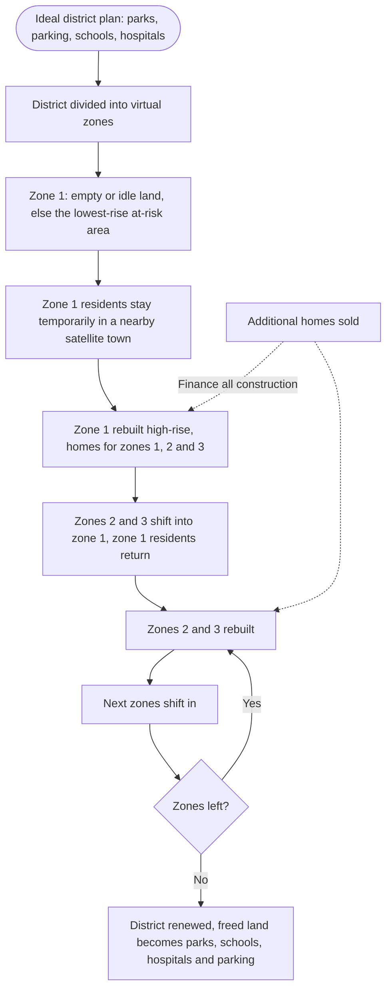

Türkçe: [README.tr.md](README.tr.md)

# Shift and Lift: A Self-Financing Urban Renewal Model That Keeps Residents in Their Neighborhood

## Summary

Many dense, unplanned districts are full of buildings that are not earthquake resistant, waste energy and leave no room for parking, parks or emergency access. Renewal stalls because residents cannot organize, cannot afford it and do not want to leave their neighborhood. **Shift and Lift** is an urban renewal model in which the public authority organizes the whole district, residents pay **almost nothing**, and they **stay in their own district**. The district is divided into zones. One zone is rebuilt first with enough homes for itself and the next two zones; those residents then **shift** into the new buildings without leaving the district, their old zones are rebuilt, and the process rolls on zone by zone. A moderate increase in housing capacity finances the construction, and the land freed along the way becomes parks, parking, schools and hospitals.

## Problem

Why renewal is necessary:

- **Buildings that are not earthquake resistant:** large numbers of people live in buildings that may not survive a major earthquake.
- **Poor insulation:** old buildings waste energy on heating and cooling and cause high carbon emissions.
- **Unplanned density:** there is no parking, so cars fill narrow streets and **block fire engines and ambulances**. Residents coming home can spend **30 to 60 minutes** looking for a parking space. This daily stress lowers quality of life, sparks conflict between neighbors and affects family life and the next generation.

Why renewal does not happen in dense districts today:

- **Residents cannot organize:** getting every owner in an apartment building to agree is very hard.
- **Residents cannot afford it:** most owners do not have the money to rebuild.
- **Residents do not want to leave:** people do not want to be separated from their jobs, schools, neighbors and friends.

Therefore renewal must be **organized by the public authority, not left to individual initiatives**, it must cost residents **almost nothing**, and it must be done **without moving residents away from their district**.

## Proposed Solution

**1. An ideal district plan first.** Before anything is demolished, a complete plan is prepared for the whole district: parks and gardens, parking, schools, hospitals and health centers, roads and emergency access.

**2. A self-financing model.** The plan increases housing capacity moderately, for example **2:1 or 3:1**: for every home that is demolished, **one or two additional homes** are built. Selling these additional homes pays for all the construction, including the residents' new homes, schools, hospitals and parks. Residents receive their new homes at almost no cost.

**3. Virtual zones.** As an illustrative example, a district of about **40 km²** can be divided into about **10 virtual zones**.

**4. Zone 1: the starting point.** Zone 1 is chosen in this order of preference: **empty land** if available; otherwise **idle land**; otherwise the **lowest-rise, chronically at-risk** part of the district. Its residents are **temporarily hosted in a nearby satellite town prepared in advance**, and the first new housing stock is built quickly. These new buildings are sized to house the residents of **zones 1, 2 and 3**.

**5. Shift.** Residents of zones 2 and 3 **move directly into the new zone 1 buildings**, without ever leaving their district. Zone 1 residents return from the satellite town to their new homes.

**6. Lift and repeat.** The emptied zones 2 and 3 are demolished and rebuilt. Residents of **zones 4, 5 and 6** then shift into them, and so on until the whole district is renewed. At each step, the land that is no longer needed for housing becomes **parks, gardens, parking, schools and hospitals**, as the district plan foresees.

**Height and population balance.** The first rebuilt zones are planned **taller**, and later zones are planned **progressively lower**. Total capacity is increased **only enough to finance the renewal**. An excessive population increase must be avoided, because more people means more traffic and a greater need for schools, hospitals and clinics.

**An honest weakness.** Zone 1 residents carry the burden of a temporary move to the satellite town, and they may not be happy about it. This step is nevertheless necessary for the model to work, so the satellite town should be **as close to the district as possible**, well prepared and served, and the zone 1 construction period kept as short as possible.

## How It Works

| Step | Who moves where | What is built |
|---|---|---|
| 0. Plan | Nobody moves yet | Ideal district plan; satellite town prepared near the district |
| 1. Start | Zone 1 residents stay temporarily in the satellite town | Zone 1 rebuilt high-rise, with homes for zones 1, 2 and 3 |
| 2. Shift | Zones 2 and 3 move into zone 1; zone 1 residents return | Zones 2 and 3 emptied |
| 3. Lift | Zones 4, 5 and 6 move into the new zones 2 and 3 | Zones 2 and 3 rebuilt; freed land starts becoming parks and public facilities |
| 4. Repeat | The next group of zones moves into the most recently rebuilt zones | Later zones progressively lower; parks, schools, hospitals and parking completed |
| Financing | Throughout | Additional homes (2:1 or 3:1) are sold to pay for the construction |

## Implementation & Phasing

1. **Priority districts:** the public authority identifies dense districts with the highest earthquake risk and the weakest infrastructure.
2. **District plan and financing model:** an ideal district plan and a capacity increase that is just enough to finance the renewal are prepared, and the plan is shared openly with residents.
3. **Satellite town:** temporary housing is prepared as close to the district as possible, with transport, schools and services.
4. **Pilot district:** the model runs first in one district, and lessons are published.
5. **Scale-up:** the model is applied to other districts, starting with those at highest risk.
6. **Urgency:** the work should start **before a major earthquake**. If it does not, lives will be lost, trauma will reach across generations, and the economic losses will be enormous.

## Stakeholders & Benefits

- **Residents:** safe, insulated homes at almost no cost, without leaving their neighborhood, jobs, schools and friends.
- **Families and children:** parks, schools, parking and a calmer daily life instead of long searches for parking and conflict in the street.
- **Emergency services:** clear streets and planned access for fire engines and ambulances.
- **Municipalities and the public authority:** a renewal model that pays for itself and can be applied district by district.
- **The environment:** lower energy use and emissions thanks to well-insulated buildings.
- **Builders:** large, planned, predictable projects instead of fragmented single-building work.

## Risks & Mitigations

| Risk | Mitigation |
|---|---|
| Zone 1 residents bear a temporary move | Satellite town as close to the district as possible, good services, a short construction period, and priority in choosing their new homes |
| Population grows too much, overloading traffic, schools and clinics | Capacity increased only enough to finance the renewal; later zones progressively lower |
| Residents distrust the process | A public district plan, clear rules on who moves where and when, and residents' rights to a new home guaranteed in advance |
| Sales of additional homes do not cover the costs | Financing model checked before starting; the capacity ratio set per district |
| Delays leave residents in limbo | Zone-by-zone planning, so each step is small and completed before the next begins |
| An earthquake strikes before renewal is complete | Start with the highest-risk zones and districts, and begin as soon as possible |

**Keywords:** urban renewal, earthquake resilience, housing, urban planning, self-financing, density, parking, energy efficiency, residents' rights, satellite town

## Origin

Originally proposed by Merih İlgör (September 2025); published here as an open project idea.

## License

This work is licensed under CC BY-NC-SA 4.0 for non-commercial use; see [LICENSE](LICENSE). Commercial use requires a revenue-share agreement; see [COMMERCIAL-LICENSE.md](COMMERCIAL-LICENSE.md). Modified versions may not be sold or transferred to third parties as new ideas, and patent-like rights are reserved; see [COMMERCIAL-LICENSE.md](COMMERCIAL-LICENSE.md#derivatives-improvements-and-idea-protection).
