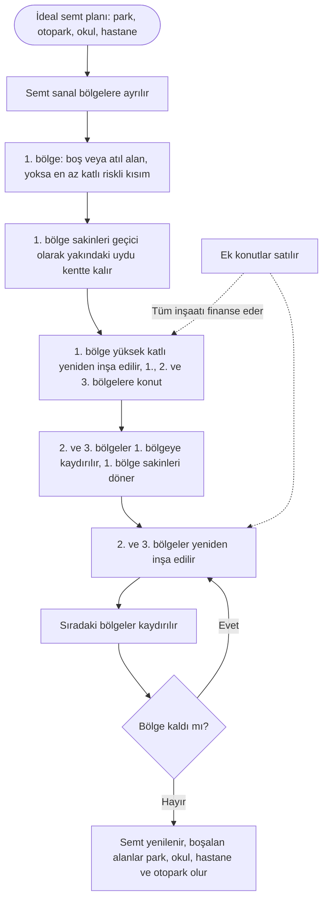

English: [README.md](README.md)

# Kaydır ve Yükselt (Shift and Lift): Sakinleri Semtinden Koparmayan, Kendini Finanse Eden Kentsel Dönüşüm Modeli

## Özet

Yoğun ve plansız birçok semt; depreme dayanıklı olmayan, enerji israf eden ve otoparka, parka ya da acil müdahaleye yer bırakmayan binalarla doludur. Dönüşüm ise sakinler organize olamadığı, maliyeti karşılayamadığı ve semtlerinden ayrılmak istemediği için tıkanır. **Kaydır ve Yükselt**, kamunun semtin tamamını organize ettiği, sakinlerin **neredeyse hiç maliyet** üstlenmediği ve **kendi semtlerinde kaldığı** bir kentsel dönüşüm modelidir. Semt bölgelere ayrılır. Önce bir bölge, kendisine ve sonraki iki bölgeye yetecek kadar konutla yeniden inşa edilir; bu bölgelerin sakinleri semtten hiç ayrılmadan yeni binalara **kaydırılır**, boşalan eski bölgeleri yeniden yapılır ve süreç bölge bölge ilerler. Konut kapasitesindeki ölçülü bir artış inşaatı finanse eder; yol boyunca boşalan alanlar park, otopark, okul ve hastaneye dönüşür.

## Sorun

Kentsel dönüşümü zorunlu kılan faktörler:

- **Depreme dayanıklı olmayan binalar:** Çok sayıda insan, büyük bir depremde ayakta kalamayabilecek binalarda yaşıyor.
- **Yalıtım eksikliği:** Eski binalar ısıtma ve soğutmada enerji israf eder ve yüksek karbon salımına yol açar.
- **Çarpık kentleşme:** Otopark olmadığı için araçlar dar sokakları doldurur ve **itfaiye ile ambulansın yolunu kapatır**. Evine dönen sakinler park yeri bulmak için **30 ila 60 dakika** harcayabilir. Bu günlük stres yaşam kalitesini düşürür, komşular arasında çatışmaya yol açar, aile hayatını ve yeni nesilleri etkiler.

Yoğun semtlerde bugün dönüşümün gerçekleşmemesinin nedenleri:

- **Sakinler organize olamıyor:** Bir apartmandaki tüm malikleri uzlaştırmak çok zordur.
- **Sakinlerin ekonomik gücü yetmiyor:** Maliklerin çoğunun yeniden inşa için parası yoktur.
- **Sakinler ayrılmak istemiyor:** İnsanlar işlerinden, okullarından, komşularından ve arkadaşlarından ayrılmak istemez.

Bu nedenlerle dönüşüm **bireysel girişimlere bırakılmamalı, kamu eliyle organize edilmeli**, sakinlere **neredeyse hiç maliyet** çıkarmamalı ve **sakinler semtlerinden uzaklaştırılmadan** yapılmalıdır.

## Önerilen Çözüm

**1. Önce ideal bir semt planı.** Hiçbir şey yıkılmadan önce semtin tamamı için eksiksiz bir plan hazırlanır: park ve bahçeler, otoparklar, okullar, hastaneler ve sağlık ocakları, yollar ve acil müdahale erişimi.

**2. Kendi kendini finanse eden bir model.** Plan, konut kapasitesini ölçülü biçimde artırır, örneğin **2'ye 1 veya 3'e 1**: yıkılan her konut yerine **bir veya iki ek konut** yapılır. Bu ek konutların satışı; sakinlerin yeni evleri, okullar, hastaneler ve parklar dahil tüm inşaatın bedelini karşılar. Sakinler yeni evlerine neredeyse hiç maliyet ödemeden kavuşur.

**3. Sanal bölgeler.** Örnek olarak, yaklaşık **40 km²** büyüklüğündeki bir semt yaklaşık **10 sanal bölgeye** ayrılabilir.

**4. 1. bölge: başlangıç noktası.** 1. bölge şu tercih sırasıyla seçilir: mümkünse **boş bir alan**; değilse **atıl bir alan**; o da değilse semtin **en az katlı ve kronik risk taşıyan** kısmı. Buranın sakinleri **önceden hazırlanmış, yakındaki bir uydu kentte geçici olarak misafir edilir** ve ilk yeni konut stoğu kısa sürede inşa edilir. Bu yeni binalar **1., 2. ve 3. bölgelerin** sakinlerini barındıracak büyüklükte planlanır.

**5. Kaydır.** 2. ve 3. bölgelerin sakinleri, semtlerinden hiç ayrılmadan **doğrudan 1. bölgenin yeni binalarına taşınır**. 1. bölge sakinleri de uydu kentten yeni evlerine döner.

**6. Yükselt ve tekrarla.** Boşalan 2. ve 3. bölgeler yıkılıp yeniden inşa edilir. Ardından **4., 5. ve 6. bölgelerin** sakinleri buraya kaydırılır ve semtin tamamı yenilenene kadar süreç böyle devam eder. Her adımda artık konut için gerekmeyen alanlar, semt planında öngörüldüğü şekilde **park, bahçe, otopark, okul ve hastaneye** dönüştürülür.

**Kat ve nüfus dengesi.** İlk yeniden yapılan bölgeler **daha yüksek katlı**, sonraki bölgeler ise **giderek daha az katlı** planlanır. Toplam kapasite **yalnızca dönüşümü finanse edecek kadar** artırılır. Aşırı nüfus artışından kaçınılmalıdır; çünkü daha fazla nüfus daha fazla trafik ve daha fazla okul, hastane ve sağlık ocağı ihtiyacı demektir.

**Dürüst bir zayıf nokta.** 1. bölge sakinleri uydu kente geçici taşınmanın yükünü taşır ve bundan memnun olmayabilir. Yine de bu adım modelin işlemesi için zorunludur; bu nedenle uydu kent **semte olabildiğince yakın**, iyi hazırlanmış ve hizmetlere erişimi olan bir yer olmalı, 1. bölgenin inşaat süresi de mümkün olduğunca kısa tutulmalıdır.

## Nasıl Çalışır

| Adım | Kim nereye taşınır | Ne inşa edilir |
|---|---|---|
| 0. Plan | Henüz kimse taşınmaz | İdeal semt planı; semte yakın bir uydu kent hazırlanır |
| 1. Başlangıç | 1. bölge sakinleri geçici olarak uydu kentte kalır | 1. bölge, 1., 2. ve 3. bölgelere yetecek konutla yüksek katlı olarak yeniden inşa edilir |
| 2. Kaydır | 2. ve 3. bölgeler 1. bölgeye taşınır; 1. bölge sakinleri döner | 2. ve 3. bölgeler boşalır |
| 3. Yükselt | 4., 5. ve 6. bölgeler yeni 2. ve 3. bölgelere taşınır | 2. ve 3. bölgeler yeniden inşa edilir; boşalan alanlar park ve kamu tesislerine dönüşmeye başlar |
| 4. Tekrarla | Sıradaki bölge grubu en son yenilenen bölgelere taşınır | Sonraki bölgeler giderek daha az katlı; park, okul, hastane ve otoparklar tamamlanır |
| Finansman | Süreç boyunca | Ek konutlar (2'ye 1 veya 3'e 1) satılarak inşaat finanse edilir |

## Uygulama ve Fazlandırma

1. **Öncelikli semtler:** Kamu, deprem riski en yüksek ve altyapısı en zayıf yoğun semtleri belirler.
2. **Semt planı ve finansman modeli:** İdeal bir semt planı ve dönüşümü finanse etmeye ancak yetecek bir kapasite artışı hazırlanır; plan sakinlerle açıkça paylaşılır.
3. **Uydu kent:** Ulaşım, okul ve hizmetleri olan geçici konutlar semte olabildiğince yakın bir yerde hazırlanır.
4. **Pilot semt:** Model önce tek bir semtte uygulanır ve çıkarılan dersler yayımlanır.
5. **Yaygınlaştırma:** Model, en yüksek riskli olanlardan başlayarak diğer semtlere uygulanır.
6. **Aciliyet:** Çalışmalar **büyük bir depremden önce** başlamalıdır. Aksi halde can kayıpları yaşanacak, travmalar nesiller boyu sürecek ve ekonomik kayıplar çok büyük olacaktır.

## Paydaşlar ve Faydalar

- **Sakinler:** Mahallelerinden, işlerinden, okullarından ve arkadaşlarından ayrılmadan, neredeyse hiç maliyet ödemeden güvenli ve yalıtımlı evler.
- **Aileler ve çocuklar:** Uzun park yeri aramaları ve sokakta çatışma yerine parklar, okullar, otoparklar ve daha sakin bir günlük yaşam.
- **Acil durum hizmetleri:** İtfaiye ve ambulans için açık sokaklar ve planlı erişim.
- **Belediyeler ve kamu:** Kendi kendini finanse eden ve semt semt uygulanabilen bir dönüşüm modeli.
- **Çevre:** İyi yalıtılmış binalar sayesinde daha düşük enerji kullanımı ve salım.
- **Yükleniciler:** Parçalı tek bina işleri yerine büyük, planlı ve öngörülebilir projeler.

## Riskler ve Önlemler

| Risk | Önlem |
|---|---|
| 1. bölge sakinleri geçici bir taşınmanın yükünü taşır | Semte olabildiğince yakın uydu kent, iyi hizmetler, kısa inşaat süresi ve yeni evlerini seçmede öncelik |
| Nüfus aşırı artar; trafik, okullar ve sağlık ocakları zorlanır | Kapasite yalnızca dönüşümü finanse edecek kadar artırılır; sonraki bölgeler giderek daha az katlı |
| Sakinler sürece güvenmez | Kamuya açık bir semt planı, kimin ne zaman nereye taşınacağına dair net kurallar ve sakinlerin yeni konut hakkının önceden güvence altına alınması |
| Ek konut satışları maliyetleri karşılamaz | Başlamadan önce finansman modelinin kontrol edilmesi; kapasite oranının her semt için ayrı belirlenmesi |
| Gecikmeler sakinleri belirsizlikte bırakır | Bölge bölge planlama; her adım küçüktür ve bir sonrakinden önce tamamlanır |
| Dönüşüm tamamlanmadan deprem olur | En yüksek riskli bölge ve semtlerden başlamak ve mümkün olan en kısa sürede başlamak |

**Anahtar kelimeler:** kentsel dönüşüm, depreme dayanıklılık, konut, şehir planlama, kendi kendini finanse etme, otopark, enerji verimliliği, uydu kent

## Köken

Merih İlgör tarafından önerilmiştir (Eylül 2025); burada açık bir proje fikri olarak yayımlanmaktadır.

## Lisans

Bu çalışma, ticari olmayan kullanım için CC BY-NC-SA 4.0 lisansı ile lisanslanmıştır; bkz. [LICENSE](LICENSE). Ticari kullanım bir gelir paylaşımı anlaşması gerektirir; bkz. [COMMERCIAL-LICENSE.md](COMMERCIAL-LICENSE.md). Değiştirilmiş sürümler yeni bir fikir olarak satılamaz veya üçüncü kişilere aktarılamaz; patent benzeri haklar saklıdır. Bkz. [COMMERCIAL-LICENSE.md](COMMERCIAL-LICENSE.md#derivatives-improvements-and-idea-protection).
