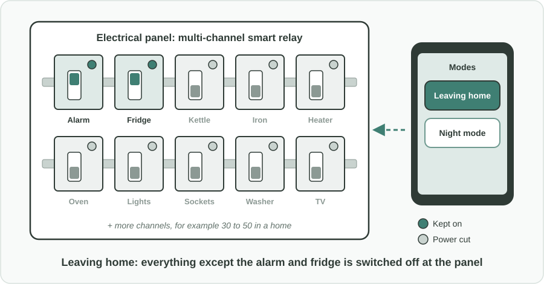
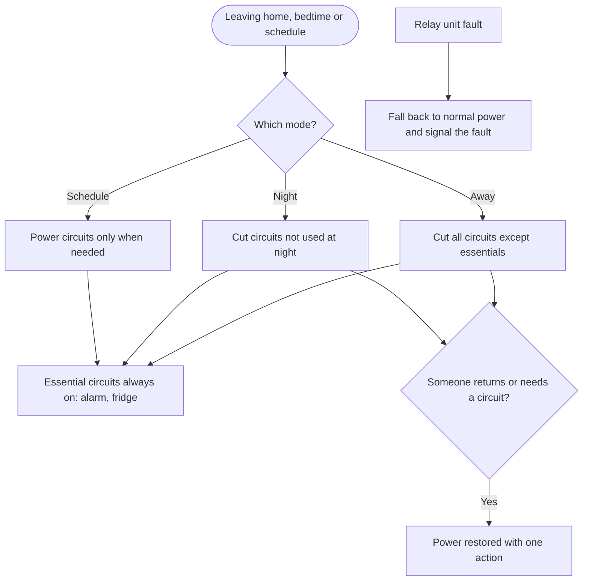

Türkçe: [README.tr.md](README.tr.md)

# Smart Relay Panel for Fire Prevention: Switching Off Whole Circuits When Nobody Needs Them

## Summary

A kettle left on, an iron that was not unplugged, a heater running in an empty room: forgotten appliances and electrical leakage are a well-known cause of fires in homes and workplaces. Today's answer is usually a smart plug for each socket, which is fiddly, expensive to scale and easy to skip. This proposal moves the control to where all the circuits already meet: a **multi-channel smart relay mounted in the electrical panel** (a home might need roughly 30 to 50 channels). With one command, or on a schedule, it can **cut power to everything except the alarm and the fridge when people leave home**, and switch off unused circuits at night. Because it lowers fire claims, **insurers have a direct reason to sponsor it**, for example as a gift in home insurance campaigns. Adoption starts in factories, then spreads gradually to homes, backed by standards, incentives and, in time, a requirement.

## Problem

- Many fires start from **appliances that were forgotten or left on**: kettles, irons, electric heaters, cookers and similar devices, or from electrical leakage in circuits that stay powered all the time.
- When people leave home or go to sleep, **almost every circuit stays live**, even though only a few (such as the alarm and the fridge) actually need power.
- Smart plugs protect **one socket at a time**. Covering a whole home means many separate devices, each to buy, install, set up and maintain. Lights, built-in appliances and wired devices are often not covered at all.
- The people who pay most for electrical fires (households, businesses and their insurers) have **no simple, whole-building tool** for reducing the risk every day.

## Proposed Solution

Put circuit-level control into the electrical panel, and let insurers help pay for it:

1. **Panel-mounted, multi-channel smart relay:** a rail-mounted unit in the electrical panel with many channels (for example 30 to 50 for a home, more for a factory), so each circuit or group of circuits can be switched on or off without touching individual sockets or appliances.
2. **Simple modes that match daily life:**
   - **Away mode:** when the last person leaves, power is cut to everything except essential circuits such as the alarm and the fridge.
   - **Night mode:** circuits that are not used at night (for example the kitchen, the ironing corner, the office) are switched off.
   - **Schedules:** circuits that are only needed at certain times are powered only then.
3. **Essential circuits are protected:** circuits marked as essential (alarm, fridge, medical devices, heating safety) can never be switched off by a mode.
4. **Manual control always works:** people can switch any non-essential circuit back on at once, from the home or remotely.
5. **Insurer sponsorship:** insurers offer the system as a gift or discount in home and business insurance campaigns, because fewer fires means fewer claims.

## How It Works

| Situation | What happens |
|---|---|
| Everyone leaves home and away mode is activated | Only essential circuits (alarm, fridge) stay on. Kettle, iron, heater, oven, sockets and lights are switched off. |
| Night | Circuits marked as unused at night are switched off; bedrooms and essentials stay on. |
| Someone comes home | Normal power is restored to all circuits. |
| A person needs a circuit during a mode | They switch that circuit back on with one action. |
| The relay unit itself has a fault | It falls back to normal power and signals the fault, so the home is never left without essentials. |

People do not need to remember every appliance. They only need to leave home or go to bed, and the panel takes care of the rest.

## Implementation & Phasing

1. **Factories and workplaces first:** start where circuits, shifts and fire risks are well understood and insurance values are high. Factories switch off whole areas outside working hours.
2. **Insurer-sponsored homes:** insurers include the panel relay in home insurance campaigns, as a gift or discount, and electricians install it in existing panels.
3. **Standards:** the building and electrical regulators define a standard for panel-mounted smart relays, including essential-circuit protection, fail-safe behavior and installation by qualified electricians.
4. **Incentives:** lower insurance premiums and public incentives for buildings that install the system.
5. **Gradual requirement:** once the standard is proven, the system becomes a requirement, first in new buildings and major renovations, then more widely.

## Stakeholders & Benefits

- **Households and workers:** fewer fires and fewer deaths and injuries from fires, with no need to remember every appliance.
- **Businesses and factories:** protection of premises, stock and jobs, and lower standby energy use outside working hours.
- **Insurers:** fewer and smaller fire claims, which pays for sponsoring the system.
- **Electricians and manufacturers:** a new product category and steady installation work.
- **Fire services and emergency management:** fewer call-outs for preventable fires.
- **Building and electrical regulators:** a clear, testable safety measure that can be introduced step by step.

## Risks & Mitigations

| Risk | Mitigation |
|---|---|
| An essential device (fridge, alarm, medical equipment) loses power | Essential circuits are marked at installation and can never be switched off by a mode |
| The relay unit fails or loses its connection | Fail-safe design: on a fault it returns to normal power and signals the problem |
| Unsafe installation | Installation only by qualified electricians, following the published standard |
| Cost for households | Insurer sponsorship, premium discounts and public incentives |
| People find it confusing | A few simple modes (away, night, schedule) and a one-action override |

**Keywords:** fire prevention, electrical safety, smart relay, electrical panel, home automation, insurance, forgotten appliances, building safety, energy saving, risk reduction

## Origin

Originally proposed by Merih İlgör (December 2025); published here as an open project idea.

## License

This work is licensed under CC BY-NC-SA 4.0 for non-commercial use; see [LICENSE](LICENSE). Commercial use requires a revenue-share agreement; see [COMMERCIAL-LICENSE.md](COMMERCIAL-LICENSE.md). Modified versions may not be sold or transferred to third parties as new ideas, and patent-like rights are reserved; see [COMMERCIAL-LICENSE.md](COMMERCIAL-LICENSE.md#derivatives-improvements-and-idea-protection).
