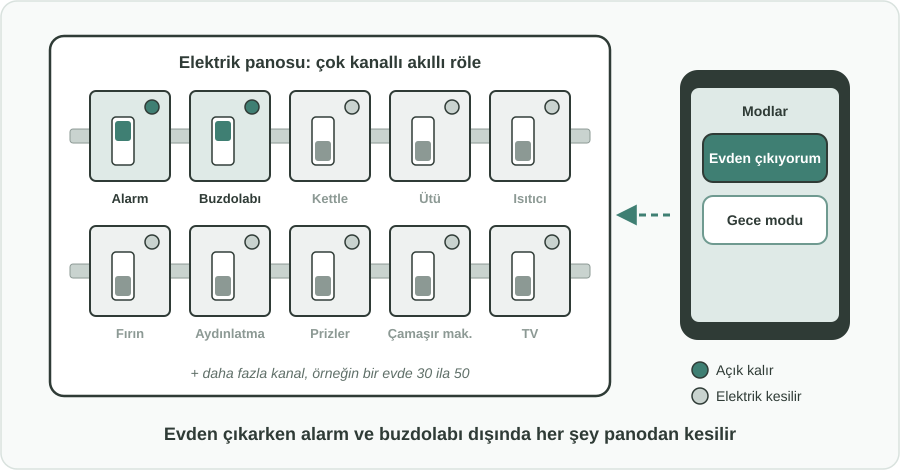
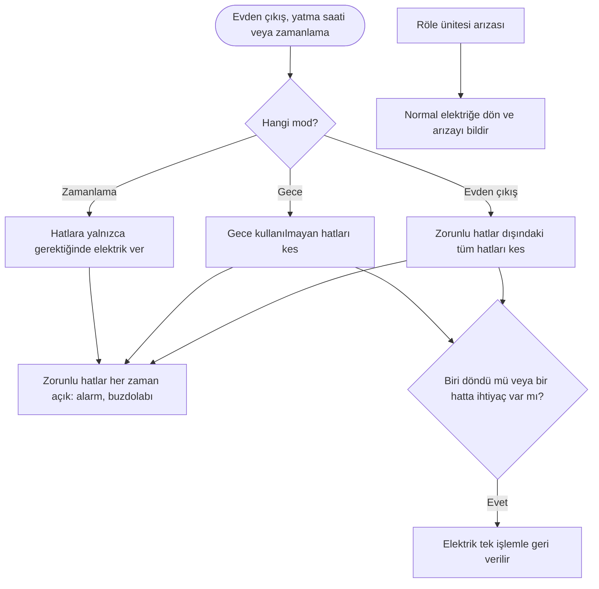

English: [README.md](README.md)

# Yangın Önleme İçin Akıllı Röle Panosu: Kimse İhtiyaç Duymadığında Tüm Hatların Elektriğini Kesmek

## Özet

Açık unutulan bir kettle, fişte bırakılan bir ütü, boş odada çalışan bir ısıtıcı: kapatılması unutulan cihazlar ve elektrik kaçakları, ev ve iş yerlerindeki yangınların bilinen nedenleri arasındadır. Bugün bunun yanıtı genellikle her priz için ayrı bir akıllı priz olur; bu hem zahmetli hem yaygınlaştırması pahalıdır, hem de kolayca ihmal edilir. Bu öneri, kontrolü tüm hatların zaten buluştuğu yere taşır: **elektrik panosuna monte edilen çok kanallı bir akıllı röle** (bir ev için yaklaşık 30 ila 50 kanal gerekebilir). Tek bir komutla veya bir zamanlamayla **evden çıkıldığında alarm ve buzdolabı dışındaki her şeyin elektriğini keser**, geceleri kullanılmayan hatları kapatır. Yangın kaynaklı hasarları azalttığı için **sigorta şirketlerinin bu sisteme sponsor olmak için doğrudan bir nedeni vardır**; örneğin konut sigortası kampanyalarında hediye olarak verilebilir. Uygulama önce fabrikalarda başlar, ardından standartlar, teşvikler ve zamanla bir zorunlulukla kademeli olarak evlere yayılır.

## Sorun

- Pek çok yangın, **unutulan veya açık bırakılan cihazlardan** çıkar: kettle, ütü, elektrikli ısıtıcı, ocak ve benzeri aygıtlar ya da sürekli elektrik verilen hatlardaki kaçaklar.
- Evden çıkıldığında veya uyunduğunda, yalnızca birkaç hattın (alarm ve buzdolabı gibi) gerçekten elektriğe ihtiyacı olmasına rağmen **neredeyse tüm hatlar enerjili kalır**.
- Akıllı prizler **tek seferde yalnızca bir prizi** korur. Bir evin tamamını kapsamak, her biri ayrı ayrı satın alınan, takılan, kurulan ve bakımı yapılan çok sayıda cihaz demektir. Aydınlatma, ankastre cihazlar ve sabit bağlı cihazlar çoğu zaman hiç kapsanmaz.
- Elektrik yangınlarının bedelini en çok ödeyenlerin (haneler, işletmeler ve sigortacıları) riski her gün azaltmak için **basit, bina ölçeğinde bir aracı yoktur**.

## Önerilen Çözüm

Hat düzeyinde kontrolü elektrik panosuna yerleştirmek ve maliyetine sigorta şirketlerinin katkı vermesini sağlamak:

1. **Panoya monte, çok kanallı akıllı röle:** Elektrik panosunda raya takılan, çok kanallı bir ünite (örneğin bir ev için 30 ila 50, bir fabrika için daha fazla kanal). Böylece her hat veya hat grubu, prizlere ya da cihazlara tek tek dokunmadan açılıp kapatılabilir.
2. **Günlük hayata uyan basit modlar:**
   - **Evden çıkış modu:** Son kişi evden çıktığında, alarm ve buzdolabı gibi zorunlu hatlar dışındaki her şeyin elektriği kesilir.
   - **Gece modu:** Geceleri kullanılmayan hatlar (örneğin mutfak, ütü köşesi, çalışma odası) kapatılır.
   - **Zamanlamalar:** Yalnızca belirli saatlerde gereken hatlara yalnızca o saatlerde elektrik verilir.
3. **Zorunlu hatlar korunur:** Zorunlu olarak işaretlenen hatlar (alarm, buzdolabı, tıbbi cihazlar, ısınma güvenliği) hiçbir mod tarafından kapatılamaz.
4. **Elle kontrol her zaman çalışır:** Zorunlu olmayan herhangi bir hat, evden veya uzaktan hemen yeniden açılabilir.
5. **Sigorta sponsorluğu:** Daha az yangın daha az hasar talebi demek olduğundan, sigorta şirketleri sistemi konut ve işyeri sigortası kampanyalarında hediye veya indirim olarak sunar.

## Nasıl Çalışır

| Durum | Ne olur |
|---|---|
| Herkes evden çıkar ve evden çıkış modu açılır | Yalnızca zorunlu hatlar (alarm, buzdolabı) açık kalır. Kettle, ütü, ısıtıcı, fırın, prizler ve aydınlatma kapatılır. |
| Gece | Gece kullanılmayan olarak işaretlenen hatlar kapatılır; yatak odaları ve zorunlu hatlar açık kalır. |
| Biri eve döner | Tüm hatlara normal elektrik geri verilir. |
| Bir mod açıkken birinin bir hatta ihtiyacı olur | O hattı tek bir işlemle yeniden açar. |
| Röle ünitesinin kendisi arızalanır | Normal elektriğe geri döner ve arızayı bildirir; böylece ev hiçbir zaman zorunlu hatlardan yoksun kalmaz. |

İnsanların her cihazı hatırlaması gerekmez. Yalnızca evden çıkmaları veya yatmaları yeterlidir; gerisini pano halleder.

## Uygulama ve Fazlandırma

1. **Önce fabrikalar ve iş yerleri:** Hatların, vardiyaların ve yangın risklerinin iyi bilindiği, sigorta değerlerinin yüksek olduğu yerlerden başlanır. Fabrikalar çalışma saatleri dışında tüm alanların elektriğini keser.
2. **Sigorta destekli evler:** Sigorta şirketleri pano rölesini konut sigortası kampanyalarına hediye veya indirim olarak ekler; elektrikçiler mevcut panolara takar.
3. **Standartlar:** Yapı ve elektrik alanındaki düzenleyici kurumlar, panoya monte akıllı röleler için zorunlu hat koruması, arızada güvenli davranış ve yetkin elektrikçi tarafından montajı kapsayan bir standart belirler.
4. **Teşvikler:** Sistemi kuran binalar için daha düşük sigorta primleri ve kamu teşvikleri.
5. **Kademeli zorunluluk:** Standart kendini kanıtladıktan sonra sistem, önce yeni binalarda ve büyük tadilatlarda, ardından daha geniş kapsamda zorunlu hale gelir.

## Paydaşlar ve Faydalar

- **Haneler ve çalışanlar:** Her cihazı hatırlamaya gerek kalmadan daha az yangın, yangın kaynaklı daha az ölüm ve yaralanma.
- **İşletmeler ve fabrikalar:** Tesis, stok ve istihdamın korunması; çalışma saatleri dışında daha az bekleme enerjisi tüketimi.
- **Sigorta şirketleri:** Daha az ve daha küçük yangın hasarı; bu da sisteme sponsor olmanın maliyetini karşılar.
- **Elektrikçiler ve üreticiler:** Yeni bir ürün kategorisi ve düzenli montaj işi.
- **İtfaiye ve afet-acil durum yönetimi:** Önlenebilir yangınlar için daha az çağrı.
- **Yapı ve elektrik düzenleyicileri:** Adım adım uygulanabilen, açık ve test edilebilir bir güvenlik önlemi.

## Riskler ve Önlemler

| Risk | Önlem |
|---|---|
| Zorunlu bir cihazın (buzdolabı, alarm, tıbbi cihaz) elektriği kesilir | Zorunlu hatlar montaj sırasında işaretlenir ve hiçbir mod tarafından kapatılamaz |
| Röle ünitesi arızalanır veya bağlantısını kaybeder | Arızada güvenli tasarım: arıza durumunda normal elektriğe döner ve sorunu bildirir |
| Güvensiz montaj | Yalnızca yayımlanan standarda uyan yetkin elektrikçiler tarafından montaj |
| Haneler için maliyet | Sigorta sponsorluğu, prim indirimleri ve kamu teşvikleri |
| İnsanların sistemi karmaşık bulması | Birkaç basit mod (evden çıkış, gece, zamanlama) ve tek işlemle geçersiz kılma |

**Anahtar kelimeler:** yangın önleme, elektrik güvenliği, akıllı röle, elektrik panosu, ev otomasyonu, sigorta, unutulan cihazlar, bina güvenliği

## Köken

Merih İlgör tarafından önerilmiştir (Aralık 2025); burada açık bir proje fikri olarak yayımlanmaktadır.

## Lisans

Bu çalışma, ticari olmayan kullanım için CC BY-NC-SA 4.0 lisansı ile lisanslanmıştır; bkz. [LICENSE](LICENSE). Ticari kullanım bir gelir paylaşımı anlaşması gerektirir; bkz. [COMMERCIAL-LICENSE.md](COMMERCIAL-LICENSE.md). Değiştirilmiş sürümler yeni bir fikir olarak satılamaz veya üçüncü kişilere aktarılamaz; patent benzeri haklar saklıdır. Bkz. [COMMERCIAL-LICENSE.md](COMMERCIAL-LICENSE.md#derivatives-improvements-and-idea-protection).
