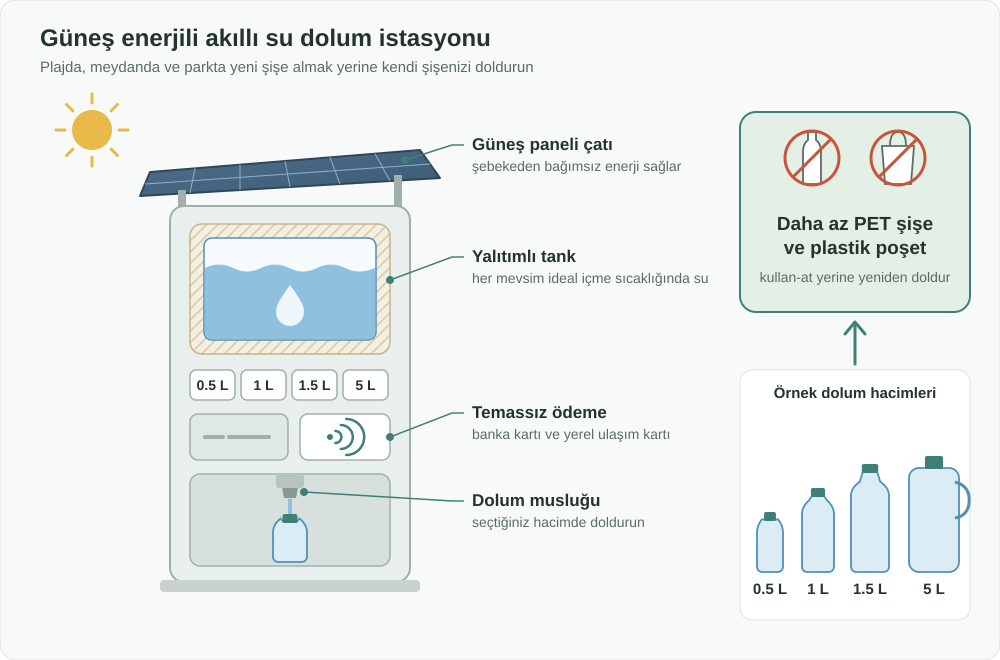

English: [README.md](README.md)

# AKASU: Güneş Enerjili Akıllı Su Dolum İstasyonları ve Entegre Plastik Atık Azaltım Projesi

*Türkiye Geneli Güneş Enerjili Akıllı Su Dolum İstasyonları, Ambalaj Standardizasyonu ve Entegre Plastik Atık Azaltım Projesi (AKASU)*

## Özet

Türkiye genelinde, özellikle sahil şeritleri, milli parklar ve yoğun yaya trafiğine sahip şehir merkezlerinde en sık karşılaşılan çevre kirliliği unsurları tek kullanımlık ince PET su şişeleri ve alışveriş poşetleridir. Bu proje; akıllı ve bağlantılı altyapı, %100 yenilenebilir enerji kullanımı, yeni ambalaj standartları, hijyen denetimleri ve tüm paydaşların (kamu, özel sektör, vatandaş) ekonomik faydasını gözeten bir iş modeliyle plastik atıkları ve karbon ayak izini kaynağında minimize etmeyi hedeflemektedir.

Projenin temel bileşenleri:

- "Önemli Noktalara" su şirketleri tarafından pazar payları oranında kurulacak **güneş enerjili, uzaktan izlenen Akıllı Su Dolum İstasyonları**;
- istasyonları belediyeler için bir gider kalemi olmaktan çıkarıp su şirketleri için **kârlı yeni nesil satış noktasına** dönüştüren **kazan-kazan iş modeli**;
- Sağlık Bakanlığı standartlarına uygun otomatik temizlik ve su arıtma, Bakanlığa anlık su kalitesi raporlaması ve zorunlu denetimlerle **halk sağlığı ve hijyen denetimi**;
- **İngiltere modeline** uygun olarak ince ve küçük PET şişelerin yerine kalın, defalarca kullanılabilir, daha büyük ebatlı şişeler (kişisel "matara") getiren **ambalaj standartları revizyonu**;
- istasyondan dolumu raftaki ambalajlı sudan ciddi oranda ucuz kılan ve poşet/ambalaj vergilerini "Yeniden Değerleme Oranı"na endeksleyen **fiyatlandırma** düzenlemesi.

## Sorun

- **PET Şişe Kirliliği:** Tek kullanımlık ince PET şişelerin üretim maliyetlerinin düşük olması, "kullan-at" kültürünü beslemekte ve bu ürünlerin tüketim sonrası doğaya bırakılmasıyla doğada kalıcı kirliliğe neden olmaktadır. Özellikle yaz aylarında sahil şeritlerinde, mesire alanlarında ve şehir merkezlerinde toplanan atıkların en büyük kalemlerinden biri tek kullanımlık su şişeleridir (bunu naylon poşetler ve sigara izmaritleri takip eder).
- **Plastik Poşet Tüketimi:** Market poşetleri için uygulanan 25 Kuruşluk ücretlendirmenin enflasyon karşısında caydırıcılığını yitirmesi, poşet kullanımını ve doğadaki plastik atığını yeniden artırmıştır. Poşetler, PET şişelerle birlikte plajlarda, hatta çöp kutusu dışında atık olarak gözlemlenmektedir.
- **Mevcut yaklaşımların sınırı:** Birçok çevre projesi, özel sektörün ekonomik çıkarlarıyla çatıştığı için kağıt üzerinde kalır veya lobi faaliyetleriyle engellenir. Ücretsiz veya sübvanse edilmiş kamu çeşmeleri ise zamanla bakımsız ve atıl kalır ("atıl kamu çeşmeleri sendromu").

## Önerilen Çözüm

Proje, sadece bir yasak getirmek yerine akıllı altyapıyla desteklenmiş, ekonomik teşviki olan ve sorumluluğu doğrudan üreticiye (su şirketlerine) yükleyen bir "Döngüsel Ekonomi" ekosistemi önermektedir. Önerilen çözüm modeli ve proje adımları şunlardır:

| # | Bileşen | Temel fikir |
|---|---------|-------------|
| A | Güneş Enerjili Akıllı Su Dolum İstasyonları Ağı | Önemli Noktalara pazar payları oranında zorunlu istasyon; hiç susuz kalmama, otomatik dolum talebi, temassız ödeme, farklı hacim seçenekleri |
| B | İklimlendirme, Enerji Verimliliği ve Yenilenebilir Enerji | Her mevsim az enerjiyle ideal içme sıcaklığı, şebekeden bağımsız güneş enerjisi |
| C | Sürdürülebilir İş Modeli (Kazan-Kazan) | Kurulum, işletme ve bakım belediyelere değil, su üreticisi şirketlere; suyun istasyon üzerinden satışı |
| D | Halk Sağlığı ve Hijyen Denetimi | Otomatik temizlik ve su arıtma, anlık su kalitesi raporlaması, periyodik denetim |
| E | Ambalaj Standartlarının Revizyonu (İngiltere Modeli) | İnce ve küçük PET sınırlaması; kalın, dayanıklı, büyük ebatlı "matara" şişeler |
| F | Fiyatlandırma ve Tüketici Davranışı Değişimi | İstasyon suyu raftaki sudan ciddi oranda ucuz; vergiler Yeniden Değerleme Oranı'na endeksli |

## İşleyiş

### A. Güneş Enerjili Akıllı Su Dolum İstasyonları Ağı Kurulması

- Nüfus yoğunluğuna ve turistik kapasiteye göre belirlenecek "Önemli Noktalara" (Point of Interest: halk plajları, meydanlar, parklar) su şirketleri tarafından "Akıllı Su Dolum İstasyonları" kurulması pazar payları oranında zorunlu hale getirilmelidir. Her önemli noktada oranın insan kapasitesine uygun miktarda istasyon bulunması Çevre, Şehircilik ve İklim Değişikliği Bakanlığı tarafından zorunlu tutulmalı, toplam ihtiyaç duyulan istasyon sayısı büyük su şirketlerine zorunlu hedef olarak verilmeli ve su firmalarına pazar payları oranında istasyon kurma ve işletme kotası tahsis edilmelidir.
- **Kesintisiz Hizmet:** İstasyonlarda yedek bir su kaynağı bulunmalıdır. Ana kaynak tükendiğinde istasyon yedekten hizmet vermeye devam etmeli ve su şirketine otomatik olarak "dolum talebi" iletilmeli; istasyon su şirketi tarafından doldurularak atıl kalması engellenmelidir.
- **Temassız Ödeme ve Esnek Dolum Seçenekleri:** Tüketici deneyimini kolaylaştırmak adına istasyonlarda banka kartları ve yerel ulaşım kartları (örn. İstanbulkart) dahil temassız ödeme yapılabilmelidir. Cihazlarda kullanıcıların ihtiyaçlarına göre 0.5 Litre, 1 Litre, 1.5 Litre ve 5 Litre gibi farklı hacim seçenekleri sunulmalıdır.

### B. İklimlendirme, Enerji Verimliliği ve Yenilenebilir Enerji

- **Yaz Sıcağına Karşı Koruma:** İstasyonlar iyi yalıtılmış olmalı; böylece su yaz aylarındaki yüksek sıcaklıklardan etkilenmemeli ve soğutma için az enerji harcanmalıdır.
- **İdeal İçme Sıcaklığı:** Suyun her mevsim ideal içme sıcaklığında (sıcakta soğutulmuş, aşırı soğuklarda donmaya karşı korunmuş) sunulması garanti altına alınmalıdır.
- **Güneş Enerjisi:** İstasyonların ödeme, izleme, su arıtma ve soğutma/ısıtma için ihtiyaç duyduğu enerji, istasyonlara yerleştirilecek güneş panelleri ile şebekeden bağımsız olarak sağlanmalı; böylece projenin karbon ayak izi sıfıra indirilmelidir.

### C. Sürdürülebilir İş Modeli ve Özel Sektör Entegrasyonu (Kazan-Kazan Yaklaşımı)

- Projenin başarısı ve uzun vadeli sürdürülebilirliği için istasyonların kurulum, işletme ve bakım sorumluluğu **belediyelere değil, doğrudan su üreticisi şirketlere** verilmelidir.
- Eğer bu hizmet belediyeler tarafından "ücretsiz veya sübvanse edilmiş kamu çeşmeleri" şeklinde verilirse, su şirketlerinin mevcut ticari faaliyetleriyle doğrudan rekabet edecek, özel sektörün haklı direncine yol açacak ve belediyeler için altından kalkılamaz bir bakım maliyeti (gider kalemi) yaratacaktır.
- Bunun yerine su şirketlerinin suyu "şişe" yerine doğrudan "istasyon" üzerinden satması, onların ticari iş modellerini tehdit etmeden, sadece dağıtım kanalını dönüştürecektir. Ambalaj, lojistik ve depolama maliyetlerinden kurtulan şirketler için istasyonlar "kârlı birer yeni nesil satış noktası" olacak; böylece proje kendi kendini finanse edecektir.
- Şirketlerin bu sistemden ticari gelir elde etmesi ve istasyonlarda kendi marka kimliklerini (logolarını) sergilemeleri; istasyonların sürekli temiz, bakımlı, hijyenik ve çalışır durumda tutulmasını (atıl kamu çeşmeleri sendromunun önüne geçilmesini) doğal bir güdü ile garanti altına alacaktır.

### D. İstasyonlarda Halk Sağlığı ve Hijyen Denetimi

- Kurulacak istasyonlar kendi kendini otomatik olarak temizlemeli ve suyu Sağlık Bakanlığı standartlarına uygun şekilde arıtmalıdır.
- Su kalitesi, Sağlık Bakanlığı (ve yerel yönetimlerin) sistemlerine anlık raporlanmalıdır.
- Periyodik hijyen ve mikrobiyolojik analiz denetimleri zorunlu tutulmalıdır.

### E. Ambalaj Standartlarının Revizyonu ve İngiltere Modeli

- Tüketiciyi sıkça alıp atmaya iten "ince ve küçük" (330ml, 500ml) PET şişe üretimi sınırlandırılmalıdır.
- İngiltere ve benzeri ülkelerdeki modellere uygun olarak standart ambalajların ebatları büyütülmeli (örn. 750 ml - 1 Litre) ve bu şişelerin kalın, defalarca kullanılmaya dayanıklı, sağlığa zararlı salınım yapmayan materyallerden üretilmesi zorunlu kılınmalıdır.
- Bu sayede şişe "çöp" olmaktan çıkıp istasyonlarda tekrar doldurulabilecek kişisel bir "mataraya" dönüşecektir.
- Aynı uygulama 5 litrelik sular için de geçerli olmalı; 5 litrelik suların da dayanıklı ve tekrar doldurulabilir formlarda satılması teşvik edilmelidir.

### F. Fiyatlandırma ve Tüketici Davranışı Değişimi

- İstasyonlardan su doldurmanın litre maliyeti, raflardaki ambalajlı sudan ciddi oranda ucuz olmalıdır.
- Tek kullanımlık ambalajlı sulara uygulanacak çevre vergileri ile raflardaki su fiyatları artırılarak, aradaki farkın ciddi bir tercih sebebi yaratması ve tüketicinin yenisini alıp doğaya atmak yerine "doldurma" kültürüne ekonomik olarak teşvik edilmesi sağlanmalıdır.
- Market poşetleri ve tek kullanımlık ambalajlı sular üzerindeki çevre vergileri, sabit bir miktar yerine "Yeniden Değerleme Oranı"na (veya enflasyon endeksine) endekslenerek her yıl otomatik güncellenmeli ve caydırıcılık korunmalıdır.

## Uygulama ve Aşamalar

Kaynak metin projeyi tarihli bir takvim yerine paralel iş kalemleri olarak tanımlamaktadır. Tasarımdan doğan uygulama adımları şunlardır:

1. **Önemli Noktaların ve kapasitenin belirlenmesi:** Halk plajları, meydanlar, parklar ve diğer yoğun noktaların nüfus yoğunluğu ve turistik kapasiteye göre belirlenmesi; her nokta için gerekli istasyon sayısının tespiti.
2. **Kota tahsisi:** Toplam istasyon ihtiyacının büyük su şirketlerine pazar payları oranında zorunlu hedef olarak verilmesi.
3. **İstasyonların kurulması:** Su şirketlerince güneş enerjili, temassız ödemeli ve farklı hacim seçenekli akıllı istasyonların kurulması ve işletme, dolum ve bakım sorumluluğunun üstlenilmesi.
4. **Hijyen rejimi:** İstasyonların Sağlık Bakanlığı (ve yerel yönetim) raporlama sistemlerine bağlanması ve periyodik hijyen/mikrobiyolojik denetimlerin başlatılması.
5. **Ambalaj düzenlemesi:** İnce ve küçük PET şişelerin sınırlandırılması; kalın, dayanıklı, büyük ebatlı şişelerin (5 litrelik tekrar doldurulabilir formlar dahil) zorunlu kılınması.
6. **Fiyatlandırma ve vergi endekslemesi:** İstasyon suyunun raftaki sudan ciddi oranda ucuz tutulması, tek kullanımlık ambalajlı sulara çevre vergisi uygulanması ve poşet/ambalaj vergilerinin Yeniden Değerleme Oranı'na endekslenmesi.

## Paydaşlar ve Faydalar

| Paydaş | Rolü | Faydası |
|--------|------|---------|
| Çevre, Şehircilik ve İklim Değişikliği Bakanlığı | Önemli noktalarda istasyon zorunluluğunu ve pazar payı kotalarını belirler; ambalaj standartlarını ve çevre vergilerini düzenler | Plastik atık ve mikroplastik yükünde azalma, sıfır karbonlu hizmet, ek kamu harcaması olmaması |
| Sağlık Bakanlığı | Hijyen standartlarını belirler; su kalitesi verilerini anlık alır; periyodik denetimi zorunlu tutar | Dolum noktalarında halk sağlığının korunması |
| Su üreticisi şirketler | İstasyonları kurar, işletir, doldurur ve bakımını yapar; markasını sergiler | Kârlı yeni nesil satış noktası; ambalaj, lojistik ve depolama maliyetlerinden tasarruf; iş modeli tehdit edilmeden dağıtım kanalının dönüşümü |
| Belediyeler / yerel yönetimler | İstasyonlara ev sahipliği yapar; kalite raporlarını alır | İstasyon bakım maliyeti olmaması; atık toplama maliyetlerinin düşmesi |
| Vatandaşlar ve turistler | Kişisel şişelerini temassız ödemeyle farklı hacimlerde doldurur | Daha ucuz, hijyenik, ideal içme sıcaklığında su; dayanıklı kişisel matara |
| Çevre | | Denizel ekosistemdeki mikroplastik yükünün dramatik şekilde azalması; kalıcı "yeniden doldur" kültürü |

**Beklenen Çıktılar**

Bu proje sayesinde devlete ve yerel yönetimlere hiçbir ekstra finansal yük ve atık toplama maliyeti binmeyecek; yerel yönetimlerin atık toplama maliyetleri düşecektir. Özel sektör, ticari faaliyetlerini çevre dostu bir yaklaşımla sürdürmeye devam ederken denizel ekosistemdeki mikroplastik yükü dramatik şekilde azalacaktır. Güneş enerjisi kullanımı sayesinde çevreye sıfır karbon emisyonu ile hizmet verilecek; "kullan-at" kültürü yerini, güneş enerjisiyle çalışan, güvenilir, hijyenik, akıllı ve ekonomik bir "yeniden doldur" (refill) ekosistemine bırakarak kalıcı bir tüketici davranışına dönüşecektir.

## Riskler ve Önlemler

| Risk | Önlem (öneri metninden) |
|------|-------------------------|
| İstasyonların susuz ya da atıl kalması | Yedek kaynakla kesintisiz hizmet; su şirketine otomatik dolum talebi; şirketin istasyondan ticari gelir elde etmesi |
| Özel sektörün direnci ve lobi faaliyetleri | İstasyonların şirketlerle rekabet eden ücretsiz kamu çeşmesi değil, onlar için kârlı yeni satış kanalı olması; yalnızca dağıtım kanalının dönüşmesi |
| Belediyelere bakım yükü ve atıl kamu çeşmeleri sendromu | Kurulum, işletme ve bakımın belediyelere değil su şirketlerine verilmesi; marka görünürlüğü ve gelir güdüsü |
| Hijyen ve halk sağlığı riskleri | Otomatik temizlik ve su arıtma, Sağlık Bakanlığı'na anlık raporlama, zorunlu mikrobiyolojik denetim |
| Yaz sıcakları ve enerji tüketimi | İyi yalıtım ve az enerjili sıcaklık kontrolü, güneş enerjisi |
| Çevre ücretlerinin enflasyon karşısında etkisizleşmesi (25 Kuruşluk poşet ücreti örneği) | Yeniden Değerleme Oranı'na endeksli otomatik yıllık güncelleme |
| Tüketicinin tek kullanımlık şişe almaya devam etmesi | İstasyon suyu ile raftaki su arasında ciddi fiyat farkı; ince ve küçük PET sınırlaması; matara işlevli dayanıklı şişeler |

## Kaynaklar / Örnekler

- **İngiltere modeli:** Defalarca kullanıma uygun, kalın ve daha büyük ebatlı standart şişeler; ambalaj standartları revizyonu için referans alınmıştır.
- **Türkiye'de market poşetleri için uygulanan 25 Kuruşluk ücret:** Enflasyon karşısında caydırıcılığını yitiren ücret örneği.
- **İstanbulkart:** İstasyonlarda temassız ödeme için kullanılabilecek yerel ulaşım kartı örneği.

**Anahtar kelimeler:** plastik atık azaltma, pet şişe, su dolum istasyonu, güneş enerjisi, döngüsel ekonomi, sıfır atık, poşet ücreti, sürdürülebilirlik, belediye hizmetleri

## Köken

İlk olarak Merih İlgör tarafından bir kamu politikası önerisi olarak hazırlanmıştır (Ağustos 2026); burada açık proje fikri olarak yayımlanmaktadır.

## Lisans

Bu çalışma ticari olmayan kullanım için [CC BY-NC-SA 4.0](https://creativecommons.org/licenses/by-nc-sa/4.0/) lisansı ile lisanslanmıştır; bkz. [LICENSE](LICENSE). Ticari kullanım bir gelir paylaşımı anlaşması gerektirir; bkz. [COMMERCIAL-LICENSE.md](COMMERCIAL-LICENSE.md).
