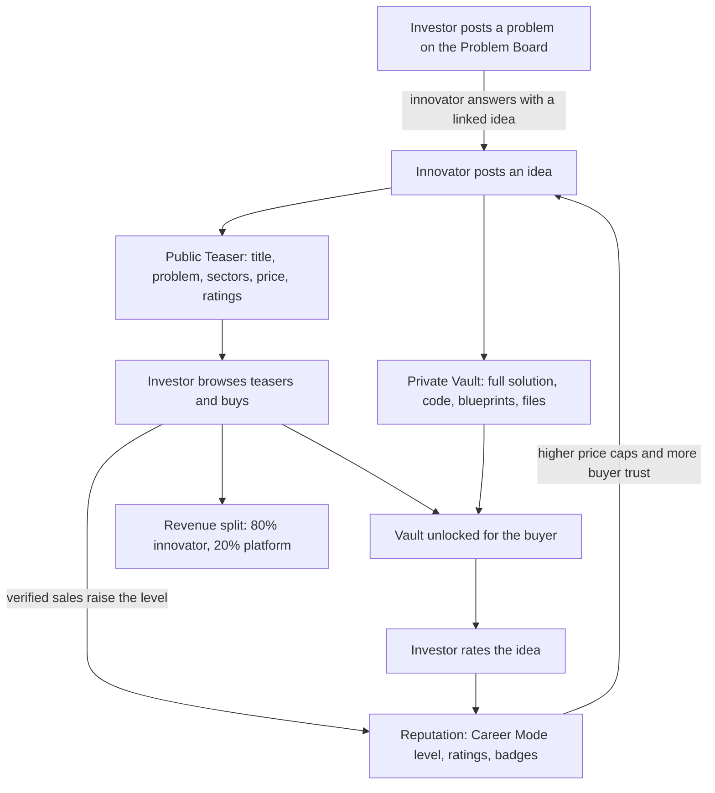

Türkçe: [README.tr.md](README.tr.md)

# Vestinno: A Marketplace Where Investment Meets Innovation

## Summary

**Vestinno** (from *INVEST* + *INNOVATION*) is a two-sided digital marketplace that connects **Innovators** (sellers) with **Investors** (buyers). Innovators, from garage tinkerers to research labs, list actionable solutions such as intellectual property, code and blueprints. Investors with capital to deploy buy them outright. The platform's tagline is *"Where Investment Meets Innovation"*. Its mission is to democratize innovation: innovators get paid for their work without giving up equity or pitching, and investors get vetted, high-quality assets they can turn into products or ventures.

Quality is handled mainly by the platform's rules rather than by manual moderation. A gamified reputation system called **Career Mode** makes innovators earn the right to sell higher-priced ideas through verified sales. Each idea is split into a public **Teaser** and a private **Vault** that opens only after purchase. A **Problem Board** lets investors post the problems they want solved. The platform earns a fixed **20% commission** on every sale plus subscription fees.

## Problem

- **Ideas are hard to monetize.** Individual inventors and small teams often have valuable solutions but no practical way to sell them. The usual routes (raising equity, pitching, cold outreach) are slow, exclusive and dependent on location.
- **Fear of idea theft.** Creators hesitate to share ideas because once disclosed, an idea can be copied without payment.
- **Investors waste time scouting.** Companies, investors and public bodies spend a lot of effort finding and filtering ideas. Raw idea sources are noisy and give little signal about whether the creator can deliver.
- **Weak trust between strangers.** A buyer cannot easily judge an unknown seller, and a seller has no reputation to show. Without a trust mechanism, prices and deal sizes stay low.
- **Gatekeepers and geography.** Access to innovation capital is concentrated. A good idea from an unconnected region rarely reaches a global pool of buyers.

## Proposed Solution

Build a premium, minimalist marketplace where ideas are traded as assets:

1. **Two-sided marketplace.** Innovators list solutions; investors browse and buy them. One listing reaches a global pool of investors with no gatekeepers.
2. **Teaser vs. Vault.** Each idea has a public teaser (title, problem statement, sectors, price, seller rating) and a private vault (full solution, source code, blueprints, files). The vault opens only for buyers, which protects the innovator's IP until payment.
3. **Career Mode.** New innovators start with low price caps and unlock higher ones as they complete verified sales. Reputation is earned, not claimed.
4. **Problem Board (Request for Innovation).** Investors post specific problems, optionally with a budget and deadline. Innovators then build and sell solutions aimed at them.
5. **Automated quality signals.** Every published idea gets an AI-generated review score (0–10) that all users can see. Buyers also leave star ratings, and user-submitted text is checked automatically for abusive language.
6. **Clear commercial rules.** A fixed 20% commission, subscription tiers for both sides, a no-refund policy for digital goods with a time-limited dispute process, and a "frozen" state for lapsed accounts that keeps the user's data.

## How It Works

### Roles

| Role | What they do |
|---|---|
| **Innovator (Seller)** | Uploads and sells intellectual property (solution logic, code, blueprints). Keeps 80% of each sale. Can link an idea to an open problem on the Problem Board. Can choose to hide their name on an idea. |
| **Investor (Buyer)** | Browses and buys ideas within their chosen sectors. Posts problems on the Problem Board. Rates purchased ideas. Gets email notifications when new ideas appear in their sectors. |
| **Platform (Admin)** | Manages plans, resolves disputes, can ban fraudulent users, can override frozen status, and monitors revenue and commission. |

### Subscription Tiers

There is no free tier. Both sides subscribe to a paid plan during onboarding.

**Innovator plans**: higher tiers allow more active ideas and higher prices. Upgrading requires the previous tier's badge and a minimum number of verified sales.

| Plan | Monthly price | Active ideas | Max price per idea | Sectors per idea | Entry requirement |
|---|---|---|---|---|---|
| Starter | ~$2 | 2 | $50 | 3 | Open to all |
| Plus | $7 | 5 | $200 | 5 | Starter badge + 2 verified sales |
| Pro | $45 | 10 | $1,000 | 7 | Plus badge + 4 verified sales |
| Ultra | $100 | 20 | $10,000 | 10 | Pro badge + 10 verified sales |

**Investor plans**: higher tiers allow more purchases, higher-tier ideas and more sectors. Investors can buy only ideas in the sectors they selected (Ultra can buy in any sector), and they get email alerts for new ideas in those sectors.

| Plan | Monthly price | Purchases per month | Idea tiers purchasable | Sectors |
|---|---|---|---|---|
| Small | $20 | 3 | Starter, Plus | 1 |
| Medium | $50 | 5 | Starter, Plus, Pro | 2 |
| Enterprise | $200 | 10 | All tiers | 3 |
| Ultra | $1,000 | Unlimited | All tiers | All |

Plan upgrades take effect immediately. Downgrades take effect at the end of the current billing period. A cancellation ends the subscription at the end of the billing cycle, with no prorated refunds.

### Teaser vs. Vault

| Block | Visibility | Contents |
|---|---|---|
| **Teaser** (public) | All subscribers | Title, problem statement, sectors, price, seller rating, AI review score. Links and contact details are not allowed, so buyers cannot bypass the platform. |
| **Vault** (private) | Only buyers of that idea (and its owner) | Full solution logic, source code, blueprints, downloadable files |

### Career Mode (Reputation)

Innovators cannot sell high-ticket items right away; they have to earn it. Levels go up automatically as verified sales accumulate, and a level, once reached, is never lost.

| Level | Verified sales required | Price range per idea |
|---|---|---|
| Starter | 0 | $20 – $50 |
| Plus | 2 | $20 – $200 |
| Pro | 4 | $20 – $1,000 |
| Ultra | 10 | $20 – $10,000 |

An innovator's **effective price limit** is the higher of their career-level limit and their subscription-tier limit. Career progress, sales count and the current price limit are shown on the innovator dashboard. Together with the trust score, ratings and badges, Career Mode shows buyers which innovators have a track record of delivering.

### Problem Board (Request for Innovation)

The Problem Board reverses the usual flow of the marketplace. Instead of innovators listing solutions first, an investor posts a problem they need solved.

- **Who posts:** Investors (and platform admins). Innovators browse problems and respond with solutions.
- **Problem details:** A short title, a detailed description, a single sector, and an optional budget range and deadline.
- **Linking:** When an innovator creates an idea, they can link it to an open problem.
- **Lifecycle:** *Open* (accepting solutions), then *Solved* (the poster bought a solution, which is linked) or *Closed* (no longer accepting solutions).
- **Gamification:** Innovators whose solution solves a problem earn a **"Problem Solver"** badge. The design also gives them a trust-score boost and priority visibility in search.

### Refund & Dispute Policy

- **No refunds on digital goods by default.** Buyers confirm at checkout that the purchase is non-refundable.
- **48-hour dispute window.** A buyer can report a problem on a purchased idea within 48 hours of purchase. Valid grounds are corrupted files, inaccessible content, significant misrepresentation (for example, promised code files missing), plagiarism, or a terms-of-service violation.
- **Resolution.** The platform reviews the idea, the transaction and the complaint, then either refunds the buyer or rejects the dispute. Every step is recorded in an audit trail.
- **Fraud.** If fraud is confirmed, the buyer is refunded and the innovator can be banned (trust score set to zero).

### Frozen Accounts

If a subscription payment fails (for example, the card has expired) or the user cancels, the account becomes **frozen**. It is not deleted:

- User data and ideas are kept.
- The user cannot buy, sell or upload while frozen and is sent to billing on any such action.
- Access comes back as soon as a payment succeeds.

### Content Moderation

All user-submitted text (ideas, problems, reviews, disputes and profile names) is checked automatically for profanity and abusive language, and submissions that fail are rejected with a generic message. On top of this, each idea gets a transparent AI review score from 0 to 10 every time it is published. The score is based on investor-focused criteria: problem–solution fit, originality, investment potential, feasibility and clarity. Low-quality ideas therefore cannot hide.

### Sector Taxonomy

Ideas and problems are classified in a two-level hierarchy: broad categories, each containing many specific sectors (762 in total). It is meant to cover everything from small workshops (plastics, wood, crafts) to large enterprises (space, energy, telecom). The 16 top-level categories are:

| | | | |
|---|---|---|---|
| Manufacturing & Materials | Electronics & Hardware | Software & IT | Health & Life Sciences |
| Energy & Utilities | Transportation & Logistics | Consumer & Retail | Finance & Professional Services |
| Telecom & Media | Construction & Real Estate | Agriculture & Food Production | Government, Defense & Space |
| Education & Research | Environmental & Sustainability | Industrial & B2B | Other |

An idea can be tagged with up to 3, 5, 7 or 10 sectors depending on the innovator's plan. A problem has a single sector.

## Business Model

| Revenue stream | Description |
|---|---|
| **Fixed 20% commission** | On every idea sale, regardless of tier: 80% goes to the innovator and 20% to the platform. Payment processing fees are deducted from the total. |
| **Innovator subscriptions** | Four tiers (Starter, Plus, Pro, Ultra) that unlock more active ideas and higher price caps. |
| **Investor subscriptions** | Four tiers (Small, Medium, Enterprise, Ultra) that unlock more purchases, higher-tier ideas and more sectors. |

**Low fixed-cost strategy.** The platform is designed to start with near-zero fixed costs ("$1 start"), so its costs grow only as its user base and revenue grow.

## Phasing

The platform is planned to grow in three phases by user base:

| Phase | Users |
|---|---|
| Startup | 0 – 1,000 |
| Growth | 1,000 – 10,000 |
| Scale | 10,000+ |

## Stakeholders & Benefits

| Stakeholder | Benefits |
|---|---|
| **Innovators** | Get paid for ideas with no equity and no pitching. Reach a global pool of buyers from any location. Protect IP until purchase. Build a visible reputation through Career Mode. |
| **Investors & companies** | Pre-vetted, actionable IP with clear ownership. Less scouting and more building ("R&D without the hunt"). Sector-targeted alerts. The option to post exact problems and get targeted solutions. |
| **Governments & public bodies** | Access to vetted innovations with clear ownership for public-impact projects. |
| **Society** | More ideas reach implementation. Creative work becomes a real income stream no matter where the creator lives. |
| **Platform operator** | Recurring subscription revenue plus a commission on every sale, on low fixed costs. |

## Risks & Mitigations

| Risk | Mitigation |
|---|---|
| **IP theft / leakage before purchase** | The Vault stays locked until purchase. Teasers cannot contain links or contact details. Innovators can hide their name on an idea. |
| **Low-quality or misleading listings** | Career Mode price caps for new sellers, AI review scores, buyer star ratings, a 48-hour dispute window, and bans (trust score zero) for fraud. |
| **Abusive content** | Automatic language moderation on all user-submitted text. |
| **Scraping and cloning of the platform or its content** | Vault content is available only to verified buyers, bulk automated copying is restricted, and casual saving of previews is discouraged. |
| **Revenue loss from lapsed payments** | Frozen accounts block activity but keep all data, so users are encouraged to reactivate instead of leaving. |

**Keywords:** innovation marketplace, idea marketplace, intellectual property, investors, crowdsourced innovation, open innovation, reputation system, two-sided marketplace, startup ideas

## Origin

Originally designed by Merih İlgör (SRS v2.5, February 2026); published here as an open project idea.

## License

This work is licensed under CC BY-NC-SA 4.0 for non-commercial use (see [LICENSE](LICENSE)). Commercial use requires a revenue-share agreement (see [COMMERCIAL-LICENSE.md](COMMERCIAL-LICENSE.md)).
