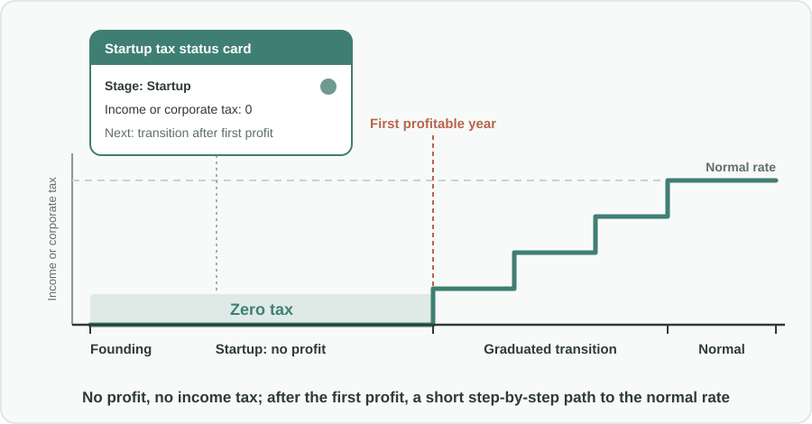
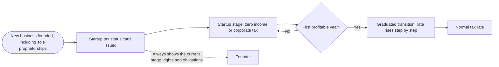

Türkçe: [README.tr.md](README.tr.md)

# Zero Tax Until First Profit: Encouraging New Businesses with a Simple Startup Tax Status

## Summary

Starting a business is risky, and the first years rarely bring a profit. This proposal gives every newly founded business, including **sole proprietorships**, a simple **startup tax status**: as long as the new business has made **no profit**, it pays **zero income or corporate tax**. After its first profitable year, the business moves to normal tax rates through a **short, graduated transition** that is easy to follow. Setting up a business is made **simple and low-cost**, and a digital **startup tax status card** shows founders at a glance which rights they have and what they owe. The goal is to give people the courage to start new businesses and to bring informal activity into the formal economy.

## Problem

- Many good business ideas never start because founders fear that **costs, paperwork and tax obligations** will arrive before any income does.
- Tax rules for new businesses are often **complex and hard to predict**. Founders cannot easily tell what they will owe, when, and why.
- Because being formal feels expensive and complicated, some people **work informally** instead: they do not register a business, do not appear in official records, and cannot grow, hire openly or access formal finance.
- A new business that has not yet made a profit is still building its product, customers and team. Any tax or fixed charge in this period **drains the cash it needs to survive**.
- When a business finally becomes profitable, a **sudden jump** to full tax rates can be a shock that discourages growth.

## Proposed Solution

A startup tax status that is generous while a business is unprofitable, predictable afterwards, and simple from day one:

1. **Who qualifies:** every **newly founded business**, whatever its legal form: companies of all kinds and **sole proprietorships**. There is no need to be a technology company or to win a special program.
2. **Zero tax until first profit:** from founding until its first profitable year, within a defined startup period, a business that has made **no profit pays zero income or corporate tax**. (The original proposal suggested covering the founding year and the following year as a starting point.) Ordinary obligations that do not depend on profit, such as collecting sales taxes from customers and social security for employees, continue as normal.
3. **Graduated transition after the first profit:** after the first profitable year, the tax rate rises **step by step** to the normal rate over a short, fixed schedule, in line with the business's growth, so the business can prepare for the increase instead of facing a sudden jump.
4. **Simple and transparent rules:** the status, its duration and the transition steps are written into the rules in plain terms, with **no complex calculations**. A founder should be able to understand them in minutes.
5. **Digital startup tax status card:** each business can see, online, a simple card that shows its **current stage** (startup, transition or normal), what it owes, what it does not owe, and when the next stage begins.
6. **Low-cost, simple setup:** founding a business, including a sole proprietorship, is made **quick, simple and low-cost**, preferably in a single online process, so the startup status is not cancelled out by setup fees and paperwork.

Some countries already run small-company and startup-friendly schemes, such as those in the United Kingdom, that show public policy can actively lower the barriers to starting a business. This proposal takes that general spirit and focuses on one clear, easy-to-explain rule: **no profit, no income tax**.

## How It Works

| Stage | When | What the business pays in income or corporate tax |
|---|---|---|
| Setup | Day of founding | Quick, simple, low-cost registration; the startup tax status card is issued |
| Startup | From founding until the first profitable year | Zero |
| Transition | The years after the first profitable year | A reduced rate that rises step by step on a fixed, published schedule |
| Normal | After the transition | The normal rate that applies to all businesses |

## Implementation & Phasing

1. **Design:** the tax authority defines the startup status, its maximum duration, the transition schedule and simple anti-abuse rules, and publishes them in plain language.
2. **Simple setup:** a single, low-cost online process for founding a business, including sole proprietorships, is put in place or improved.
3. **Status card launch:** every new business receives a digital startup tax status card at founding.
4. **Monitoring:** the number of new businesses, how many move from informal to formal activity, survival rates and the tax collected after the transition are tracked and published.
5. **Adjustment:** the duration and the transition steps are adjusted based on the results.

## Stakeholders & Benefits

- **Founders and would-be founders:** the courage to start, because an unprofitable business does not owe income tax; clear rules and a card that shows exactly where they stand.
- **Sole proprietors and small traders:** a simple, low-cost way to become formal without fear of immediate tax costs.
- **Employees:** more new businesses means more jobs, and formal businesses offer formal, protected employment.
- **The tax authority and the public budget:** a wider tax base over time, as businesses that would never have started, or would have stayed informal, become formal and later profitable taxpayers.
- **The wider economy:** more innovation, competition and value added.

## Risks & Mitigations

| Risk | Mitigation |
|---|---|
| Existing businesses close and reopen to restart the startup status | The status applies only to genuinely new activity; simple rules link a new business to earlier businesses of the same owners |
| Profits are hidden or shifted to stay in the startup stage | The startup stage has a maximum duration; normal reporting and audits still apply |
| Short-term loss of tax revenue | The zero rate covers only businesses that have not yet made a profit, so the direct cost is limited; more formal businesses widen the tax base over time |
| Rules become complicated again over time | A commitment to plain-language rules and a single status card that must stay understandable |
| Founders misunderstand what they still owe | The status card clearly lists what is and is not covered, such as sales taxes and employee social security |

**Keywords:** startup tax, entrepreneurship, small business, sole proprietorship, corporate tax, income tax, graduated tax, informal economy, business formation, tax simplification

## Origin

Originally proposed by Merih İlgör (June 2025); published here as an open project idea.

## License

This work is licensed under CC BY-NC-SA 4.0 for non-commercial use; see [LICENSE](LICENSE). Commercial use requires a revenue-share agreement; see [COMMERCIAL-LICENSE.md](COMMERCIAL-LICENSE.md). Modified versions may not be sold or transferred to third parties as new ideas, and patent-like rights are reserved; see [COMMERCIAL-LICENSE.md](COMMERCIAL-LICENSE.md#derivatives-improvements-and-idea-protection).
