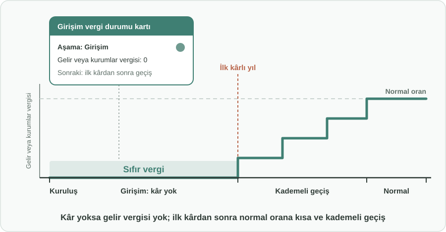
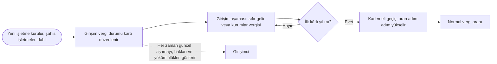

English: [README.md](README.md)

# İlk Kâra Kadar Sıfır Vergi: Basit Bir Girişim Vergi Statüsüyle Yeni İşletme Kurmayı Teşvik Etmek

## Özet

İşletme kurmak risklidir ve ilk yıllar nadiren kâr getirir. Bu öneri, **şahıs işletmeleri** dahil yeni kurulan her işletmeye basit bir **girişim vergi statüsü** tanır: yeni işletme **hiç kâr elde etmediği** sürece **sıfır gelir veya kurumlar vergisi** öder. İlk kârlı yılından sonra işletme, takip etmesi kolay, **kısa ve kademeli bir geçişle** normal vergi oranlarına ulaşır. İşletme kurmak **basit ve düşük maliyetli** hale getirilir; dijital bir **girişim vergi durumu kartı** da girişimcilere hangi haklara sahip olduklarını ve neyi ödemeleri gerektiğini tek bakışta gösterir. Amaç, insanlara yeni işletme kurma cesareti vermek ve kayıt dışı faaliyetleri kayıt içine çekmektir.

## Sorun

- Birçok iyi iş fikri, girişimciler **masrafların, bürokrasinin ve vergi yükümlülüklerinin** herhangi bir gelirden önce geleceğinden korktuğu için hiç hayata geçmez.
- Yeni işletmelere ilişkin vergi kuralları çoğu zaman **karmaşık ve öngörülmesi zordur**. Girişimciler neyi, ne zaman ve neden ödeyeceklerini kolayca anlayamaz.
- Kayıtlı olmak pahalı ve karmaşık göründüğü için bazı insanlar **kayıt dışı çalışmayı** tercih eder: işletme kaydı yaptırmazlar, resmi kayıtlarda görünmezler; büyüyemez, açıkça istihdam sağlayamaz ve kayıtlı finansmana erişemezler.
- Henüz kâr etmemiş yeni bir işletme hâlâ ürününü, müşterilerini ve ekibini kurmaktadır. Bu dönemdeki her vergi veya sabit yük, **ayakta kalmak için ihtiyaç duyduğu nakdi eritir**.
- İşletme nihayet kâra geçtiğinde, tam vergi oranlarına **ani bir sıçrama** büyümeyi caydıran bir şok olabilir.

## Önerilen Çözüm

İşletme kâr etmediği sürece cömert, sonrasında öngörülebilir ve ilk günden itibaren basit bir girişim vergi statüsü:

1. **Kimler yararlanır:** Hukuki biçimi ne olursa olsun **yeni kurulan her işletme**: her türden şirket ve **şahıs işletmeleri**. Teknoloji şirketi olmak veya özel bir programa seçilmek gerekmez.
2. **İlk kâra kadar sıfır vergi:** Belirlenmiş bir girişim süresi içinde, kuruluştan ilk kârlı yıla kadar **hiç kâr etmemiş bir işletme sıfır gelir veya kurumlar vergisi öder**. (Özgün öneri, başlangıç olarak kuruluş yılını ve izleyen yılı kapsamayı önermiştir.) Müşteriden tahsil edilen satış vergileri ve çalışanlar için sosyal güvenlik primleri gibi kâra bağlı olmayan olağan yükümlülükler normal şekilde devam eder.
3. **İlk kârdan sonra kademeli geçiş:** İlk kârlı yıldan sonra vergi oranı, işletmenin büyümesiyle uyumlu, kısa ve sabit bir takvimle **adım adım** normal orana yükselir; böylece işletme ani bir sıçramayla karşılaşmak yerine artışa hazırlanabilir.
4. **Basit ve şeffaf kurallar:** Statü, süresi ve geçiş adımları mevzuatta **karmaşık hesaplamalara yer vermeden** açık bir dille tanımlanır. Bir girişimci bunları birkaç dakikada anlayabilmelidir.
5. **Dijital girişim vergi durumu kartı:** Her işletme, çevrimiçi olarak **bulunduğu aşamayı** (girişim, geçiş veya normal), neyi ödediğini, neyi ödemediğini ve bir sonraki aşamanın ne zaman başlayacağını gösteren basit bir kartı görebilir.
6. **Düşük maliyetli ve basit kuruluş:** Şahıs işletmeleri dahil işletme kurmak, tercihen tek bir çevrimiçi süreçle **hızlı, basit ve düşük maliyetli** hale getirilir; böylece girişim statüsünün faydası kuruluş masrafları ve evrak işleriyle yok olmaz.

Birleşik Krallık'taki gibi bazı ülkeler, kamu politikasının işletme kurmanın önündeki engelleri aktif olarak azaltabileceğini gösteren küçük şirket ve girişim dostu uygulamalara zaten sahiptir. Bu öneri o genel yaklaşımı alır ve tek, açık ve anlatması kolay bir kurala odaklanır: **kâr yoksa gelir vergisi de yok**.

## Nasıl Çalışır

| Aşama | Ne zaman | İşletmenin ödediği gelir veya kurumlar vergisi |
|---|---|---|
| Kuruluş | Kuruluş günü | Hızlı, basit ve düşük maliyetli kayıt; girişim vergi durumu kartı düzenlenir |
| Girişim | Kuruluştan ilk kârlı yıla kadar | Sıfır |
| Geçiş | İlk kârlı yılı izleyen yıllar | Sabit ve ilan edilmiş bir takvime göre adım adım yükselen indirimli oran |
| Normal | Geçişten sonra | Tüm işletmelere uygulanan normal oran |

## Uygulama ve Fazlandırma

1. **Tasarım:** Vergi idaresi girişim statüsünü, azami süresini, geçiş takvimini ve basit kötüye kullanım önleme kurallarını belirler ve bunları sade bir dille yayımlar.
2. **Basit kuruluş:** Şahıs işletmeleri dahil işletme kurmak için tek, düşük maliyetli bir çevrimiçi süreç oluşturulur veya iyileştirilir.
3. **Durum kartının devreye alınması:** Her yeni işletme, kuruluşta dijital bir girişim vergi durumu kartı alır.
4. **İzleme:** Yeni işletme sayısı, kayıt dışından kayıt içine geçenlerin sayısı, hayatta kalma oranları ve geçiş sonrasında toplanan vergi izlenir ve yayımlanır.
5. **Ayarlama:** Süre ve geçiş adımları sonuçlara göre ayarlanır.

## Paydaşlar ve Faydalar

- **Girişimciler ve girişimci adayları:** Kâr etmeyen bir işletme gelir vergisi ödemediği için başlama cesareti; açık kurallar ve tam olarak nerede durduklarını gösteren bir kart.
- **Şahıs işletmeleri ve küçük esnaf:** Anında vergi yükü korkusu olmadan kayıt içine girmenin basit ve düşük maliyetli bir yolu.
- **Çalışanlar:** Daha fazla yeni işletme daha fazla iş demektir; kayıtlı işletmeler kayıtlı ve güvenceli istihdam sunar.
- **Vergi idaresi ve kamu bütçesi:** Hiç kurulmayacak ya da kayıt dışı kalacak işletmeler kayıt içine girip zamanla kârlı vergi mükelleflerine dönüştükçe genişleyen vergi tabanı.
- **Genel ekonomi:** Daha fazla yenilik, rekabet ve katma değer.

## Riskler ve Önlemler

| Risk | Önlem |
|---|---|
| Mevcut işletmeler girişim statüsünü yeniden almak için kapanıp yeniden açılır | Statü yalnızca gerçekten yeni faaliyetlere uygulanır; basit kurallar yeni bir işletmeyi aynı sahiplerin önceki işletmeleriyle ilişkilendirir |
| Girişim aşamasında kalmak için kâr gizlenir veya aktarılır | Girişim aşamasının azami bir süresi vardır; olağan beyan ve denetimler geçerliliğini korur |
| Kısa vadeli vergi geliri kaybı | Sıfır oran yalnızca henüz kâr etmemiş işletmeleri kapsadığı için doğrudan maliyet sınırlıdır; kayıt içine giren işletmeler zamanla vergi tabanını genişletir |
| Kurallar zamanla yeniden karmaşıklaşır | Sade dille yazılmış kurallara ve anlaşılır kalması gereken tek bir durum kartına bağlılık |
| Girişimciler hâlâ neyi ödemeleri gerektiğini yanlış anlar | Durum kartı, satış vergileri ve çalışan sosyal güvenlik primleri gibi neyin kapsamda olup neyin olmadığını açıkça listeler |

**Anahtar kelimeler:** girişim vergisi, girişimcilik, küçük işletme, şahıs işletmesi, kurumlar vergisi, gelir vergisi, kademeli vergi, kayıt dışı ekonomi

## Köken

Merih İlgör tarafından önerilmiştir (Haziran 2025); burada açık bir proje fikri olarak yayımlanmaktadır.

## Lisans

Bu çalışma, ticari olmayan kullanım için CC BY-NC-SA 4.0 lisansı ile lisanslanmıştır; bkz. [LICENSE](LICENSE). Ticari kullanım bir gelir paylaşımı anlaşması gerektirir; bkz. [COMMERCIAL-LICENSE.md](COMMERCIAL-LICENSE.md). Değiştirilmiş sürümler yeni bir fikir olarak satılamaz veya üçüncü kişilere aktarılamaz; patent benzeri haklar saklıdır. Bkz. [COMMERCIAL-LICENSE.md](COMMERCIAL-LICENSE.md#derivatives-improvements-and-idea-protection).
